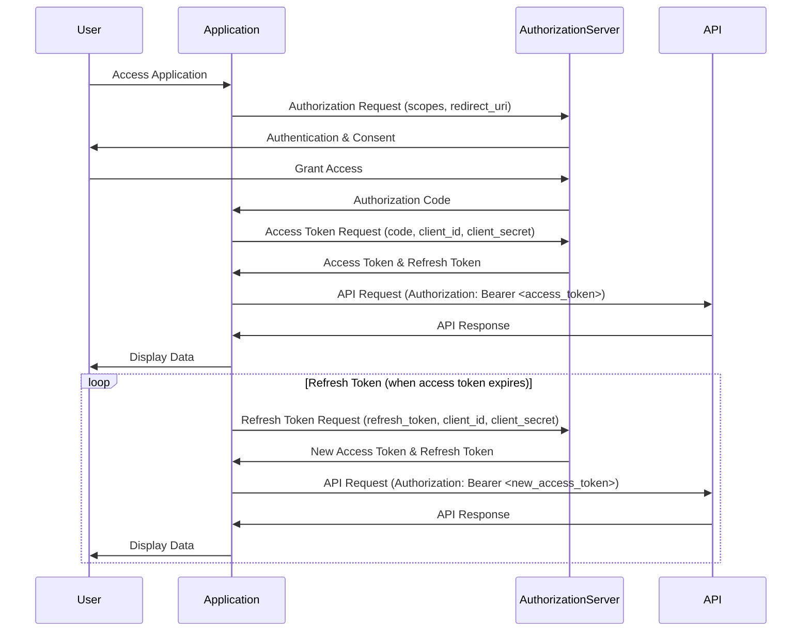

# Authentication and Authorization

This document provides a comprehensive guide to authentication and authorization methods used to securely access our API.  It is intended for developers and security engineers who need to integrate with our platform.  Understanding these mechanisms is crucial for ensuring the security and integrity of your applications and our services.

**Priority:** High

**Related Endpoints:**

*   `/auth/token`
*   `/auth/refresh`
*   `/auth/revoke`

## 1. API Keys

API keys are a simple authentication method that allows you to identify your application when making API requests.  They are typically used for non-sensitive operations and are less secure than OAuth.

### 1.1 Obtaining an API Key

To obtain an API key, you must first register your application through our developer portal.  Once registered, you can generate an API key from your application's settings.

### 1.2 Using an API Key

API keys are passed in the `X-API-Key` header of your HTTP requests.

```
GET /api/resource HTTP/1.1
Host: api.example.com
X-API-Key: YOUR_API_KEY
```

### 1.3 Security Considerations for API Keys

*   **Never embed API keys directly in client-side code (e.g., JavaScript).** This exposes your key to unauthorized access.
*   **Treat your API key like a password.**  Do not share it publicly or commit it to version control.
*   **Rotate your API keys regularly.**  This reduces the risk of compromise.
*   **Monitor your API key usage.**  Look for suspicious activity, such as unusually high request volumes.
*   **Use IP whitelisting (if available).**  Restrict API key usage to specific IP addresses or ranges.

## 2. OAuth Flow

OAuth 2.0 is a more robust authentication and authorization framework that allows users to grant your application limited access to their data without sharing their credentials.  We support the Authorization Code Grant flow.

### 2.1 Authorization Code Grant Flow

The Authorization Code Grant flow involves the following steps:

1.  **Authorization Request:** Your application redirects the user to our authorization server, requesting access to specific scopes.
2.  **User Authorization:** The user authenticates with our authorization server and grants or denies your application's request.
3.  **Authorization Code:** If the user grants access, the authorization server redirects the user back to your application with an authorization code.
4.  **Access Token Request:** Your application exchanges the authorization code for an access token by making a request to our token endpoint (`/auth/token`).
5.  **Access Token:** The token endpoint returns an access token and a refresh token.
6.  **API Access:** Your application uses the access token to make API requests.
7.  **Token Refresh:** When the access token expires, your application uses the refresh token to obtain a new access token.

### 2.2 Sequence Diagram



### 2.3 Example: Authorization Request

```
GET /oauth/authorize?client_id=YOUR_CLIENT_ID&redirect_uri=YOUR_REDIRECT_URI&response_type=code&scope=read:profile write:posts HTTP/1.1
Host: api.example.com
```

### 2.4 Example: Access Token Request

```
POST /auth/token HTTP/1.1
Host: api.example.com
Content-Type: application/x-www-form-urlencoded

grant_type=authorization_code&code=YOUR_AUTHORIZATION_CODE&client_id=YOUR_CLIENT_ID&client_secret=YOUR_CLIENT_SECRET&redirect_uri=YOUR_REDIRECT_URI
```

### 2.5 Example: Access Token Response

```json
{
  "access_token": "YOUR_ACCESS_TOKEN",
  "token_type": "Bearer",
  "expires_in": 3600,
  "refresh_token": "YOUR_REFRESH_TOKEN",
  "scope": "read:profile write:posts"
}
```

## 3. Token Management

Proper token management is crucial for maintaining the security of your application and user data.

### 3.1 Access Token Usage

Access tokens should be included in the `Authorization` header of your API requests using the `Bearer` scheme.

```
GET /api/resource HTTP/1.1
Host: api.example.com
Authorization: Bearer YOUR_ACCESS_TOKEN
```

### 3.2 Refreshing Tokens

When an access token expires, you can use the refresh token to obtain a new access token.  Send a `POST` request to the `/auth/refresh` endpoint with the following parameters:

```
POST /auth/refresh HTTP/1.1
Host: api.example.com
Content-Type: application/x-www-form-urlencoded

grant_type=refresh_token&refresh_token=YOUR_REFRESH_TOKEN&client_id=YOUR_CLIENT_ID&client_secret=YOUR_CLIENT_SECRET
```

### 3.3 Revoking Tokens

You can revoke an access token or refresh token by sending a `POST` request to the `/auth/revoke` endpoint.  This will invalidate the token and prevent it from being used to access the API.

```
POST /auth/revoke HTTP/1.1
Host: api.example.com
Content-Type: application/x-www-form-urlencoded

token=YOUR_TOKEN&token_type_hint=access_token
```

or

```
POST /auth/revoke HTTP/1.1
Host: api.example.com
Content-Type: application/x-www-form-urlencoded

token=YOUR_REFRESH_TOKEN&token_type_hint=refresh_token
```

### 3.4 Token Storage

*   **Securely store refresh tokens.**  Refresh tokens should be stored securely, as they can be used to obtain new access tokens.  Consider using encryption or a secure storage mechanism.
*   **Avoid storing access tokens for longer than necessary.**  Access tokens have a limited lifespan, so there is no need to store them indefinitely.

## 4. Security Best Practices

*   **Use HTTPS for all API requests.**  This encrypts the communication between your application and our API, protecting sensitive data from eavesdropping.
*   **Validate all input data.**  This helps prevent injection attacks and other security vulnerabilities.
*   **Implement proper error handling.**  Avoid exposing sensitive information in error messages.
*   **Regularly update your application and dependencies.**  This ensures that you have the latest security patches.
*   **Monitor your application for security vulnerabilities.**  Use security scanning tools and penetration testing to identify and address potential weaknesses.
*   **Implement rate limiting.**  This helps prevent denial-of-service attacks.
*   **Use strong passwords and multi-factor authentication for your developer accounts.**
*   **Follow the principle of least privilege.**  Grant your application only the permissions it needs to function.
*   **Regularly review and update your security policies.**  Security is an ongoing process, so it is important to stay up-to-date with the latest threats and best practices.
*   **Implement logging and auditing.**  Track API usage and security events to help identify and investigate potential security incidents.
