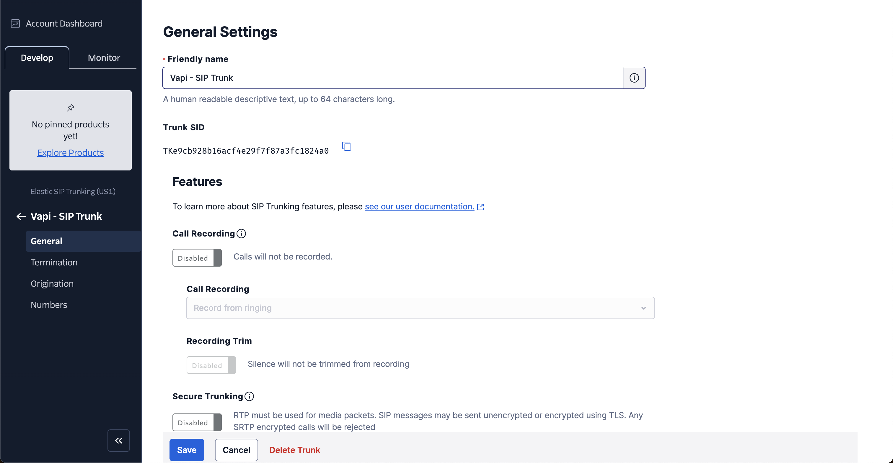
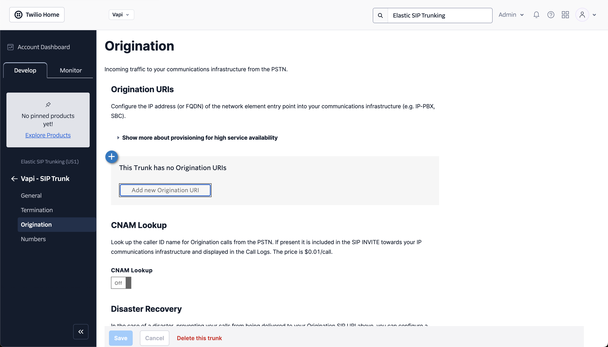
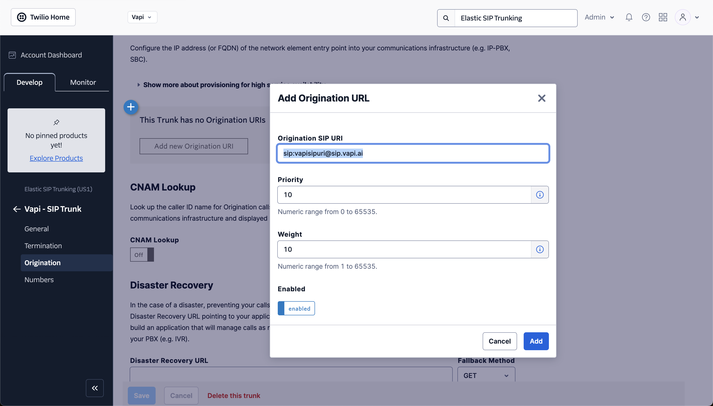
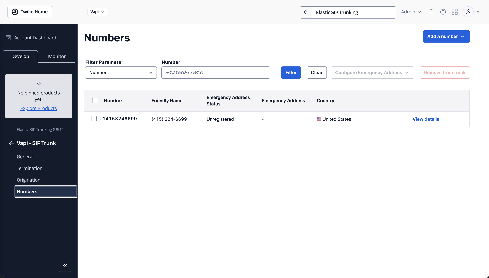

## SIP Inbound

<Steps>
<Step title="Create a Twilio Elastic SIP Trunk">

We'll login to the [Twilio Console](https://www.twilio.com/console) and create a new Elastic SIP Trunk.

</Step>

<Step title="Navigate to the Origination tab">

</Step>

<Step title="Add an Origination URL">
- In the Origination section, add the SIP URI generated from the previous step (e.g., `sip:username0@sip.vapi.ai`).
- Save the changes.

</Step>

<Step title="Configure Twilio Phone Number">
Navigate to Phone Numbers in your Twilio Console and select or purchase a new phone number.

</Step>

<Step title="Update Voice Settings">
Under Voice settings, select SIP Trunking and choose the Elastic SIP Trunk you created in the previous step.

Now, when a call is made to this Twilio number, it will be routed through the Elastic SIP Trunk to the Vapi AI SIP URI.

</Step>

</Steps>

## SIP Outbound

<Steps>

<Step title="Create a Twilio Elastic SIP Trunk">

We'll login to the [Twilio Console](https://www.twilio.com/console) and create a new Elastic SIP Trunk.

</Step>

<Step title="Navigate to the Origination tab">

</Step>

<Step title="Add a Termination URL">

</Step>

<Step title="Whitelist IP Addresses">

</Step>

<Step title="Move Numbers to SIP Trunk">

</Step>

<Step title="Trigger an Outbound Call from Vapi">

Now, the phone number that you configured in the previous step will appear in your dashboard. You can trigger the call directly or if you want to trigger the call via API you can use that phone-number-id and trigger it.
</Step>

</Steps>
