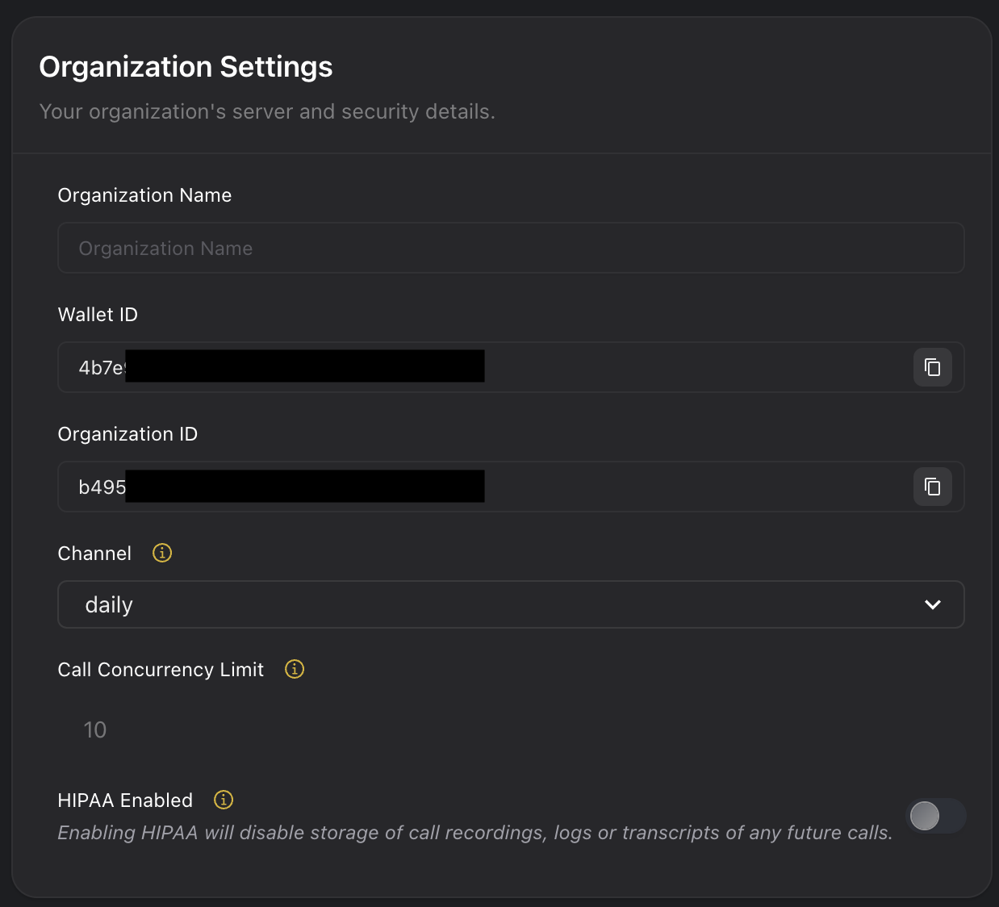

# What is Concurrency?
Concurrency refers to the ability to handle multiple API calls simultaneously. Each API plan includes a predefined concurrency limit, capping the total number of active requests across the organization at any given time. This limit applies at the organization level, not to individual accounts or phone numbers, ensuring all resources within the organization share the capacity. By default our plans offer up to 10 concurrent calls at once. 

## Handling Retries
Retries are effective for API calls of short durations. For longer-running calls, such as those exceeding 10 minutes, ensure your retry intervals align with the call duration to prevent premature attempts or wasted resources.

## Concurrency Limits
The API enforces a concurrency limit, which governs the number of simultaneous API calls. When this limit is exceeded, the API responds with:
```http
HTTP/1.1 400 Bad Request
{
  "error": "Over Concurrency Limit"
}
```

## Managing Concurrency Effectively

By default, plans allow up to 10 concurrent calls, with options to purchase additional capacity as needed by emailing [support@vapi.ai](mailto:support@vapi.ai)

Use the monitoring tools provided in the API dashboard to:

- **Reduce simultaneous calls:** Minimize concurrent requests to keep within the limit.
- **Introduce delays:** Space out call initiations to manage traffic.
- **Optimize call durations:** Ensure calls complete efficiently to prevent queue overloads.
- **Track active call usage:** Monitor ongoing API requests to stay within limits from the [Vapi dashboard](https://dashboard.vapi.ai/).
- **Analyze and adjust thresholds:** Identify patterns and reconfigure settings as needed.
- **Reference your dashboard for details of call concurrency limits in your organization's settings page**:
<Frame>
  
</Frame>