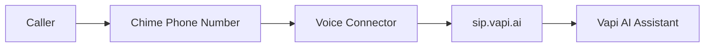

This guide walks you through setting up both outbound and inbound SIP trunking between Amazon Chime SDK and Vapi using a Voice Connector.

This is a **Voice Connector-only** integration — inbound and outbound calls work with no Lambda functions or custom logic required. Vapi handles the AI assistant entirely. This approach is best for straightforward AI assistants on a phone number where no additional integration is needed.

<Note>
This integration does not support passing custom SIP headers, metadata, or enriched escalation data (e.g., human transfer with SIP header context). For those use cases, use a **SIP Media Application** with **CallAndBridge** instead.
</Note>

## Prerequisites

- An AWS account with access to the [Amazon Chime SDK console](https://console.aws.amazon.com/chime-sdk/)
- A Vapi account with a private API key
- AWS CLI configured, or access to the Chime SDK console
- A phone number provisioned in Amazon Chime SDK (or the ability to order one)
- A Vapi assistant already created (for inbound calls)

## Outbound calls (Chime SDK to Vapi)

### Chime SDK configuration

<Steps>

<Step title="Create a Voice Connector">

In the Amazon Chime SDK console, navigate to **Voice Connectors** and create a new one.

Configure the following settings:
- **Encryption:** Enabled (default)
- **Network Type:** IPV4_ONLY


Save the **Outbound host name** from the Voice Connector details — you need it when configuring the Vapi SIP trunk.

</Step>

<Step title="Enable termination and whitelist Vapi IPs">

Navigate to the **Termination** tab of your Voice Connector and enable it.

Add Vapi's static IP addresses to the allowed host list:


- `44.229.228.186/32`
- `44.238.177.138/32`

</Step>

<Step title="Configure calling plan">

In the **Termination** tab, scroll to the calling plan section and select the countries you want to allow outbound calls to.

</Step>

<Step title="Create credentials">

Still in the **Termination** tab, create a new credential with a username and password. Save these credentials — you need them for the Vapi SIP trunk configuration.


</Step>

<Step title="Assign phone numbers">

Navigate to the **Phone numbers** tab and click **Assign from inventory** to attach a phone number to this Voice Connector.


Select the phone number you want to assign and confirm.


<Tip>
If you don't have any phone numbers in your inventory, order them from **Amazon Chime SDK → Phone Number Management → Orders → Provision Phone Numbers**.
</Tip>

</Step>

</Steps>

### Vapi configuration

<Steps>

<Step title="Retrieve your Vapi API key">

Log in to your [Vapi dashboard](https://dashboard.vapi.ai) and retrieve your API key from the **Organization Settings**.

</Step>

<Step title="Create a SIP trunk credential">

Use the following API call to create a SIP trunk credential. Replace the placeholders with your Chime SDK Voice Connector details:

```bash
curl -X POST https://api.vapi.ai/credential \
-H "Content-Type: application/json" \
-H "Authorization: Bearer YOUR_VAPI_API_KEY" \
-d '{
  "provider": "byo-sip-trunk",
  "name": "Chime SDK Trunk",
  "outboundLeadingPlusEnabled": true,
  "outboundAuthenticationPlan": {
    "authUsername": "YOUR_CHIME_CREDENTIAL_USERNAME",
    "authPassword": "YOUR_CHIME_CREDENTIAL_PASSWORD"
  },
  "gateways": [
    {
      "ip": "YOUR_CHIME_OUTBOUND_HOSTNAME",
      "outboundEnabled": true,
      "outboundProtocol": "tls/srtp",
      "inboundEnabled": false,
      "optionsPingEnabled": true
    }
  ]
}'
```

Note the `id` (credential ID) from the response for the next step.

<Note>
The `outboundProtocol` must be set to `tls/srtp` when encryption is enabled on the Voice Connector (the default).
</Note>

</Step>

<Step title="Register your phone number">

Associate your Chime SDK phone number with the Vapi SIP trunk:

```bash
curl -X POST https://api.vapi.ai/phone-number \
-H "Content-Type: application/json" \
-H "Authorization: Bearer YOUR_VAPI_API_KEY" \
-d '{
  "provider": "byo-phone-number",
  "name": "Chime SDK SIP Number",
  "number": "YOUR_CHIME_PHONE_NUMBER",
  "numberE164CheckEnabled": true,
  "credentialId": "YOUR_CREDENTIAL_ID"
}'
```

Note the phone number ID from the response for making calls.

<Note>
The phone number must be in E.164 format (e.g., `+18312168445`).
</Note>

</Step>

<Step title="Make outbound calls">

You can make outbound calls in two ways:

**Using the Vapi Dashboard:**

The phone number appears in your dashboard. Select your assistant and enter the destination number you want to call.

**Using the API:**

```bash
curl -X POST https://api.vapi.ai/call/phone \
-H "Content-Type: application/json" \
-H "Authorization: Bearer YOUR_VAPI_API_KEY" \
-d '{
  "assistantId": "YOUR_ASSISTANT_ID",
  "customer": {
    "number": "DESTINATION_PHONE_NUMBER",
    "numberE164CheckEnabled": false
  },
  "phoneNumberId": "YOUR_PHONE_NUMBER_ID"
}'
```

</Step>

</Steps>

## Inbound calls (Chime SDK to Vapi)

For inbound calls, a caller dials your Chime SDK phone number. The Voice Connector routes the call to Vapi through its origination settings — no Lambda or SIP Media Application required:



### Vapi configuration

<Steps>

<Step title="Create a SIP trunk credential">

Vapi needs to know which IP addresses are allowed to send SIP traffic to it. Since the Voice Connector originates calls from its regional signaling IPs, you must register those IPs as a BYO SIP trunk credential in Vapi.

Look up the **SIP signaling subnet** for your Voice Connector's region from the [Chime SDK Voice Connector network configuration docs](https://docs.aws.amazon.com/chime-sdk/latest/ag/network-config.html).

Create the credential via the Vapi API:

```bash
curl -X POST https://api.vapi.ai/credential \
-H "Content-Type: application/json" \
-H "Authorization: Bearer YOUR_VAPI_API_KEY" \
-d '{
  "provider": "byo-sip-trunk",
  "name": "Amazon Chime SDK Trunk",
  "gateways": [
    {
      "ip": "YOUR_VOICE_CONNECTOR_SIGNALING_IP",
      "netmask": 24,
      "inboundEnabled": true,
      "outboundEnabled": false,
      "outboundProtocol": "tls/srtp",
      "optionsPingEnabled": true
    }
  ]
}'
```

Replace the `ip` and `netmask` with the values for your Voice Connector's region. For example:
- **US West (Oregon):** `99.77.253.0` with netmask `24`
- **US East (N. Virginia):** `3.80.16.0` with netmask `23`

Set `outboundProtocol` to `tls/srtp` if your Voice Connector has encryption enabled (the default), or `udp` if not.

Save the returned `id` — this is your **Credential ID** used in the following steps.

</Step>

<Step title="Register a phone number and assign your assistant">

Register your Chime SDK phone number in Vapi, linking it to the credential and your assistant:

```bash
curl -X POST https://api.vapi.ai/phone-number \
-H "Content-Type: application/json" \
-H "Authorization: Bearer YOUR_VAPI_API_KEY" \
-d '{
  "provider": "byo-phone-number",
  "name": "Chime SDK Number",
  "number": "YOUR_CHIME_PHONE_NUMBER",
  "numberE164CheckEnabled": true,
  "credentialId": "YOUR_CREDENTIAL_ID",
  "assistantId": "YOUR_ASSISTANT_ID"
}'
```

<Warning>
The `number` field must exactly match the E.164 phone number assigned to your Voice Connector (e.g., `+18312168445`). Inbound calls will fail to route if the numbers don't match.
</Warning>

</Step>

</Steps>

### Chime SDK configuration

<Steps>

<Step title="Configure origination on the Voice Connector">

Navigate to your Voice Connector's **Origination** tab and set **Origination status** to **Enabled**.


Click **New** to add an inbound route pointing to Vapi's SIP server:

- **Host:** `YOUR_CREDENTIAL_ID.sip.vapi.ai`
- **Port:** `5061` (for encrypted connections)
- **Protocol:** TCP


</Step>

<Step title="Test the integration">

Call your Chime SDK phone number from any phone. The call routes through the Voice Connector's origination settings to `sip.vapi.ai`, where your Vapi assistant answers.

To debug issues, enable **SIP logging** on the Voice Connector (under the **Logging** tab) for detailed SIP message traces.

</Step>

</Steps>

## Next steps

Now that you have Amazon Chime SDK SIP trunking configured:

- **[SIP trunking overview](/advanced/sip/sip-trunk):** Learn more about SIP trunk concepts and configuration options.
- **[Networking and firewall](/advanced/sip/sip-networking):** Review network requirements and firewall rules.
- **[Troubleshoot SIP trunk credential errors](/advanced/sip/troubleshoot-sip-trunk-credential-errors):** Debug common SIP integration issues.
