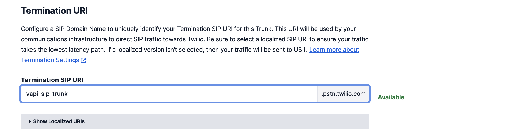
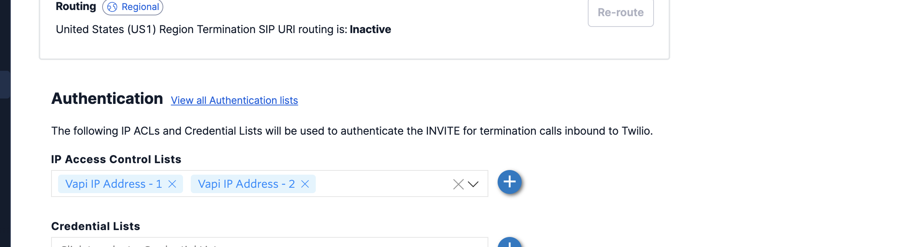
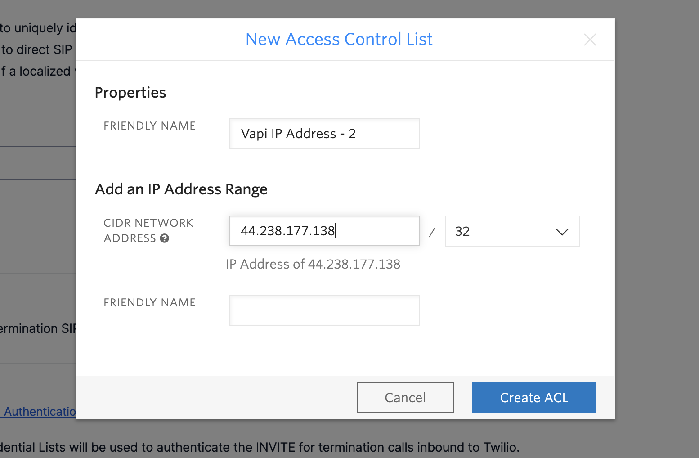
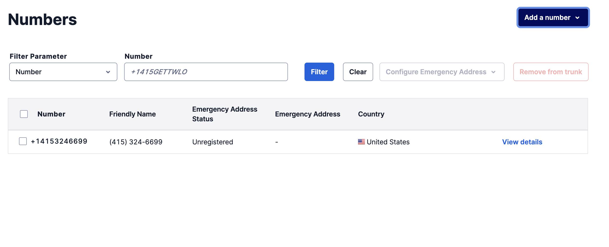
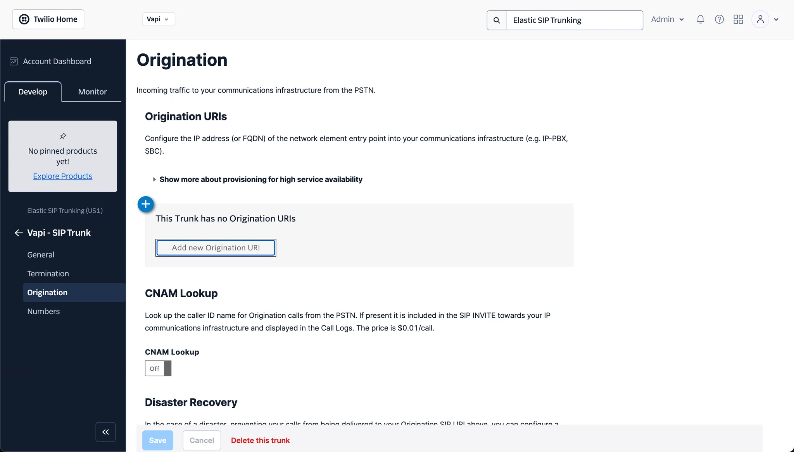
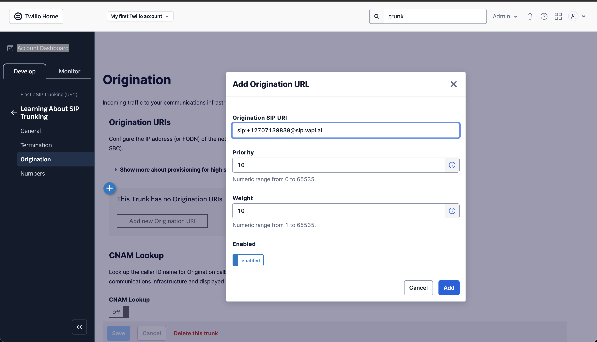

This guide walks you through setting up both outbound and inbound SIP trunking between Twilio and Vapi. The steps are quite similar for other telephony providers.

## Outbound Calls (Twilio to Vapi)

### Twilio Configuration

1. **Create Elastic SIP Trunk**
   
   Log in to your Twilio account and create a new trunk, assigning it a name, and adjusting the general settings as needed.
   
   

2. **Set Up Termination (Outbound Calls)**
   
   Configure the termination settings. The termination SIP URI is crucial as it will be used in later steps.
   
   
   
   To allow your Elastic SIP Trunk to accept outbound requests, you need to whitelist IP addresses:
   
   
   
   Whitelist Vapi's SIP server static IPs:
   - 44.229.228.186
   - 44.238.177.138
   
   Ensure you whitelist the entire IP range as shown below:
   
   
   
   

3. **Purchase or Move Numbers to Elastic SIP Trunk**
   
   After creating the Elastic SIP trunk, purchase new numbers or move existing numbers to this trunk.
   
   

### Vapi Configuration

1. **Retrieve Your Vapi API Key**
   
   Log in to your Vapi.ai account and retrieve your API key from the Organization Settings.

2. **Create a SIP Trunk Credential**
   
   Use the following API call to create a SIP trunk credential, replacing the gateway IP with your Twilio Termination SIP URI:

   ```bash
   curl -X POST https://api.vapi.ai/credential \
   -H "Content-Type: application/json" \
   -H "Authorization: Bearer YOUR_VAPI_API_KEY" \
   -d '{
     "provider": "byo-sip-trunk",
     "name": "Twilio Trunk",
     "gateways": [
       {
         "ip": "YOUR_TWILIO_GATEWAY_ID"
       }
     ],
     "outboundLeadingPlusEnabled": true
   }'
   ```
   
   Note the `id` (credentialId) from the response for the next step.

3. **Register Your Phone Number**
   
   Associate your Twilio number with the SIP trunk:

   ```bash
   curl -X POST https://api.vapi.ai/phone-number \
   -H "Content-Type: application/json" \
   -H "Authorization: Bearer YOUR_VAPI_API_KEY" \
   -d '{
     "provider": "byo-phone-number",
     "name": "Twilio SIP Number",
     "number": "YOUR_SIP_PHONE_NUMBER",
     "numberE164CheckEnabled": false,
     "credentialId": "YOUR_CREDENTIAL_ID"
   }'
   ```
   
   Note the phone number ID from the response for making calls.

4. **Make Outbound Calls**
   
   You can make outbound calls in two ways:
   
   **Using the Vapi Dashboard:**
   
   The phone number will appear in your dashboard. Select your assistant and enter the destination number you want to call.
   
   **Using the API:**
   
   ```bash
   curl --location 'https://api.vapi.ai/call/phone' \
   --header 'Authorization: Bearer YOUR_VAPI_API_KEY' \
   --header 'Content-Type: application/json' \
   --data '{
     "assistantId": "YOUR_ASSISTANT_ID",
     "customer": {
       "number": "DESTINATION_PHONE_NUMBER",
       "numberE164CheckEnabled": false
     },
     "phoneNumberId": "YOUR_PHONE_NUMBER_ID"
   }'
   ```

## Inbound Calls (Vapi to Twilio)

### Twilio Configuration

1. **Set Up Origination (Inbound Calls)**
   
   Navigate to the Origination section in your Twilio SIP Trunk settings.
   
   
   
   Add your Vapi SIP URI in the following format: `sip:YOUR_PHONE_NUMBER@sip.vapi.ai`, where "YOUR_PHONE_NUMBER" is your chosen SIP number that you will attach to this trunk.
   
   

### Vapi Configuration

1. **Create and Configure a Vapi Assistant**
   
   - Create an assistant following the steps at [https://docs.vapi.ai/quickstart/dashboard#create-an-assistant](https://docs.vapi.ai/quickstart/dashboard#create-an-assistant)
   - In the assistant settings, link it to the phone number you created
   
   Now when someone calls your Twilio number, the call will be routed to your Vapi assistant.