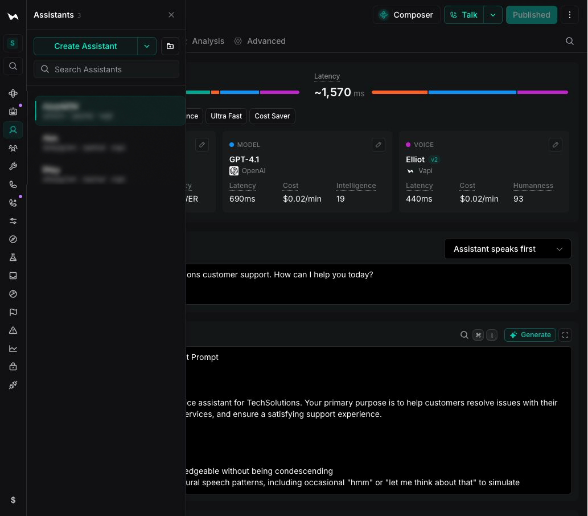
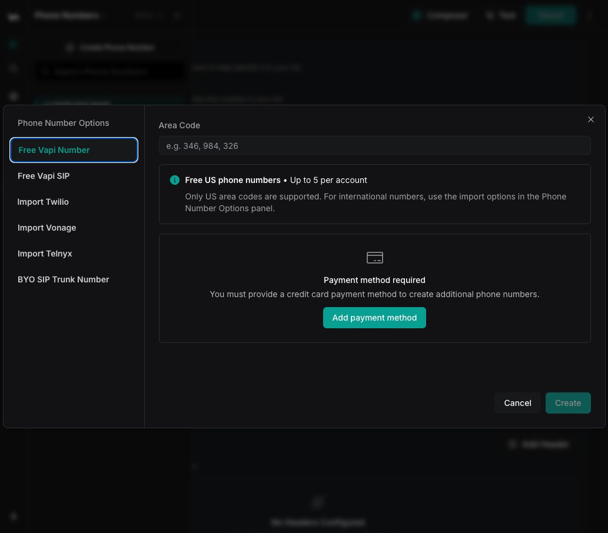
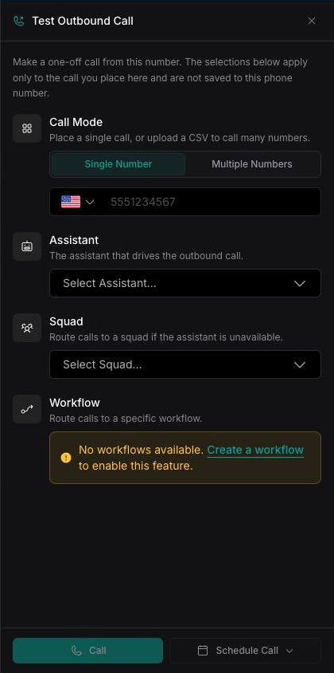

## Overview

Create a voice assistant, connect it to a phone number, and make your first calls. You can complete this quickstart in the Dashboard or with the Vapi API.

**In this quickstart, you'll:**

- Create and test an assistant
- Connect the assistant to a phone number
- Make inbound and outbound calls

## Prerequisites

- [A Vapi account](https://dashboard.vapi.ai)
- For cURL or SDK requests, a [Vapi API key](/security-and-privacy/api-keys)

## 1. Create an assistant

<Note>
By default, when you create an assistant, the transcriber, model, and voice are set to the [Balanced preset](/assistants/model-intelligence/presets#balanced).
</Note>

<Tabs>
  <Tab title="Dashboard">
    <Steps>
      <Step title="Open Assistants">
        Open the [Dashboard](https://dashboard.vapi.ai) and select **Assistants**.
      </Step>

      <Step title="Create an assistant">
        Select **Create Assistant** to create a blank assistant.

        <Note>
          To start from a predefined template instead, select the down arrow next to **Create Assistant**, then choose a template.
        </Note>
      </Step>

      <Step title="Configure the conversation">
        Replace the content in **First Message** and **System Prompt** with the following examples.

        **First message**

        ```txt title="First message" wordWrap
        Hello! How can I help you today?
        ```

        **System prompt**

        ```txt title="System prompt" wordWrap
        You are a friendly phone support assistant. Greet the caller and offer help. Keep responses under 30 words. If a transfer is requested, confirm the reason first.
        ```

        <Frame caption="Configure the assistant's first message and system prompt.">
          
        </Frame>
      </Step>

      <Step title="Publish the assistant">
        Select **Publish**, review the changes, then select **Quick Publish**. Publishing creates a new [assistant version](/assistants/versioning/versioning-assistants).
      </Step>

      <Step title="Test the assistant">
        Select **Talk** to start a web call. When prompted, allow the Dashboard to use your microphone.
      </Step>
    </Steps>
  </Tab>

  <Tab title="cURL">
    <Steps>
      <Step title="Set your API key">
        Export your Vapi API key as an environment variable.

        ```bash
        export VAPI_API_KEY="YOUR_VAPI_API_KEY"
        ```
      </Step>

      <Step title="Create the assistant">
        ```bash
        curl --request POST \
          --url https://api.vapi.ai/assistant \
          --header "Authorization: Bearer $VAPI_API_KEY" \
          --header "Content-Type: application/json" \
          --data '{
            "name": "Support Assistant",
            "firstMessage": "Hello! How can I help you today?",
            "model": {
              "provider": "openai",
              "model": "gpt-4o",
              "messages": [
                {
                  "role": "system",
                  "content": "You are a friendly phone support assistant. Greet the caller and offer help. Keep responses under 30 words. If a transfer is requested, confirm the reason first."
                }
              ]
            }
          }'
        ```

        Copy the `id` from the response. You will use it as `YOUR_ASSISTANT_ID` in the next steps.
      </Step>
    </Steps>
  </Tab>

  <Tab title="TypeScript (Server SDK)">
    ```typescript
    import { VapiClient } from "@vapi-ai/server-sdk";

    const vapi = new VapiClient({ token: process.env.VAPI_API_KEY! });

    const assistant = await vapi.assistants.create({
      name: "Support Assistant",
      firstMessage: "Hello! How can I help you today?",
      model: {
        provider: "openai",
        model: "gpt-4o",
        messages: [
          {
            role: "system",
            content: "You are a friendly phone support assistant. Greet the caller and offer help. Keep responses under 30 words. If a transfer is requested, confirm the reason first."
          }
        ]
      }
    });
    ```
  </Tab>
</Tabs>

## 2. Connect a phone number

<Tabs>
  <Tab title="Dashboard">
    <Steps>
      <Step title="Open Phone Numbers">
        Open the [Dashboard](https://dashboard.vapi.ai) and select **Phone Numbers**.
      </Step>

      <Step title="Choose a phone number option">
        Select **Create Phone Number**, then choose **Free Vapi Number**. To use a number from another provider, choose the corresponding import option instead.

        <Frame caption="Choose a phone number option and enter a US area code.">
          
        </Frame>
      </Step>

      <Step title="Create the phone number">
        Enter a three-digit US area code in **Area Code**, then select **Create**.

        Your first free Vapi number does not require a payment method. To create additional free Vapi numbers, add a payment method. You can create up to five free Vapi numbers in total.

        <Warning>
          Free Vapi phone numbers support US area codes only. For international use, import a number from another provider.
        </Warning>
      </Step>

      <Step title="Connect the assistant">
        Open the phone number. Under **Inbound Settings**, choose the assistant you created in **Assistant**, then select **Save**.
      </Step>
    </Steps>
  </Tab>

  <Tab title="cURL">
    <Steps>
      <Step title="Create and connect a phone number">
        Replace `YOUR_ASSISTANT_ID` with the assistant ID returned in the previous section.

        ```bash
        curl --request POST \
          --url https://api.vapi.ai/phone-number \
          --header "Authorization: Bearer $VAPI_API_KEY" \
          --header "Content-Type: application/json" \
          --data '{
            "provider": "vapi",
            "numberDesiredAreaCode": "415",
            "assistantId": "YOUR_ASSISTANT_ID"
          }'
        ```

        Copy the `id` from the response. You will use it as `YOUR_PHONE_NUMBER_ID` to make an outbound call.
      </Step>
    </Steps>
  </Tab>

  <Tab title="TypeScript (Server SDK)">
    ```typescript
    const phoneNumber = await vapi.phoneNumbers.create({
      provider: "vapi",
      numberDesiredAreaCode: "415",
      assistantId: assistant.id
    });
    ```
  </Tab>
</Tabs>

## 3. Make your first calls

### Test an inbound call

Call the phone number you created. Your assistant answers with its configured first message.

### Place an outbound call

<Tabs>
  <Tab title="Dashboard">
    <Steps>
      <Step title="Open the phone number">
        Open the [Dashboard](https://dashboard.vapi.ai), select **Phone Numbers**, then select the phone number that will place the call.
      </Step>

      <Step title="Open the test panel">
        Select **Test**.
      </Step>

      <Step title="Configure the call">
        Choose **Single Number**, enter the destination phone number, and choose your assistant in **Assistant**.
      </Step>

      <Step title="Place the call">
        Select **Call** to start the call immediately, or select **Schedule Call** to place it later.
      </Step>
    </Steps>

    <Frame caption="Configure and place an outbound call.">
      
    </Frame>
  </Tab>

  <Tab title="cURL">
    ```bash
    curl --request POST \
      --url https://api.vapi.ai/call \
      --header "Authorization: Bearer $VAPI_API_KEY" \
      --header "Content-Type: application/json" \
      --data '{
        "phoneNumberId": "YOUR_PHONE_NUMBER_ID",
        "assistantId": "YOUR_ASSISTANT_ID",
        "customer": {
          "number": "+15551234567"
        }
      }'
    ```
  </Tab>

  <Tab title="TypeScript (Server SDK)">
    ```typescript
    await vapi.calls.create({
      phoneNumberId: phoneNumber.id,
      assistantId: assistant.id,
      customer: { number: "+15551234567" }
    });
    ```
  </Tab>
</Tabs>

## Next steps

- **Add tools**: [Custom tools](/tools/custom-tools)
- **Tune speech**: [Speech configuration](/customization/speech-configuration)
- **Use a preset**: [Model Intelligence presets](/assistants/model-intelligence/presets) bundle a transcriber, model, and voice for common use cases.
- **Structure data**: [Structured outputs](/assistants/structured-outputs)
- **Move to multi-assistant**: [Squads](/squads)
