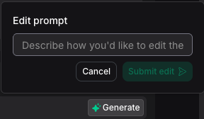
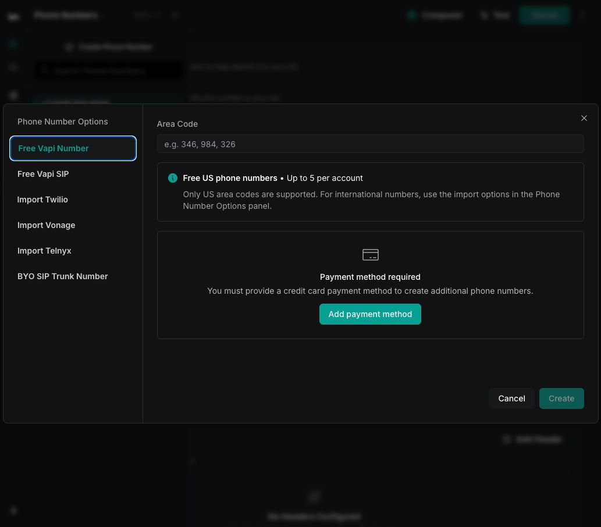
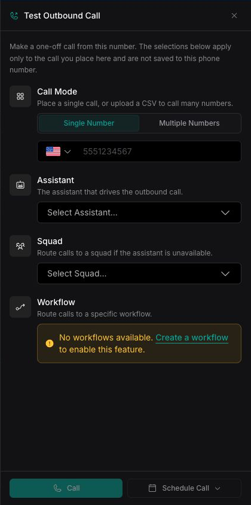

## Overview

Create a voice assistant, connect it to a free phone number, and call it. You can complete this quickstart in the Dashboard or with the Vapi API.

**In this quickstart, you'll:**

- Create and test an assistant
- Connect the assistant to a phone number
- Call your assistant on its new phone number
- Optionally, place an outbound call from an imported number

## Prerequisites

- [A Vapi account](https://dashboard.vapi.ai)
- For cURL or SDK requests, a [Vapi API key](/security-and-privacy/api-keys)

## 1. Create an assistant

Start from a blank assistant or from a template. A template includes a first message and a system prompt written for a common use case, so you can test a working conversation right away and edit it to fit your business.

| Template | Assistant | Use it to | Model preset |
|---|---|---|---|
| **Customer Support** | Alex | Resolve product issues and answer customer questions | Balanced |
| **Lead Qualification** | Morgan | Qualify prospects and connect them with sales | High Intelligence |
| **Appointment Scheduler** | Riley | Book, confirm, reschedule, or cancel appointments | Ultra Fast |
| **Info Collector** | Jamie | Gather accurate, complete information from customers | Balanced |

<Note>
A blank assistant uses the [Balanced preset](/assistants/model-intelligence/presets#balanced) for its transcriber, model, and voice. A template uses the preset that best fits its use case. You can [change the preset](/assistants/model-intelligence/presets#apply-a-model-preset) at any time.
</Note>

<Tabs>
  <Tab title="Dashboard">
    <Steps>
      <Step title="Open Assistants">
        Open the [Dashboard](https://dashboard.vapi.ai) and select **Assistants**.
      </Step>

      <Step title="Create an assistant">
        To start from a template, select the down arrow next to **Create Assistant**, then choose a template from the table above. To start from scratch, select **Create Assistant** to create a blank assistant.
      </Step>

      <Step title="Configure a blank assistant">
        If you started from a template, skip this step. The template already includes a first message, a system prompt, and a model preset.

        For a blank assistant:

        1. **Choose a model preset.** Under **Model Presets**, choose the preset that sets the transcriber (speech-to-text), model (LLM), and voice (text-to-speech) for your goal. Blank assistants use **Balanced**. See [Model Presets](/assistants/model-intelligence/presets) to compare them.
        2. **Write the conversation.** Add a **First Message** and a **System Prompt**. The first message is what the assistant says when the call starts. The system prompt tells it who it is and how to behave. Start with these examples, then adapt them for your use case. For more on writing system prompts, see the [prompting guide](/prompting-guide).

        **First message**

        ```txt title="First message" wordWrap
        Hello! Thanks for calling. How can I help you today?
        ```

        **System prompt**

        ```txt title="System prompt" wordWrap
        [Identity]
        You are Sam, a friendly phone support assistant. Your tone is warm, patient, and professional.

        [Response guidelines]
        - Keep responses under 30 words.
        - Ask one question at a time.
        - Speak in plain language. Don't use lists, symbols, or formatting.

        [Guardrails]
        - Don't make up information. If you don't know an answer, say so.
        - Stay on topic. Politely steer unrelated questions back to how you can help.

        [Workflow]
        1. Greet the caller and ask how you can help.
        2. Ask clarifying questions until you understand the request.
        3. Answer the question or explain the next step.
        4. Ask if there is anything else, then end the call politely.
        ```

        To edit the system prompt with AI, select **Generate** in the **System Prompt** section, describe the changes you want, then select **Submit edit**. Review the proposed edits, then select **Accept changes**.

        <Frame caption="Describe your changes, then select Submit edit.">
          
        </Frame>
      </Step>

      <Step title="Publish the assistant">
        Select **Publish**, review the changes, then select **Quick Publish**. Publishing creates a new [assistant version](/assistants/versioning/versioning-assistants).
      </Step>

      <Step title="Test the assistant">
        Select **Talk** to start a web call. When prompted, allow the Dashboard to use your microphone.
      </Step>
    </Steps>
  </Tab>

  <Tab title="cURL">
    <Steps>
      <Step title="Set your API key">
        Export your Vapi API key as an environment variable.

        ```bash
        export VAPI_API_KEY="YOUR_VAPI_API_KEY"
        ```
      </Step>

      <Step title="Create the assistant">
        ```bash
        curl --request POST \
          --url https://api.vapi.ai/assistant \
          --header "Authorization: Bearer $VAPI_API_KEY" \
          --header "Content-Type: application/json" \
          --data '{
            "name": "Support Assistant",
            "firstMessage": "Hello! How can I help you today?",
            "model": {
              "provider": "openai",
              "model": "gpt-4o",
              "messages": [
                {
                  "role": "system",
                  "content": "You are a friendly phone support assistant. Greet the caller and offer help. Keep responses under 30 words. If a transfer is requested, confirm the reason first."
                }
              ]
            }
          }'
        ```

        Copy the `id` from the response. You will use it as `YOUR_ASSISTANT_ID` in the next steps.
      </Step>
    </Steps>
  </Tab>

  <Tab title="TypeScript (Server SDK)">
    ```typescript
    import { VapiClient } from "@vapi-ai/server-sdk";

    const vapi = new VapiClient({ token: process.env.VAPI_API_KEY! });

    const assistant = await vapi.assistants.create({
      name: "Support Assistant",
      firstMessage: "Hello! How can I help you today?",
      model: {
        provider: "openai",
        model: "gpt-4o",
        messages: [
          {
            role: "system",
            content: "You are a friendly phone support assistant. Greet the caller and offer help. Keep responses under 30 words. If a transfer is requested, confirm the reason first."
          }
        ]
      }
    });
    ```
  </Tab>
</Tabs>

## 2. Connect a phone number

<Tabs>
  <Tab title="Dashboard">
    <Steps>
      <Step title="Open Phone Numbers">
        Open the [Dashboard](https://dashboard.vapi.ai) and select **Phone Numbers**.
      </Step>

      <Step title="Choose a phone number option">
        Select **Create Phone Number**, then choose **Free Vapi Number**. To use a number from another provider, choose the corresponding import option instead.

        <Frame caption="Choose a phone number option and enter a US area code.">
          
        </Frame>
      </Step>

      <Step title="Create the phone number">
        Enter a three-digit US area code in **Area Code**, then select **Create**.

        Your first free Vapi number doesn't require a payment method. You may be asked to add one when you request more numbers. It can take a few minutes for the number to become active.

        <Note>
          With free Vapi numbers, only inbound calls are supported. To make outbound calls, import a number from [Twilio](/phone-numbers/import-twilio), [Telnyx](/telnyx), or [DIDWW](/phone-numbers/didww). See [Free Vapi numbers](/free-telephony) for details, and [Pricing and Success Packages](/billing/pricing-and-success-packages#whats-included) for how many numbers your package includes.
        </Note>
      </Step>

      <Step title="Connect the assistant">
        Open the phone number. Under **Inbound Settings**, choose the assistant you created in **Assistant**, then select **Save**.
      </Step>
    </Steps>
  </Tab>

  <Tab title="cURL">
    <Steps>
      <Step title="Create and connect a phone number">
        Replace `YOUR_ASSISTANT_ID` with the assistant ID returned in the previous section.

        ```bash
        curl --request POST \
          --url https://api.vapi.ai/phone-number \
          --header "Authorization: Bearer $VAPI_API_KEY" \
          --header "Content-Type: application/json" \
          --data '{
            "provider": "vapi",
            "numberDesiredAreaCode": "415",
            "assistantId": "YOUR_ASSISTANT_ID"
          }'
        ```

        Copy the `id` from the response to manage the phone number later.
      </Step>
    </Steps>
  </Tab>

  <Tab title="TypeScript (Server SDK)">
    ```typescript
    const phoneNumber = await vapi.phoneNumbers.create({
      provider: "vapi",
      numberDesiredAreaCode: "415",
      assistantId: assistant.id
    });
    ```
  </Tab>
</Tabs>

## 3. Call your assistant

Call the phone number you created from your own phone. Your assistant answers with its first message. A new number can take a few minutes to become active.

Have a short conversation to see how your assistant responds:

- Ask a question your assistant is built to handle.
- Interrupt it while it's speaking to check that it stops and listens.
- Ask something off-topic to see how it steers the conversation back.
- Say goodbye and hang up.

After the call, open [**Logs → Calls**](/observability/logs/call-logs) in the Dashboard to review the transcript, recording, and how the call ended.

## 4. Place an outbound call (optional)

<Note>
With free Vapi numbers, only inbound calls are supported. To make outbound calls, import a number from [Twilio](/phone-numbers/import-twilio), [Telnyx](/telnyx), or [DIDWW](/phone-numbers/didww). See [Free Vapi numbers](/free-telephony) for details.
</Note>

<Tabs>
  <Tab title="Dashboard">
    <Steps>
      <Step title="Open the phone number">
        Open the [Dashboard](https://dashboard.vapi.ai), select **Phone Numbers**, then select the imported phone number that will place the call.
      </Step>

      <Step title="Open the test panel">
        Select **Test**.
      </Step>

      <Step title="Configure the call">
        Choose **Single Number**, enter the destination phone number, and choose your assistant in **Assistant**.
      </Step>

      <Step title="Place the call">
        Select **Call** to start the call immediately, or select **Schedule Call** to place it later.
      </Step>
    </Steps>

    <Frame caption="Configure and place an outbound call.">
      
    </Frame>
  </Tab>

  <Tab title="cURL">
    ```bash
    curl --request POST \
      --url https://api.vapi.ai/call \
      --header "Authorization: Bearer $VAPI_API_KEY" \
      --header "Content-Type: application/json" \
      --data '{
        "phoneNumberId": "YOUR_IMPORTED_PHONE_NUMBER_ID",
        "assistantId": "YOUR_ASSISTANT_ID",
        "customer": {
          "number": "+15551234567"
        }
      }'
    ```
  </Tab>

  <Tab title="TypeScript (Server SDK)">
    ```typescript
    await vapi.calls.create({
      phoneNumberId: "YOUR_IMPORTED_PHONE_NUMBER_ID",
      assistantId: assistant.id,
      customer: { number: "+15551234567" }
    });
    ```
  </Tab>
</Tabs>

## Next steps

- **Build with an AI coding assistant:** The [create-assistant skill](/agent-skills#create-assistant) helps you design, create, and validate an assistant through the API.
- **Add tools**: [Function tools](/tools/custom-tools)
- **Tune speech**: [Speech configuration](/customization/speech-configuration)
- **Use a preset**: [Model Intelligence presets](/assistants/model-intelligence/presets) bundle a transcriber, model, and voice for common use cases.
- **Structure data**: [Structured outputs](/assistants/structured-outputs)
- **Move to multi-assistant**: [Squads](/squads)
