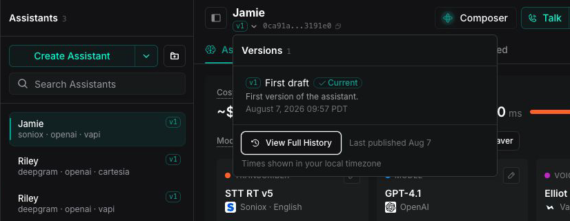
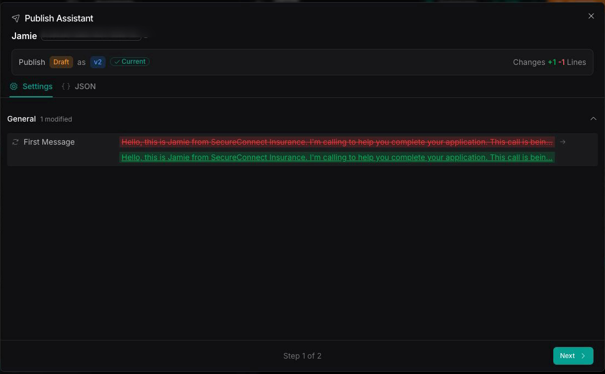
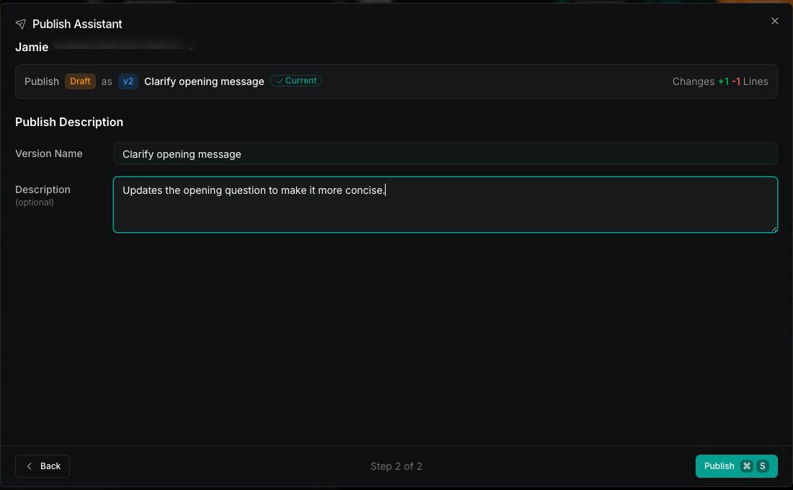
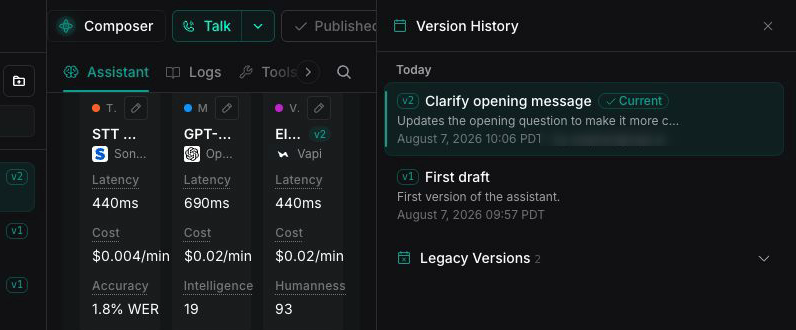
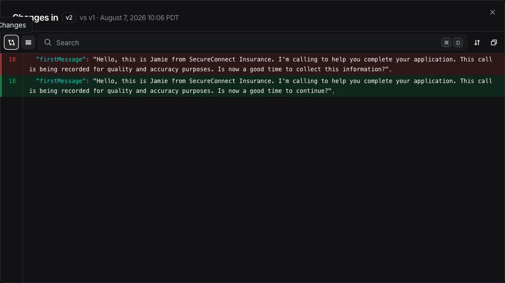
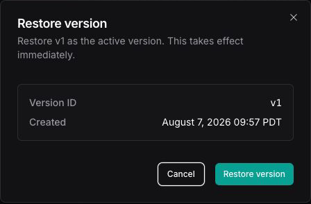

## How assistant versioning works

[Assistants](/assistants) follow the [versioning lifecycle](/assistants/versioning). Edit the draft, then publish it to create a version. Published versions do not change. To reuse an earlier configuration, restore it. Vapi immediately creates a new version from that configuration and makes it current.

The assistant list and header show the selected version. A draft appears separately when the assistant has unpublished changes.

<Frame caption="Open the version menu from the assistant header to see the current published version.">
  
</Frame>

## Publish a new version

Publishing turns your current draft into a new version and makes it the **current** version.

<Steps>
  <Step title="Edit your draft">
    Make changes to the assistant. Vapi saves your edits automatically as a draft. The changes do not affect live calls.
  </Step>
  <Step title="Review the changes">
    Select **Publish** to compare the draft with the current published version. In the diff, you can copy individual lines, wrap long lines, move between changes, or copy the complete diff.

    <Frame caption="Review the draft changes before publishing a new assistant version.">
      
    </Frame>
  </Step>
  <Step title="Name and describe the version">
    Give the version a name. You can also add a short description so teammates understand what changed and why.

    <Frame caption="Add a descriptive name and optional description for the version.">
      
    </Frame>
  </Step>
  <Step title="Publish">
    Select **Publish** to create the version and make it current. To publish with the default settings, select **Quick Publish**. To remove the draft changes, select **Discard Changes…**.
  </Step>
</Steps>

## View version history

Open the version menu in the assistant header to see recent versions. Select **View Full History** to see all versions. The current published version is marked **Current**. Each version includes its version number, name, description, and publication time.

<Frame caption="View the assistant's published versions in the version history.">
  
</Frame>

From the version history, you can:

- Select **View changes** to compare a version with the previous version
- Select **Export** to download a version as JSON
- Select **Restore** to make an earlier configuration current as a new version

<Frame caption="Review the changes between two published assistant versions.">
  
</Frame>

## Restore a previous version

Open the version history and select **Restore** for an earlier version. Review the confirmation, then select **Restore version**. Vapi immediately creates a new version from the selected configuration and makes the new version current. For example, restoring v1 while v2 is current creates v3 with the v1 configuration.

<Frame caption="Confirm the version you want to restore and make active.">
  
</Frame>

<Warning>
Restoring a version takes effect immediately and replaces any current draft changes.
</Warning>

The new version includes the tool version selections saved with the restored assistant version. A tool set to **Latest** continues to use its newest published version. See [How versioning works with assistants and tools](/assistants/versioning/versioning-with-assistants-and-tools).

## Which version a call uses

- **Inbound calls** use the assistant's current published version. You cannot select another version for an inbound call.
- **Outbound and web calls** use the current published version by default. To use a specific published version, pass `assistantVersion` with `assistantId` in the [create call request](/api-reference/calls/create).

## Next steps

<CardGroup cols={2}>
  <Card title="Versioning overview" icon="clock-rotate-left" href="/assistants/versioning">
    Save, publish, and restore versions of your assistants and tools.
  </Card>
  <Card title="How versioning works with assistants and tools" icon="link" href="/assistants/versioning/versioning-with-assistants-and-tools">
    Choose the tool versions an assistant uses and learn how restoring an assistant affects them.
  </Card>
</CardGroup>
