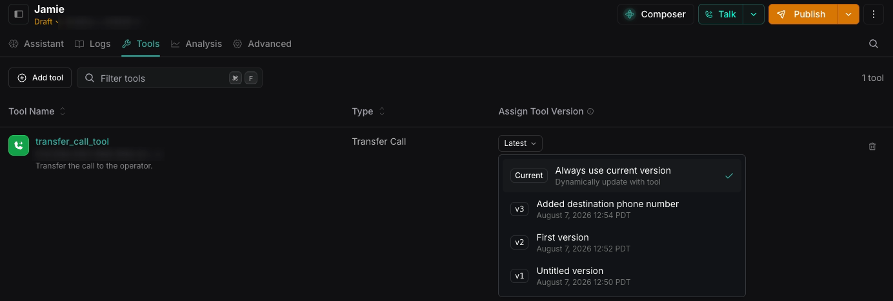

## How version pinning works

Assistants and tools are [versioned independently](/assistants/versioning), but an assistant configuration records which version of each tool to use. You can select a numbered version or **Current**, which appears as **Latest** when the menu is closed. When you publish the assistant, Vapi saves those selections in the assistant version.

## Choose a tool version in the Dashboard

<Steps>
  <Step title="Open the assistant">
    Open the [Dashboard](https://dashboard.vapi.ai), select **Assistants**, and select the assistant that uses the tool.
  </Step>
  <Step title="Open the Tools tab">
    Select **Tools**.
  </Step>
  <Step title="Choose the tool version">
    Under **Assign Tool Version**, open the version menu for the tool. Choose one of these options:

    - **Current**: Always use the tool's current version. The closed menu displays **Latest**.
    - **Numbered version**: Pin the assistant to a specific version, such as **v3**. The assistant stays on that version until you change the selection and publish the assistant again.

    <Frame caption="Choose the current tool version or pin the assistant to a numbered version.">
      
    </Frame>
  </Step>
  <Step title="Publish the assistant">
    Select **Publish** and complete the publish flow to save the tool version selection in a new assistant version.
  </Step>
</Steps>

## Use the latest tool version through the API

When you [create](/api-reference/assistants/create) or [update](/api-reference/assistants/update) an assistant through the API, omit the tool version to use **Latest**. The assistant then uses the newest published version of that tool.

## How restoring an assistant affects tools

When you restore an assistant version, Vapi immediately creates a new current assistant version with its saved tool version selections. A specific tool version returns to the saved selection. A tool set to **Latest** continues to use its newest published version.

For example:

- At **v6**, the assistant uses **Tool A v4** and **Tool B v6**.
- The assistant's **v5** configuration used **Tool A v2** and **Tool B v4**.
- You restore assistant **v5**. Vapi creates assistant **v7**, makes it current, and restores the selections for Tool A v2 and Tool B v4.
- If Tool B was set to **Latest** in assistant v5, it continues to use the newest published Tool B version.

## Next steps

<CardGroup cols={2}>
  <Card title="Versioning overview" icon="clock-rotate-left" href="/assistants/versioning">
    Save, publish, and restore versions of your assistants and tools.
  </Card>
  <Card title="Versioning with assistants" icon="robot" href="/assistants/versioning/versioning-assistants">
    Publish, view history, and restore versions of an assistant.
  </Card>
  <Card title="Versioning with tools" icon="screwdriver-wrench" href="/assistants/versioning/versioning-tools">
    Publish, view history, and restore versions of a tool.
  </Card>
</CardGroup>
