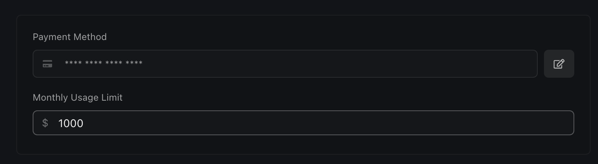

You can set billing limits in the billing section of your dashboard.

<Note>
  You can access your billing settings at
  [dashboard.vapi.ai/org/billing](https://dashboard.vapi.ai/org/billing) 
</Note>

### Concurrency Limits
Vapi has concurrency limits on inbound and outbound calls. These limits has maximum number of simultaneous calls your account can handle concurrently. Exceeding your concurrency limit causes new requests to queue or be rejected until existing calls finish.

- The default concurrency limit is 10 simultaneous calls(inbound and outbound calls combined). This limit applies to your entire account and is not dependent on the number of users or organizations associated with it.

- To increase your concurrency limit beyond the default of 10, you must purchase additional concurrent lines through the dashboard section.

### Setting a Monthly Billing Limit

In your billing settings you can set a monthly billing limit:

<Frame>
  
</Frame>

### Exceeding Billing Limits

Once you have used all of your starter credits, or exceeded your set monthly usage limit, you will start seeing errors in your dashboard & via the API mentioning `Billing Limits Exceeded`.

<Frame caption="Once you have gone over on your monthly billing limits, the API & dashboard will throw billing-related errors.">
  
</Frame>
