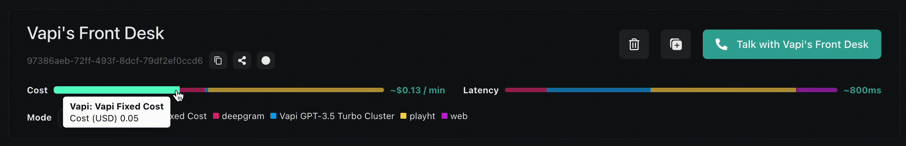

Since there are so many moving parts to the voice pipeline that can incur cost, it would be ideal for us to get a good estimate of our final projected per-minute cost for calls.

### Dashboard Cost Estimates

The Vapi dashboard provides static cost projections on a per-assistant basis, so you can get a rough idea of the costs your assistant will incur during live execution.

<Tip>
  You can view your dashboard at [dashboard.vapi.ai](https://dashboard.vapi.ai/)
  & get started with our [dashboard quickstart](/quickstart/dashboard).
</Tip>

<Frame caption="Vapi-computed per-minute cost projection, as well as latency projection.">
  
</Frame>

### General Provider Estimates

The provider costs listed below are subject to change as we get more data, but they will always reflect our best estimate of the provider costs per minute:

<AccordionGroup>
  <Accordion
    title="Transcription Provider Estimates"
    icon="microphone"
    iconType="solid"
    defaultOpen={true}
  >
    | Provider |   \$/min (≈)   |  \$/hour  |
    | -------- | -------------- | --------- |
    | Deepgram | **\$0.01/min** | \$0.60/hr |
  </Accordion>
  <Accordion title="Model Provider Estimates" icon="microchip" iconType="solid" defaultOpen={true}>
    | Provider                | $/min (≈)       | $/hour        |
    | ----------------------- | --------------- | ------------- |
    | OpenAI (gpt-4-turbo)    | **$0.20/min**   | $12.00/hr     |
    | OpenAI (gpt-3.5-turbo)  | **$0.02/min**   | $1.20/hr      |

  </Accordion>
  <Accordion title="Voice Provider Estimates" icon="person" iconType="solid" defaultOpen={true}>
    | Provider   | $/min (≈)       | $/hour     |
    | ---------- | --------------- | ---------- |
    | ElevenLabs | **$0.04/min**   | $2.40/hr   |
    | PlayHT     | **$0.07/min**   | $4.20/hr   |
    | Deepgram   | **$0.02/min**   | $1.20/hr   |
    | OpenAI     | **$0.02/min**   | $1.20/hr   |
    | RimeAI     | **$0.03/min**   | $1.80/hr   |
    | Azure      | **$0.02/min**   | $1.20/hr   |
    | Neets      | **$0.005/min**  | $0.30/hr   |
    | LMNT       | **$0.03/min**   | $1.80/hr   |

  </Accordion>
  <Accordion
    title="Telephony Provider Estimates"
    icon="phone-arrow-up-right"
    iconType="solid"
    defaultOpen={true}
  >
    | Provider | $/min (≈)       | $/hour     |
    | -------- | --------------- | ---------- |
    | Twilio   | **$0.01/min**   | $0.60/hr   |
    | Vonage   | **$0.01/min**   | $0.60/hr   |

  </Accordion>
</AccordionGroup>

### Provider Pricings

Here are direct links to different provider's pricing pages to assist in estimating cost:

<AccordionGroup>
  <Accordion
    title="Transcription Providers"
    icon="microphone"
    iconType="solid"
    defaultOpen={true}
  >
    <CardGroup cols={2}>
      <Card
        title="Deepgram"
        href="https://deepgram.com/pricing"
        icon="arrow-up-right-from-square"
              >
        Deepgram transcription pricing.
      </Card>
    </CardGroup>
  </Accordion>
  <Accordion
    title="Model Providers"
    icon="microchip"
    iconType="solid"
    defaultOpen={true}
  >
    <CardGroup cols={2}>
      <Card
        title="OpenAI"
        href="https://openai.com/pricing"
        icon="arrow-up-right-from-square"
              >
        OpenAI model pricing.
      </Card>
    </CardGroup>
  </Accordion>
  <Accordion
    title="Voice Providers"
    icon="person"
    iconType="solid"
    defaultOpen={true}
  >
    <CardGroup cols={3}>
      <Card
        title="ElevenLabs"
        href="https://elevenlabs.io/pricing"
        icon="arrow-up-right-from-square"
              >
        ElevenLabs voice pricing.
      </Card>
      <Card
        title="PlayHT"
        href="https://play.ht/pricing"
        icon="arrow-up-right-from-square"
              >
        PlayHT voice pricing.
      </Card>
      <Card
        title="Deepgram"
        href="https://deepgram.com/pricing"
        icon="arrow-up-right-from-square"
              >
        Deepgram voice pricing.
      </Card>
      <Card
        title="OpenAI"
        href="https://openai.com/pricing"
        icon="arrow-up-right-from-square"
              >
        OpenAI voice pricing.
      </Card>
      <Card
        title="RimeAI"
        href="https://rime.ai/pricing"
        icon="arrow-up-right-from-square"
              >
        RimeAI voice pricing.
      </Card>
      <Card
        title="Azure"
        href="https://azure.microsoft.com/en-us/pricing/details/cognitive-services/speech-services"
        icon="arrow-up-right-from-square"
              >
        Azure voice pricing.
      </Card>
      <Card
        title="Neets"
        href="https://neets.ai/#pricing"
        icon="arrow-up-right-from-square"
              >
        Neets voice pricing.
      </Card>
      <Card
        title="LMNT"
        href="https://app.lmnt.com/pricing"
        icon="arrow-up-right-from-square"
              >
        LMNT voice pricing.
      </Card>
    </CardGroup>
  </Accordion>
  <Accordion
    title="Telephony Providers"
    icon="phone-arrow-up-right"
    iconType="solid"
    defaultOpen={true}
  >
    <CardGroup cols={2}>
      <Card
        title="Twilio"
        href="https://www.twilio.com/en-us/voice/pricing"
        icon="arrow-up-right-from-square"
              >
        Twilio phone call pricing.
      </Card>
      <Card
        title="Vonage"
        href="https://www.vonage.com/communications-apis/voice/pricing"
        icon="arrow-up-right-from-square"
              >
        Vonage phone call pricing.
      </Card>
    </CardGroup>
  </Accordion>
</AccordionGroup>

### Calling Your Assistant

One good way to get an empirical per-minute cost on your whole voice pipeline is to actually call in, use it for a few minutes, & observe the average cost/minute at the call level.

<Note>
  You can view a breakdown of your cost per call in your dashboard at
  [dashboard.vapi.ai/calls](https://dashboard.vapi.ai/calls)
</Note>

Your call cost breakdowns will look something like this:

<Frame caption="Cost breakdown for a call viewed in the Vapi web dashboard.">
  
</Frame>

Here is what each line item corresponds to:

- `STT`: Speech-to-text (providers often bill per-minute, prorated)
- `LLM`: LLM inference (providers often bill per-million or per-thousand tokens)
- `TTS`: Text-to-speech (providers often bill per-character)
- `Vapi`: the Vapi platform fee of 5¢/minute (prorated per-second)
- `Transport`: telephony costs (incurred for inbound/outbound phone calls to/from a phone number) (providers often bill per-minute)

This method can be effective because **per-minute costs will not scale** with the amount of call minutes you consume. The cost for the 1st minute will be the same as the 10,000th minute.

<Tip>
  Volume pricing is available on enterprise plans. Check out
  [enterprise](/enterprise) to learn more.
</Tip>
