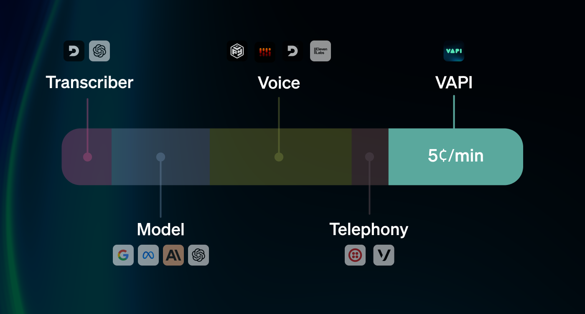
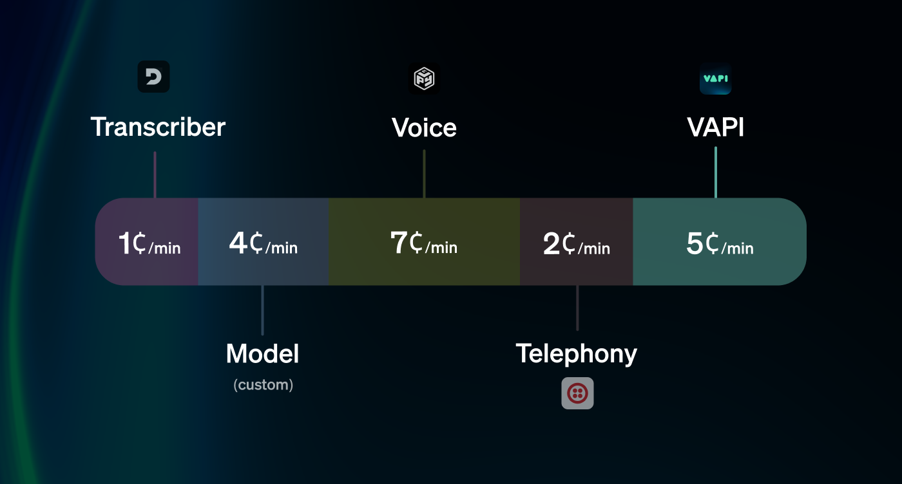
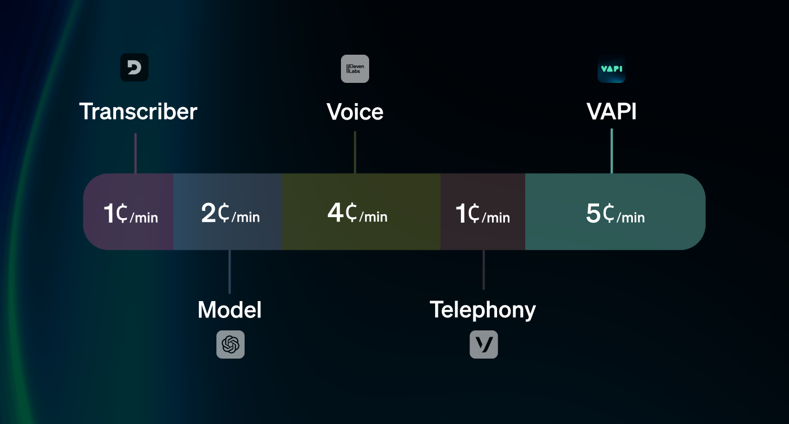
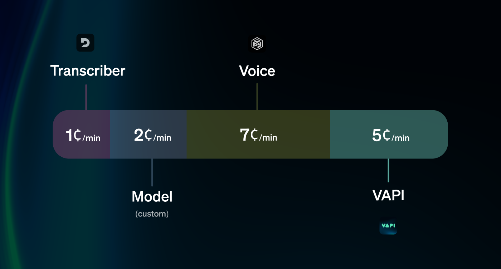

<Frame>
  
</Frame>

## Case Examples

Here are a few case-examples of what billing would look like on Vapi for different voice pipeline configurations.

<AccordionGroup>
  <Accordion title="Call Center (Inbound Phone)" icon="phone-arrow-down-left" iconType="solid" defaultOpen={true}>
    A customer is looking to use Vapi to assist their call center staff taking phone calls inbound:

    <Steps>
      <Step title="Scenario">
        

          "I want to use Vapi voice assistants to support my human customer service reps in a call
          center. However, I have a custom LLM I would prefer to use instead of the ones offered through
          the platform.
        

        

          Expected monthly usage will be 10,000 calls, with an average of 2 minutes per call. For Voice,
          PlayHT will suit our needs.
        

        
What is my pricing breakdown?"

      </Step>
      <Step title="Providers">
        The providers used will determine per-minute cost. The following providers will be involved:

        
**Transcriber:** Deepgram

        
**Model:** custom model

        
**Voice:** PlayHT

        
**Telephony:** Twilio (receiving inbound phone calls)

         
        <Frame caption="The customer will be using a custom model & taking inbound phone calls.">
          
        </Frame>
         

      </Step>
      <Step title="Cost Breakdown">
        We will break down the costs of each piece of the voice pipeline, then later multiply by call volume:

        
**Deepgram:** ≈ \$0.01/min

        
**Custom Model:** ≈ \$0.04/min (vague assumption, can vary widely)

        
**PlayHT:** ≈ \$0.07/min

        
**Twilio:** ≈ \$0.02/min (inbound, toll-free) (see Twilio [phone call pricing](https://www.twilio.com/en-us/voice/pricing))

        
**Vapi:** \$0.05/min

        <Tip>Our [estimating costs](/billing/estimating-costs) guide can help you determine these values.</Tip>

      </Step>
      <Step title="Final Estimate">
        Call Minutes / Month: 10,000 calls x 2 min/call = **20,000 call minutes**

        
**Transcription:** \$0.01/min x 20,000 = **\$200**

        
**Custom Model:** \$0.04/min x 20,000 = **\$800**

        
**Voice:** ≈ \$0.07/min x 20,000 = **\$1,400**

        
**Telephony:** ≈ \$0.02/min x 20,000 = **\$400**

        
**Vapi:** \$0.05/min x 20,000 = **\$1,000**

        **Total**: **\$3,800**/mo

      </Step>
    </Steps>

  </Accordion>
  <Accordion title="Real Estate Lead Generation (Outbound Phone)" icon="phone-arrow-up-right" iconType="solid">
    A customer doing real estate lead generation is looking to use Vapi to automate parts of their sales calling operation:

    <Steps>
      <Step title="Scenario">
        "I have a company that does real estate lead generation, and would like to use Vapi voice
        assistants to automate parts of my sales process.

        Calls would average ~4 minutes, for Model I want to use GPT-3.5-turbo through your platform, and for Voice I will be using a ElevenLabs.

        I’d like a breakdown based on sending 1,000 outbound calls in one month."

      </Step>
      <Step title="Providers">
        
**Transcriber:** Deepgram

        
**Model:** OpenAI (GPT-3.5 Turbo)

        
**Voice:** ElevenLabs

        
**Telephony:** Vonage (sending outbound phone calls)

         
        <Frame caption="The customer will be using GPT-4 & making outbound phone calls.">
          
        </Frame>
         

      </Step>
      <Step title="Cost Breakdown">
        
**Deepgram:** ≈ \$0.01/min

        
**OpenAI (GPT-3.5 Turbo):** ≈ \$0.02/min

        
**ElevenLabs:** ≈ \$0.04/min

        
**Vonage:** ≈ \$0.01/min (outbound call) (see Vonage's [phone call pricing](https://www.vonage.com/communications-apis/voice/pricing))

        
**Vapi:** \$0.05/min

        <Tip>Our [estimating costs](/billing/estimating-costs) guide can help you determine these values.</Tip>

      </Step>
      <Step title="Final Estimate">
        Call Minutes / Month: 1,000 calls x 4 min/call = **4,000 call minutes**

        
**Transcription:** \$0.01/min x 4,000 = **\$40**

        
**Model:** \$0.02/min x 4,000 = **\$80**

        
**Voice:** ≈ \$0.04/min x 4,000 = **\$160**

        
**Telephony:** ≈ \$0.01/min x 4,000 = **\$40**

        
**Vapi:** \$0.05/min x 4,000 = **\$200**

        **Total**: **\$520**/mo

      </Step>
    </Steps>

  </Accordion>
  <Accordion title="Mock Intervieweing Application (Web)" icon="browser" iconType="solid">
    A web engineer is looking to develop a website that helps job candidates practice for job interviews. They are looking to use Vapi for their virtual interviewers:

    <Steps>
      <Step title="Scenario">
        "Hi, I'm looking to develop a web application for mock interviews. Users will be able to practice for a variety
        of job interviews with AI interviewers.

        Interviews will be 30-minutes each (at max), for model I'll be using a custom open-source model hosted with Baseten & for voice I'll be using PlayHT.

        How much would this cost me each month if I service 1,000 interviews per month?"

      </Step>
      <Step title="Providers">
        
**Transcriber:** Deepgram

        
**Model:** custom model

        
**Voice:** PlayHT

         
        <Frame caption="The customer will be using a custom model & making web calls (no telephony will be involved).">
          
        </Frame>
         

      </Step>
      <Step title="Cost Breakdown">
        
**Deepgram:** ≈ \$0.01/min

        
**Custom Model:** ≈ \$0.02/min (vague assumption, can vary widely)

        
**PlayHT:** ≈ \$0.07/min

        
**Vapi:** \$0.05/min

        <Tip>Our [estimating costs](/billing/estimating-costs) guide can help you determine these values.</Tip>

      </Step>
      <Step title="Final Estimate">
        Call Minutes / Month: 1,000 calls x 30 min/call = **30,000 call minutes**

        
**Transcription:** \$0.01/min x 30,000 = **\$300**

        
**Model:** \$0.02/min x 30,000 = **\$600**

        
**Voice:** ≈ \$0.07/min x 30,000 = **\$2,100**

        
**Vapi:** \$0.05/min x 30,000 = **\$1,500**

        **Total**: **\$4,500**/mo

      </Step>
    </Steps>

  </Accordion>
</AccordionGroup>

### Further Reading

<CardGroup cols={2}>
  <Card title="Provider Costs" icon="route" iconType="solid" href="/billing/cost-routing">
    Learn more about where provider costs end up getting billed.
  </Card>
  <Card title="Estimating Costs" icon="equals" iconType="solid" href="/billing/estimating-costs">
    Learn more about determining per-minute costs for providers.
  </Card>
</CardGroup>
