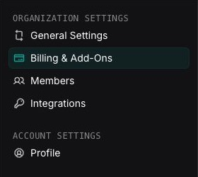
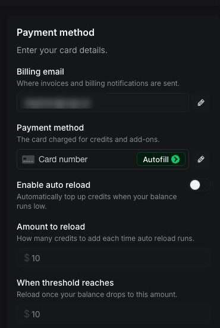
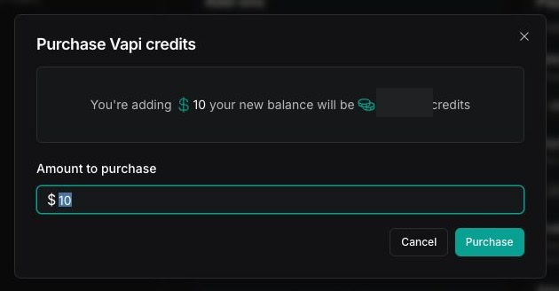
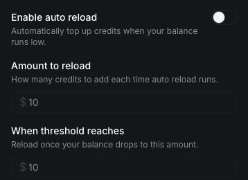

This guide shows you how to set up billing for a pay-as-you-go subscription. By the end, you can fund the subscription and configure automatic credit purchases.

## Prerequisites

- An **Admin** role in the organization.

## Steps

<Steps>
  <Step title="Open the Billing page">
    Sign in to the [Vapi Dashboard](https://dashboard.vapi.ai), select the organization you want to fund, open **Settings**, then select **Billing & Add-Ons**.

    <Frame>
      
    </Frame>
  </Step>

  <Step title="Add a payment method">
    In **Payment method**, enter the billing email and card details. Select the checkmark beside each field to save it.

    To replace a saved card, select the pencil beside **Payment method**, enter the new card details, then select the checkmark.

    <Frame caption="Billing email blurred for privacy.">
      
    </Frame>
  </Step>

  <Step title="Buy credits">
    At the top of the Billing page, select **Buy credits**. In **Purchase Vapi credits**, enter at least `$10` in **Amount to purchase**, then select **Purchase**.

    Complete any verification requested by the card issuer. A successful purchase increases the credit balance and appears as **Finalized** in **Credit purchase history**.

    <Frame caption="Current balance redacted for privacy.">
      
    </Frame>
  </Step>

  <Step title="Optional: Configure auto reload">
    In **Payment method**, turn on **Enable auto reload**. Enter at least `$10` in **Amount to reload**, then enter the balance that should trigger the purchase in **When threshold reaches**.

    Select **Save changes**, review the confirmation, then select **Confirm**. If the current balance is at or below the threshold, saving the plan charges the payment method immediately.

    <Frame>
      
    </Frame>
  </Step>

  <Step title="Verify the billing setup">
    Confirm that the page shows the saved payment method, updated credit balance, and auto reload settings. Check **Credit purchase history** for a **Finalized** payment.
  </Step>
</Steps>

## Download billing records

Select **Download monthly statement** in **Credit purchase history** to create a statement for a selected month.

To download an invoice for an eligible payment, select the payment, then select **Download invoice (PDF)**. Enter the requested invoice information and select **Confirm**.

## Related

<Card title="Troubleshoot call errors" href="/calls/troubleshoot-call-errors">
  Resolve calls blocked by an insufficient credit balance or frozen subscription.
</Card>
