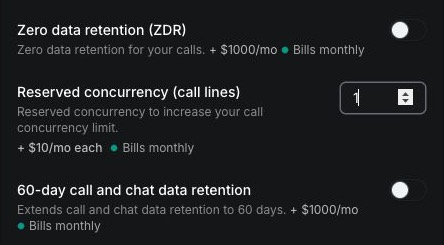

Purchase call concurrency when your organization needs to run more simultaneous calls than its plan includes.

## How call lines affect concurrency

Call concurrency is the number of Vapi calls that can be active at the same time. Each reserved call line adds one simultaneous call to your organization's included concurrency.

All inbound and outbound calls share the organization's capacity. A campaign's **Max concurrency** setting limits that campaign, but it does not purchase or reserve additional call lines.

## Prerequisites

- An **Admin** role in the organization.
- Enough Vapi credits to cover the prorated charge shown before purchase.

## Purchase call concurrency

<Steps>
  <Step title="Open Billing & Add-Ons">
    Sign in to the [Vapi Dashboard](https://dashboard.vapi.ai), select the organization you want to update, open **Settings**, then select **Billing & Add-Ons**.
  </Step>

  <Step title="Enter the reserved concurrency">
    In **Add-ons**, find **Reserved concurrency (call lines)**. Enter the total number of add-on call lines you want the organization to have.

    This value represents purchased call lines, not the organization's total concurrency. For example, if the plan includes 10 calls and you enter `5`, the organization has 15 call lines after the purchase.

    <Frame>
      
    </Frame>
  </Step>

  <Step title="Review the pricing preview">
    Review **Add-ons summary** and **Pricing preview**. The preview shows the new monthly charge and the prorated amount due for the remainder of the current billing period.
  </Step>

  <Step title="Confirm the purchase">
    Select **Purchase add-ons**, review the confirmation dialog, then select **Confirm**. The additional call lines become available after the purchase succeeds.
  </Step>

  <Step title="Verify the new capacity">
    Confirm that **Reserved concurrency (call lines)** shows the purchased amount. The organization's concurrency limit now includes those additional call lines.
  </Step>
</Steps>
