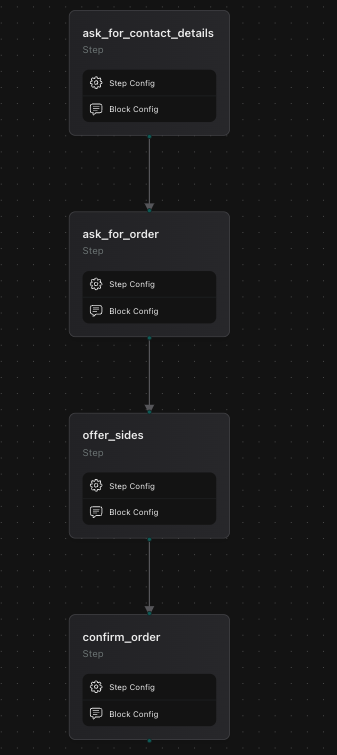

<Warning>
  **Blocks** is being deprecated in favor of [Workflows](/workflows). We recommend using Workflows for all new development as it provides a more powerful and flexible way to structure conversational AI. We're working on migration tools to help transition existing Blocks implementations to Workflows.
</Warning>

We're currently running a beta for [**Blocks**](/api-reference/blocks/create), an upcoming feature from [Vapi.ai](http://vapi.ai/) aimed at improving bot conversations. The problem we've noticed is that single LLM prompts are prone to hallucinations, unreliable tool calls, and can’t handle many-step complex instructions.

**By breaking the conversation into smaller, more manageable prompts**, we can guarantee the bot will do this, then that, or if this happens, then that happens. It’s like having a checklist for conversations — less room for error, more room for getting things right.


Here’s an example: For food ordering, this is what a prompt would look like.


<Accordion title="Without Blocks">
Example Prompt

```jsx
[Identity]
You are a friendly and efficient assistant for a food truck that serves burgers, fries, and drinks.

[Task]
1. Greet the customer warmly and inquire about their main order.
2. Offer suggestions for the main order if needed.
3. If they choose a burger, suggest upgrading to a combo with fries and a drink, offering clear options (e.g., regular or special fries, different drink choices).
4. Confirm the entire order to ensure accuracy.
5. Suggest any additional items like desserts or sauces.
6. Thank the customer and let them know when their order will be ready.
```

</Accordion>

<Accordion title="With Blocks">
  <Frame>
    
  </Frame>
</Accordion>


There are three core types of Blocks: [Conversation](https://api.vapi.ai/api#:~:text=ConversationBlock), [Tool-call](https://api.vapi.ai/api#:~:text=ToolCallBlock), and [Workflow](https://api.vapi.ai/api#:~:text=WorkflowBlock). Each type serves a different role in shaping how your assistant engages with users.


<Note>
  Blocks is currently in beta. We're excited to have you try this new feature and welcome your [feedback](https://discord.com/invite/pUFNcf2WmH) as we continue to refine and improve the experience.
</Note>

## Advanced Concepts

<CardGroup cols={2}>
  <Card title="Steps" icon="stairs" href="/blocks/steps">
    Learn how to structure the flow of your conversation
  </Card>
  <Card title="Block Types" icon="boxes-stacked" href="/blocks/block-types">
    Explore the different block types and how to use them
  </Card>
</CardGroup>