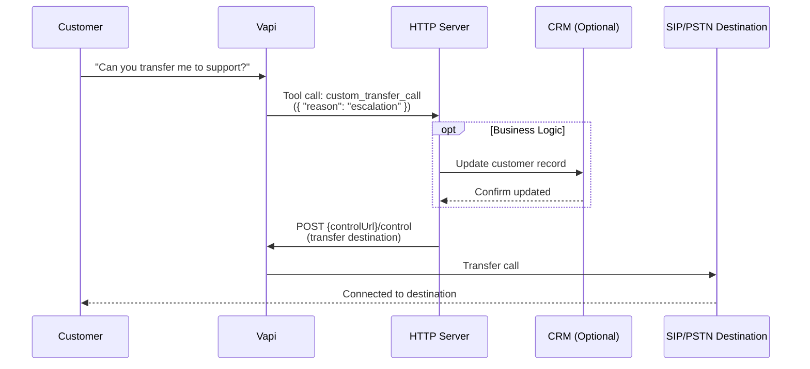

## Overview

Dynamic call transfers enable intelligent routing by determining transfer destinations in real-time based on conversation context, customer data, or external system information. Unlike static transfers with predefined destinations, dynamic transfers make routing decisions on-the-fly during the call.

**Key capabilities:**
* Real-time destination selection based on conversation analysis
* Integration with CRM systems, databases, and external APIs
* Conditional routing logic for departments, specialists, or geographic regions
* Context-aware transfers with conversation summaries
* Custom business logic execution before completing the transfer
* Programmatic transfer control via Vapi's Call Control API

## Prerequisites

* A [Vapi account](https://dashboard.vapi.ai/)
* A server or cloud function that can receive webhooks from Vapi
* (Optional) CRM system or customer database for enhanced routing logic

## How It Works

Dynamic transfers with live call control use a server-controlled pattern that gives you maximum flexibility:

1. **User initiates transfer**: The user requests a transfer in natural language during the conversation
2. **Vapi triggers custom tool**: Vapi fires your custom tool to your HTTP server
3. **Server receives control URL**: The tool payload includes `message.call.monitor.controlUrl` for live call control
4. **Execute business logic**: Your server performs any necessary operations:
   - Update CRM records with call summaries
   - Extract and store conversation data
   - Query databases for routing decisions
   - Enrich destination systems with context
5. **Complete transfer**: Your server makes a POST request to the `controlUrl` with the transfer destination
6. **Call connected**: Vapi transfers the call to the specified SIP or PSTN destination

Available context: Your server receives the full conversation transcript, custom parameters, call metadata, and the control URL, allowing you to make informed routing decisions and execute the transfer programmatically.

<Tip>
Parameters for custom tools are fully customizable. You can name and structure them however you like to guide routing (for example `department`, `reason`, `urgency`, `customerId`, etc.).
</Tip>

Sequence diagram



---

## Quick Implementation Guide

<Steps>
  <Step title="Create a custom tool for dynamic transfers">
    Create a custom tool that will receive the transfer request and provide you with the control URL to execute the transfer.

    <Tabs>
      <Tab title="Dashboard">
        - Navigate to **Tools** in your dashboard
        - Click **Create Tool** 
        - Select **Custom** as the tool type
        - Set function name: `transfer_call`
        - Add a description: "Transfer the call to the appropriate department or agent"
        - Define custom parameters based on your routing needs (e.g., `department`, `reason`, `urgency`, `customerId`)
        - Set your server URL to receive the tool call
      </Tab>
      <Tab title="TypeScript (Server SDK)">
        ```typescript
        import { VapiClient } from "@vapi-ai/server-sdk";

        const vapi = new VapiClient({ token: process.env.VAPI_API_KEY });

        const transferTool = await vapi.tools.create({
          type: "function",
          async: true,
          function: {
            name: "transfer_call",
            description: "Transfer the call to the appropriate department or agent based on customer needs",
            parameters: {
              type: "object",
              properties: {
                department: {
                  type: "string",
                  description: "Department to transfer to (e.g., 'support', 'sales', 'billing')"
                },
                reason: {
                  type: "string",
                  description: "Reason for the transfer"
                },
                urgency: {
                  type: "string",
                  enum: ["low", "medium", "high", "critical"],
                  description: "Urgency level of the transfer"
                }
              },
              required: ["department", "reason"]
            }
          },
          server: {
            url: "https://your-server.com/webhook"
          }
        });

        console.log(`Transfer tool created: ${transferTool.id}`);
        ```
      </Tab>
      <Tab title="Python (Server SDK)">
        ```python
        import requests
        import os

        def create_transfer_tool():
            url = "https://api.vapi.ai/tool"
            headers = {
                "Authorization": f"Bearer {os.getenv('VAPI_API_KEY')}",
                "Content-Type": "application/json"
            }

            tool_config = {
                "type": "function",
                "async": True,
                "function": {
                    "name": "transfer_call",
                    "description": "Transfer the call to the appropriate department or agent based on customer needs",
                    "parameters": {
                        "type": "object",
                        "properties": {
                            "department": {
                                "type": "string",
                                "description": "Department to transfer to (e.g., 'support', 'sales', 'billing')"
                            },
                            "reason": {
                                "type": "string",
                                "description": "Reason for the transfer"
                            },
                            "urgency": {
                                "type": "string",
                                "enum": ["low", "medium", "high", "critical"],
                                "description": "Urgency level of the transfer"
                            }
                        },
                        "required": ["department", "reason"]
                    }
                },
                "server": {
                    "url": "https://your-server.com/webhook"
                }
            }

            response = requests.post(url, headers=headers, json=tool_config)
            return response.json()

        tool = create_transfer_tool()
        print(f"Transfer tool created: {tool['id']}")
        ```
      </Tab>
      <Tab title="cURL">
        ```bash
        curl -X POST https://api.vapi.ai/tool \
             -H "Authorization: Bearer $VAPI_API_KEY" \
             -H "Content-Type: application/json" \
             -d '{
               "type": "function",
               "async": true,
               "function": {
                 "name": "transfer_call",
                 "description": "Transfer the call to the appropriate department or agent based on customer needs",
                 "parameters": {
                   "type": "object",
                   "properties": {
                     "department": {
                       "type": "string",
                       "description": "Department to transfer to (e.g., support, sales, billing)"
                     },
                     "reason": {
                       "type": "string",
                       "description": "Reason for the transfer"
                     },
                     "urgency": {
                       "type": "string",
                       "enum": ["low", "medium", "high", "critical"],
                       "description": "Urgency level of the transfer"
                     }
                   },
                   "required": ["department", "reason"]
                 }
               },
               "server": {
                 "url": "https://your-server.com/webhook"
               }
             }'
        ```
      </Tab>
    </Tabs>
  </Step>

  <Step title="Create an assistant with the transfer tool">
    <Tabs>
      <Tab title="Dashboard">
        - Navigate to **Assistants** 
        - Create a new assistant or edit an existing one
        - Add your custom transfer tool to the assistant
        - Configure the system prompt to guide when transfers should occur
      </Tab>
      <Tab title="TypeScript (Server SDK)">
        ```typescript
        const assistant = await vapi.assistants.create({
          name: "Dynamic Transfer Assistant", 
          firstMessage: "Hello! How can I help you today?",
          model: {
            provider: "openai",
            model: "gpt-4o",
            messages: [
              {
                role: "system",
                content: "You help customers and can transfer them to the appropriate department when needed. Use the transfer_call tool when a customer requests to speak with someone or when you determine their issue requires specialist assistance. Always gather the reason for transfer before initiating it."
              }
            ],
            toolIds: ["YOUR_TRANSFER_TOOL_ID"]
          },
          voice: {
            provider: "11labs", 
            voiceId: "burt"
          }
        });

        console.log(`Assistant created: ${assistant.id}`);
        ```
      </Tab>
      <Tab title="Python (Server SDK)">
        ```python
        def create_assistant_with_transfer(tool_id):
            url = "https://api.vapi.ai/assistant"
            headers = {
                "Authorization": f"Bearer {os.getenv('VAPI_API_KEY')}",
                "Content-Type": "application/json"
            }
            
            data = {
                "name": "Dynamic Transfer Assistant",
                "firstMessage": "Hello! How can I help you today?",
                "model": {
                    "provider": "openai",
                    "model": "gpt-4o", 
                    "messages": [{
                        "role": "system",
                        "content": "You help customers and can transfer them to the appropriate department when needed. Use the transfer_call tool when a customer requests to speak with someone or when you determine their issue requires specialist assistance. Always gather the reason for transfer before initiating it."
                    }],
                    "toolIds": [tool_id]
                },
                "voice": {"provider": "11labs", "voiceId": "burt"}
            }
            
            response = requests.post(url, headers=headers, json=data)
            return response.json()

        assistant = create_assistant_with_transfer("YOUR_TRANSFER_TOOL_ID")
        print(f"Assistant created: {assistant['id']}")
        ```
      </Tab>
      <Tab title="cURL">
        ```bash
        curl -X POST https://api.vapi.ai/assistant \
             -H "Authorization: Bearer $VAPI_API_KEY" \
             -H "Content-Type: application/json" \
             -d '{
               "name": "Dynamic Transfer Assistant",
               "firstMessage": "Hello! How can I help you today?",
               "model": {
                 "provider": "openai",
                 "model": "gpt-4o",
                 "messages": [{
                   "role": "system", 
                   "content": "You help customers and can transfer them to the appropriate department when needed. Use the transfer_call tool when a customer requests to speak with someone or when you determine their issue requires specialist assistance."
                 }],
                 "toolIds": ["YOUR_TRANSFER_TOOL_ID"]
               },
               "voice": {"provider": "11labs", "voiceId": "burt"}
             }'
        ```
      </Tab>
    </Tabs>
  </Step>

  <Step title="Build your webhook server with Live Call Control">
    Your server will receive the tool call with `message.call.monitor.controlUrl` and use it to execute the transfer via Live Call Control.

    <Tabs>
      <Tab title="Node.js (Express)">
        ```typescript
        import express from 'express';
        import axios from 'axios';

        const app = express();
        app.use(express.json());

        app.post('/webhook', async (req, res) => {
          try {
            const { message } = req.body;

            // Extract control URL from the call monitor
            const controlUrl = message?.call?.monitor?.controlUrl;
            
            // Extract tool call from toolWithToolCallList
            const toolWithToolCall = message?.toolWithToolCallList?.[0];
            const toolCall = toolWithToolCall?.toolCall;

            if (!controlUrl || !toolCall) {
              return res.status(400).json({ error: 'Missing required data' });
            }

            // Extract parameters from the tool call
            const { department, reason, urgency } = toolCall.function.arguments;

            // Execute business logic (optional)
            console.log(`Transfer request: ${department} - ${reason} (${urgency})`);

            // Determine destination based on department
            // Include transferPlan for warm transfers with context
            let destination;
            if (department === 'support') {
              destination = {
                type: "number",
                number: "+1234567890",
                transferPlan: {
                  mode: "warm-transfer-say-message",
                  message: `Incoming call about: ${reason}. Priority: ${urgency}.`
                }
              };
            } else if (department === 'sales') {
              destination = {
                type: "number",
                number: "+1987654321",
                transferPlan: {
                  mode: "warm-transfer-wait-for-operator-to-speak-first-and-then-say-message",
                  message: `Hi, I have a customer interested in our products. Reason: ${reason}.`,
                  timeout: 30
                }
              };
            } else {
              // Default to blind transfer for general inquiries
              destination = {
                type: "number",
                number: "+1555555555"
              };
            }

            // Execute transfer via Live Call Control
            await axios.post(`${controlUrl}/control`, {
              type: "transfer",
              destination: destination,
              content: `Transferring you to ${department} now.`
            }, {
              headers: { 'Content-Type': 'application/json' }
            });

            // Respond to Vapi (optional acknowledgment)
            res.json({ success: true });

          } catch (error) {
            console.error('Transfer error:', error);
            res.status(500).json({ error: 'Transfer failed' });
          }
        });

        app.listen(3000, () => {
          console.log('Webhook server running on port 3000');
        });
        ```
      </Tab>
      <Tab title="Python (FastAPI)">
        ```python
        import os
        import httpx
        from fastapi import FastAPI, HTTPException, Request

        app = FastAPI()

        @app.post("/webhook")
        async def handle_webhook(request: Request):
            try:
                body = await request.json()
                message = body.get('message', {})
                
                # Extract control URL from the call monitor
                control_url = message.get('call', {}).get('monitor', {}).get('controlUrl')
                
                # Extract tool call from toolWithToolCallList
                tool_with_tool_call = message.get('toolWithToolCallList', [{}])[0]
                tool_call = tool_with_tool_call.get('toolCall', {})
                
                if not control_url or not tool_call:
                    raise HTTPException(status_code=400, detail="Missing required data")
                
                # Extract parameters from the tool call
                arguments = tool_call.get('function', {}).get('arguments', {})
                department = arguments.get('department')
                reason = arguments.get('reason')
                urgency = arguments.get('urgency', 'medium')
                
                print(f"Transfer request: {department} - {reason} ({urgency})")
                
                # Determine destination based on department
                # Include transferPlan for warm transfers with context
                if department == 'support':
                    destination = {
                        "type": "number",
                        "number": "+1234567890",
                        "transferPlan": {
                            "mode": "warm-transfer-say-message",
                            "message": f"Incoming call about: {reason}. Priority: {urgency}."
                        }
                    }
                elif department == 'sales':
                    destination = {
                        "type": "number",
                        "number": "+1987654321",
                        "transferPlan": {
                            "mode": "warm-transfer-wait-for-operator-to-speak-first-and-then-say-message",
                            "message": f"Hi, I have a customer interested in our products. Reason: {reason}.",
                            "timeout": 30
                        }
                    }
                else:
                    # Default to blind transfer for general inquiries
                    destination = {
                        "type": "number",
                        "number": "+1555555555"
                    }

                # Execute transfer via Live Call Control
                async with httpx.AsyncClient() as client:
                    await client.post(
                        f"{control_url}/control",
                        json={
                            "type": "transfer",
                            "destination": destination,
                            "content": f"Transferring you to {department} now."
                        },
                        headers={"Content-Type": "application/json"}
                    )
                
                return {"success": True}
                
            except Exception as error:
                print(f"Transfer error: {error}")
                raise HTTPException(status_code=500, detail="Transfer failed")
        ```
      </Tab>
    </Tabs>

    <Note>
    **SIP transfers:** To transfer to a SIP endpoint, use `"type": "sip"` with `"sipUri"` instead:

    ```json
    {
      "type": "transfer",
      "destination": {
        "type": "sip",
        "sipUri": "sip:+1234567890@sip.telnyx.com"
      },
      "content": "Transferring your call now."
    }
    ```
    </Note>

    <Tip>
    **Warm transfer modes:** The examples above show warm transfers using `transferPlan`. Available modes include:
    - `blind-transfer` - Immediate transfer (default when no `transferPlan` is specified)
    - `warm-transfer-say-message` - Say a custom message to the operator
    - `warm-transfer-say-summary` - Say an AI-generated conversation summary
    - `warm-transfer-wait-for-operator-to-speak-first-and-then-say-message` - Wait for operator response before delivering message
    - `warm-transfer-wait-for-operator-to-speak-first-and-then-say-summary` - Wait for operator response before delivering summary
    - `warm-transfer-twiml` - Execute custom TwiML instructions
    - `warm-transfer-experimental` - Use a transfer assistant for intelligent handoffs

    See [Live Call Control](/calls/call-features#5-transfer-call) and [Assistant-based warm transfer](/calls/assistant-based-warm-transfer) for more details.
    </Tip>
  </Step>

  <Step title="Test your dynamic transfer system">
    <Tabs>
      <Tab title="Dashboard">
        - Create a phone number and assign your assistant
        - Call the number and request a transfer to different departments
        - Monitor your webhook server logs to see the tool calls and control URL
        - Verify transfers are executing to the correct destinations
      </Tab>
      <Tab title="TypeScript (Testing)">
        ```typescript
        // Test with an outbound call
        const testCall = await vapi.calls.create({
          assistantId: "YOUR_ASSISTANT_ID",
          customer: {
            number: "+1234567890" // Your test number
          }
        });

        console.log(`Test call created: ${testCall.id}`);
        
        // During the call, say "I need to speak with support"
        // Monitor webhook server logs to see the transfer execution
        ```
      </Tab>
      <Tab title="Python (Testing)">
        ```python
        def test_dynamic_transfers(assistant_id):
            url = "https://api.vapi.ai/call"
            headers = {
                "Authorization": f"Bearer {os.getenv('VAPI_API_KEY')}",
                "Content-Type": "application/json"
            }
            
            data = {
                "assistantId": assistant_id,
                "customer": {"number": "+1234567890"}
            }
            
            response = requests.post(url, headers=headers, json=data)
            call = response.json()
            print(f"Test call created: {call['id']}")
            
            # During the call, say "I need to speak with support"
            # Monitor webhook server logs to see the transfer execution
            return call
        ```
      </Tab>
    </Tabs>
  </Step>
</Steps>

---

<CardGroup cols={2}>
  <Card title="Customer Support Escalation" icon="headset" href="/assistants/examples/support-escalation">
    **Assistant-based routing**
    
    Route customers to appropriate support tiers based on conversation analysis and customer data
  </Card>
  <Card title="Property Management Routing" icon="building" href="/squads/examples/property-management">
    **Squad-based routing**
    
    Direct tenant calls to the right department with automated verification
  </Card>
</CardGroup>

## Routing Patterns

### Common Use Cases

* **Customer support routing** - Route based on issue type, customer tier, agent availability, and interaction history. Enterprise customers and critical issues get priority routing to specialized teams.

* **Geographic routing** - Direct calls to regional offices based on customer location and business hours. Automatically handle time zone differences and language preferences.

* **Load balancing** - Distribute calls across available agents to optimize wait times and agent utilization. Route to the least busy qualified agent.

* **Escalation management** - Implement intelligent escalation based on conversation tone, issue complexity, and customer history. Automatically route urgent issues to senior agents.

### Transfer Configuration

1. **Warm transfers** provide context to receiving agents with AI-generated conversation summaries, ensuring smooth handoffs with full context.

2. **Cold transfers** route calls immediately with predefined context messages, useful for simple departmental routing.

3. **Conditional transfers** apply different transfer modes based on routing decisions, such as priority handling for enterprise customers.

4. **Destination types** include phone numbers for human agents, SIP endpoints for VoIP systems, and Vapi assistants for specialized AI agents.

<Warning>
**Security considerations:** Always verify webhook signatures to ensure requests come from Vapi. Never log sensitive customer data, implement proper access controls, and follow privacy regulations like GDPR and CCPA when handling customer information in routing decisions.
</Warning>

## Troubleshooting

- **Tool call not received**: Verify your server URL is correctly configured in the custom tool and is publicly accessible. Check your server logs for incoming requests.
- **Transfer not executing**: Make sure that you are sending a valid destination object (type number or sip). See API reference [here](https://docs.vapi.ai/api-reference/tools/create#request.body.TransferCallTool.destinations).
- **Invalid destination format**: For phone numbers, use `"type": "number"` with E.164 format. For SIP, use `"type": "sip"` with a valid SIP URI.
- **Transfer fails silently**: Check your server logs for errors in the axios/httpx request.

## Related Documentation

* **[Call Forwarding](/call-forwarding)** - Static transfer options and transfer plans
* **[Webhooks](/server-url)** - Webhook security and event handling patterns
* **[Custom Tools](/tools/custom-tools)** - Build custom tools for advanced routing logic
