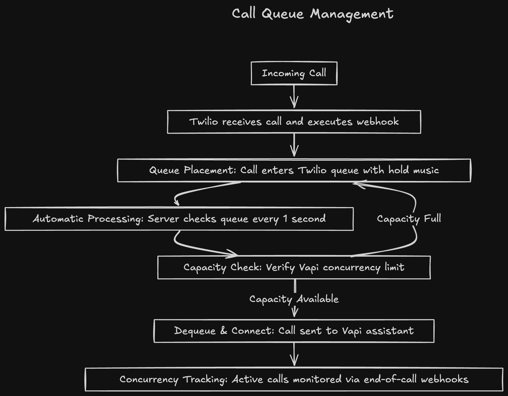

## Overview

When your application receives more simultaneous calls than your Vapi concurrency limit allows, calls can be rejected. A call queue system using Twilio queues solves this by holding excess calls in a queue and processing them as capacity becomes available.

**In this guide, you'll learn to:**
- Set up Twilio call queues for high-volume scenarios  
- Implement concurrency tracking to respect Vapi limits
- Build a queue processing system with JavaScript
- Handle call dequeuing and Vapi integration seamlessly

<Tip>
This approach is ideal for call centers, customer support lines, or any application expecting call volumes that exceed your Vapi concurrency limit.
</Tip>

## Prerequisites

Before implementing call queue management, ensure you have:

- **Vapi Account**: Access to the [Vapi Dashboard](https://dashboard.vapi.ai/org/api-keys) with your API key
- **Twilio Account**: Active Twilio account with Account SID and Auth Token
- **Twilio CLI**: Install from [twil.io/cli](https://twil.io/cli) for queue management
- **Phone Number**: Twilio phone number configured for incoming calls
- **Assistant**: Configured Vapi assistant ID for handling calls
- **Server Environment**: Node.js server capable of receiving webhooks

<Note>
You'll need to know your Vapi account's concurrency limit. Check your plan details in the [Vapi Dashboard](https://dashboard.vapi.ai/settings/billing) under billing settings.
</Note>

## How it works

The queue management system operates in three phases:

<CardGroup cols={3}>
  <Card title="Queue Incoming" icon="phone-incoming" iconType="solid">
    Incoming calls are automatically placed in a Twilio queue when received
  </Card>
  <Card title="Track Capacity" icon="gauge-high" iconType="solid">  
    Server monitors active Vapi calls against your concurrency limit
  </Card>
  <Card title="Process Queue" icon="arrow-right" iconType="solid">
    When capacity is available, calls are dequeued and connected to Vapi
  </Card>
</CardGroup>

**Call Flow:**

<Frame caption="Call Queue Management Flow">
  
</Frame>

1. **Incoming call** → Twilio receives call and executes webhook
2. **Queue placement** → Call is placed in Twilio queue with hold music  
3. **Automatic processing** → Server automatically checks queue every 1 second
4. **Capacity check** → Server verifies if Vapi concurrency limit allows new calls
5. **Dequeue & connect** → Available calls are dequeued and connected to Vapi assistants
6. **Concurrency tracking** → System tracks active calls via end-of-call webhooks

---

## Implementation Guide

<Steps>
  <Step title="Create Twilio Queue">
    First, create a Twilio queue using the Twilio CLI to hold incoming calls.

    ```bash
    twilio api:core:queues:create \
       --friendly-name customer-support
    ```

    **Expected Response:**
    ```json
    {
      "account_sid": "ACaaaaaaaaaaaaaaaaaaaaaaaaaaaaaaaa",
      "average_wait_time": 0,
      "current_size": 0,
      "date_created": "2024-01-15T18:39:09.000Z",
      "date_updated": "2024-01-15T18:39:09.000Z", 
      "friendly_name": "customer-support",
      "max_size": 100,
      "sid": "QUaaaaaaaaaaaaaaaaaaaaaaaaaaaaaaaa",
      "uri": "/2010-04-01/Accounts/ACaaaaaaaaaaaaaaaaaaaaaaaaaaaaaaaa/Queues/QUaaaaaaaaaaaaaaaaaaaaaaaaaaaaaaaa.json"
    }
    ```

    <Warning>
    Save the queue `sid` (e.g., `QUaaaaaaaaaaaaaaaaaaaaaaaaaaaaaaaa`) - you'll need this for queue operations.
    </Warning>
  </Step>

  <Step title="Configure Phone Number Webhook">
    Configure your Twilio phone number to send incoming calls to your queue endpoint.

    1. Go to [Twilio Console > Phone Numbers](https://console.twilio.com/us1/develop/phone-numbers/manage/incoming)
    2. Select your phone number
    3. Set **A call comes in** webhook to: `https://your-server.com/incoming`
    4. Set HTTP method to `POST`
    5. Save configuration
  </Step>

  <Step title="Set up Server Environment">
    Create your Node.js server with the required dependencies and environment variables.

    **Install Dependencies:**
    ```bash
    npm install express twilio axios dotenv
    ```

    **Environment Variables (.env):**
    ```bash
    # Vapi Configuration
    VAPI_API_KEY=your_vapi_api_key_here
    VAPI_PHONE_NUMBER_ID=your_phone_number_id
    VAPI_ASSISTANT_ID=your_assistant_id

    # Twilio Configuration  
    TWILIO_ACCOUNT_SID=your_twilio_account_sid
    TWILIO_AUTH_TOKEN=your_twilio_auth_token
    TWILIO_QUEUE_SID=QUaaaaaaaaaaaaaaaaaaaaaaaaaaaaaaaa

    # Server Configuration
    PORT=3000
    MAX_CONCURRENCY=5
    ```
  </Step>

  <Step title="Implement Queue Management Server">
    Create the main server file with queue handling, concurrency tracking, and Vapi integration.

    ```javascript title="server.js"
    const express = require('express');
    const twilio = require('twilio');
    const axios = require('axios');
    require('dotenv').config();

    const app = express();
    const twilioClient = twilio(process.env.TWILIO_ACCOUNT_SID, process.env.TWILIO_AUTH_TOKEN);

    // Concurrency and queue tracking
    let activeCalls = 0;
    let callsInQueue = 0;
    const MAX_CONCURRENCY = parseInt(process.env.MAX_CONCURRENCY) || 5;

    // Middleware
    app.use(express.json());
    app.use(express.urlencoded({ extended: true }));

    // Incoming call handler - adds calls to queue
    app.post('/incoming', (req, res) => {
      try {
        const twiml = `<?xml version="1.0" encoding="UTF-8"?>
          <Response>
            <Enqueue>customer-support</Enqueue>
          </Response>`;
        
        res.set('Content-Type', 'application/xml');
        res.send(twiml);
        
        // Increment queue counter
        callsInQueue++;
        console.log(`Call ${req.body.CallSid} added to queue. Calls in queue: ${callsInQueue}`);
      } catch (error) {
        console.error('Error handling incoming call:', error);
        res.status(500).send('Error processing call');
      }
    });

    // Queue processing function
    async function processQueue() {
      try {
        // Check if we have capacity for more calls
        if (activeCalls >= MAX_CONCURRENCY) {
          return;
        }

        // Check if there are calls in queue
        if (callsInQueue === 0) {
          return;
        }

        // Get next call from queue
        const members = await twilioClient.queues(process.env.TWILIO_QUEUE_SID)
          .members
          .list({ limit: 1 });

        if (members.length === 0) {
          // No calls in queue - sync our counter
          callsInQueue = 0;
          return;
        }

        const member = members[0];
        console.log(`Processing queued call: ${member.callSid}`);

        // Get Vapi TwiML for this call
        const twiml = await initiateVapiCall(member.callSid, member.phoneNumber);
        
        if (twiml) {
          // Update call with Vapi TwiML
          await twilioClient.calls(member.callSid).update({ twiml });
          
          // Increment active call counter and decrement queue counter
          activeCalls++;
          callsInQueue--;
          console.log(`Call connected to Vapi. Active calls: ${activeCalls}/${MAX_CONCURRENCY}, Queue: ${callsInQueue}`);
        } else {
          console.error(`Failed to get TwiML for call ${member.callSid}`);
        }
      } catch (error) {
        console.error('Error processing queue:', error);
      }
    }

    // Generate Vapi TwiML for a call
    async function initiateVapiCall(callSid, customerNumber) {
      const payload = {
        phoneNumberId: process.env.VAPI_PHONE_NUMBER_ID,
        phoneCallProviderBypassEnabled: true,
        customer: { number: customerNumber },
        assistantId: process.env.VAPI_ASSISTANT_ID,
      };

      const headers = {
        'Authorization': `Bearer ${process.env.VAPI_API_KEY}`,
        'Content-Type': 'application/json',
      };

      try {
        const response = await axios.post('https://api.vapi.ai/call', payload, { headers });
        
        if (response.data && response.data.phoneCallProviderDetails) {
          return response.data.phoneCallProviderDetails.twiml;
        } else {
          throw new Error('Invalid response structure from Vapi');
        }
      } catch (error) {
        console.error(`Error initiating Vapi call for ${callSid}:`, error.message);
        return null;
      }
    }

    // Webhook for call completion (decrements active calls)
    app.post('/call-ended', (req, res) => {
      try {
        // Handle Vapi end-of-call-report webhook
        const message = req.body.message;
        
        if (message && message.type === 'end-of-call-report') {
          const callId = message.call?.id;
          
          if (activeCalls > 0) {
            activeCalls--;
            console.log(`Vapi call ${callId} ended. Active calls: ${activeCalls}/${MAX_CONCURRENCY}`);
            // Note: Queue processing happens automatically every 1 second
          }
        }
        
        res.status(200).send('OK');
      } catch (error) {
        console.error('Error handling Vapi webhook:', error);
        res.status(500).send('Error');
      }
    });

    // Manual queue processing endpoint (for testing/monitoring)
    app.post('/process-queue', async (req, res) => {
      try {
        await processQueue();
        res.json({ 
          message: 'Queue processing triggered',
          activeCalls,
          callsInQueue,
          maxConcurrency: MAX_CONCURRENCY 
        });
      } catch (error) {
        console.error('Error in manual queue processing:', error);
        res.status(500).json({ error: 'Failed to process queue' });
      }
    });

    // Health check endpoint
    app.get('/health', (req, res) => {
      res.json({
        status: 'healthy',
        activeCalls,
        callsInQueue,
        maxConcurrency: MAX_CONCURRENCY,
        availableCapacity: MAX_CONCURRENCY - activeCalls
      });
    });

    // Start server
    const PORT = process.env.PORT || 3000;
    app.listen(PORT, () => {
      console.log(`Queue management server running on port ${PORT}`);
      console.log(`Max concurrency: ${MAX_CONCURRENCY}`);
      
      // Start automatic queue processing every 1 second
      startQueueProcessor();
    });

    // Automatic queue processing with 1-second interval
    function startQueueProcessor() {
      setInterval(async () => {
        try {
          // Only process queue if there are calls waiting
          if (callsInQueue > 0) {
            await processQueue();
          }
        } catch (error) {
          console.error('Error in automatic queue processing:', error);
        }
      }, 1000); // Check queue every 1 second
      
      console.log('Automatic queue processor started (1-second interval)');
    }

    module.exports = app;
    ```
  </Step>

  <Step title="Configure Vapi Webhooks for Call Tracking">
    Configure your Vapi assistant to send end-of-call-report webhooks for accurate concurrency tracking.

    **Assistant Configuration:**
    You need to configure your assistant with proper webhook settings to receive call status updates.

    ```javascript title="assistant-configuration.js"
    const assistantConfig = {
      name: "Queue Management Assistant",
      // ... other assistant configuration
      
      // Configure server URL for webhooks
      server: {
        url: "https://your-server.com",
        timeoutSeconds: 20
      },
      
      // Configure which messages to send to your server
      serverMessages: ["end-of-call-report", "status-update"]
    };
    ```

    <Note>
    The webhook will be sent to your server URL with the message type `end-of-call-report` when calls end. This allows you to decrement your active call counter accurately. See the [Assistant API reference](https://docs.vapi.ai/api-reference/assistants/create#request.body.serverMessages) for all available server message types.
    </Note>

    **Webhook Payload Example:**
    Your `/call-ended` endpoint will receive a webhook with this structure:
    
    ```json title="end-of-call-report-payload.json"
    {
      "message": {
        "type": "end-of-call-report",
        "call": {
          "id": "73a6da0f-c455-4bb6-bf4a-5f0634871430",
          "status": "ended",
          "endedReason": "assistant-ended-call"
        }
      }
    }
    ```
  </Step>

  <Step title="Test the Queue System">
    Deploy your server and test the complete queue management flow.

    **Start Your Server:**
    ```bash
    node server.js
    ```

    **Test Scenarios:**
    1. **Single call**: Call your Twilio number - should connect immediately
    2. **Multiple calls**: Make several simultaneous calls to test queuing
    3. **Capacity limit**: Make more calls than your `MAX_CONCURRENCY` setting
    4. **Queue processing**: Check that calls are processed as others end

    **Monitor Queue Status:**
    ```bash
    # Check server health and capacity
    curl https://your-server.com/health

    # Manually trigger queue processing
    curl -X POST https://your-server.com/process-queue
    ```
  </Step>
</Steps>

## Automatic Queue Processing

The system includes **automatic queue processing** that runs continuously to ensure optimal call handling:

### How It Works

- **Smart checking**: Only runs `processQueue()` when `callsInQueue > 0`
- **Queue counter tracking**: Increments when calls enter queue, decrements when processed
- **1-second intervals**: The server checks for queued calls every second
- **Efficient processing**: Only processes calls when both capacity is available AND calls are waiting
- **Error handling**: Continues running even if individual queue checks fail

### Benefits

<CardGroup cols={2}>
  <Card title="Immediate Response" icon="clock" iconType="solid">
    Calls are processed within 1 second of capacity becoming available
  </Card>
  <Card title="No Manual Triggers" icon="gear" iconType="solid">
    No need to manually trigger queue processing - it happens automatically
  </Card>
  <Card title="Fault Tolerant" icon="shield-check" iconType="solid">
    System continues running even if individual API calls fail
  </Card>
  <Card title="Scalable" icon="arrow-up" iconType="solid">
    Handles high-volume scenarios without missing queued calls
  </Card>
</CardGroup>

### Performance Considerations

- **Minimal API Calls**: Only queries Twilio API when `callsInQueue > 0`
- **Counter Synchronization**: Automatically syncs queue counter with actual Twilio queue state
- **Efficient Resource Usage**: Avoids unnecessary processing when queue is empty
- **Graceful Degradation**: Handles temporary API failures without crashing
- **Smart Logging**: Provides clear visibility into queue and active call counts

<Tip>
The automatic processing ensures that as soon as a Vapi call ends and creates capacity, the next queued call will be processed within 1 second, providing near-real-time queue management.
</Tip>

## Troubleshooting

<AccordionGroup>
  <Accordion title="Calls not being dequeued">
    **Common causes:**
    - Server not receiving call-ended webhooks (check webhook URLs)
    - Concurrency counter stuck (restart server to reset)
    - Vapi API errors (check API key and assistant ID)
    
    **Solutions:**
    - Verify webhook URLs are publicly accessible
    - Add logging to track concurrency changes
    - Test Vapi API calls independently
  </Accordion>
  
  <Accordion title="Queue filling up but not processing">
    **Check these items:**
    - `MAX_CONCURRENCY` setting is appropriate for your Vapi plan
    - Queue processing is being triggered (check logs)
    - No errors in Vapi TwiML generation
    
    **Debug steps:**
    - Call `/process-queue` endpoint manually
    - Check `/health` endpoint for current capacity
    - Review server logs for error messages
  </Accordion>
  
  <Accordion title="Calls dropping or hanging up">
    **Potential issues:**
    - Invalid phone number format (use E.164 format)
    - Incorrect Vapi configuration (phone number ID, assistant ID)
    - Network timeouts during TwiML generation
    
    **Solutions:**
    - Validate all phone numbers before processing
    - Add timeout handling to API calls
    - Implement retry logic for failed Vapi requests
  </Accordion>
</AccordionGroup>