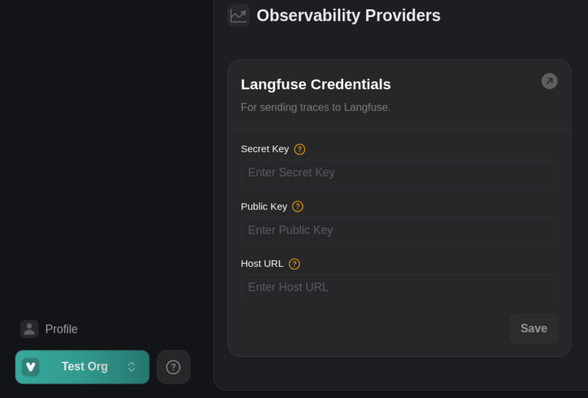
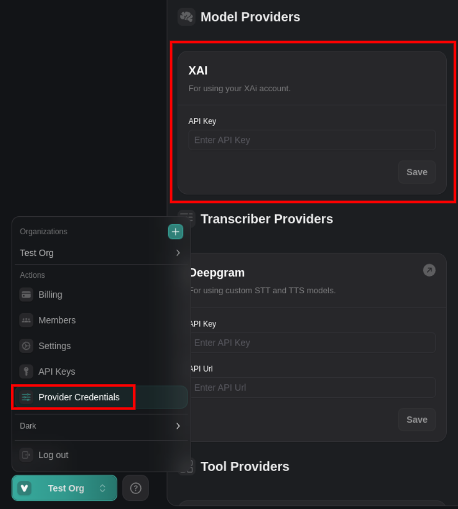
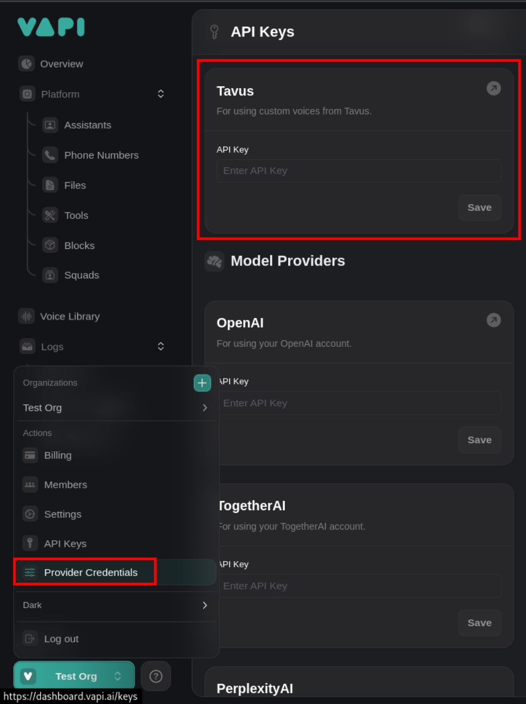
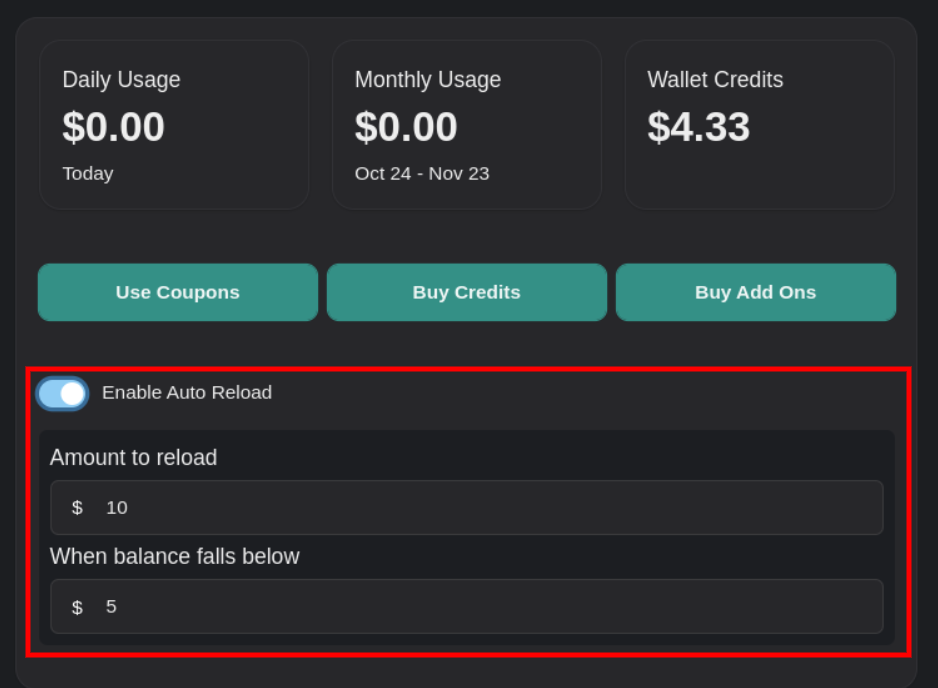
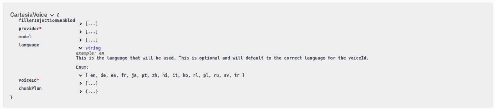
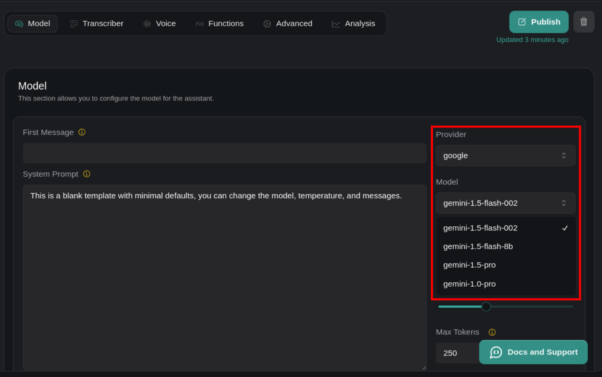
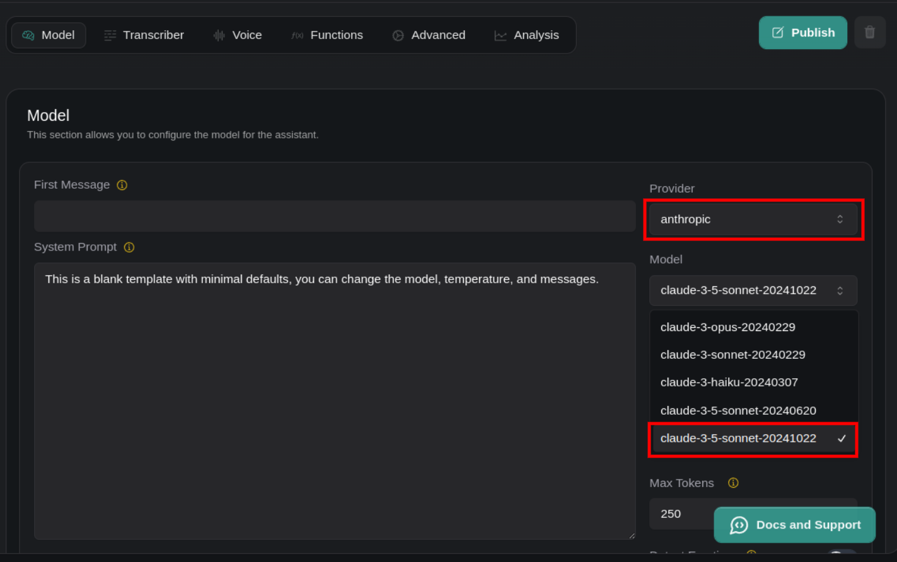

# November 11 to November 14, 2024

1. **Langfuse Credential Management**: You can now send traces to Langfuse by providing your "Secret Key", "Public Key", and "Host URL" for better telemetry monitoring. Create and update these credentials in the [updated Provider Credentials page](https://dashboard.vapi.ai/keys), under `Observability Providers`.

<Frame caption="Create and update Langfuse credentials in https://dashboard.vapi.ai/keys">
  
</Frame>

<AccordionGroup>
  <Accordion title="November 6 to November 11, 2024">
    1. **Subscription Updates**: You can now check the number of minutes used in a subscription with `Subscription.minutesUsed` (Enterprise only).

    2. **Updates to Concurrency Limits in your Subscription**: `Subscription.concurrencyLimit` now shows both the included and purchased limits, which better represents the total concurrency limit. Refer to the [Subscription schema](https://api.vapi.ai/api/) for more details.
      - Use `Subscription.concurrencyLimitIncluded` to get the default concurrency limit provided with the subscription.
      - Use `Subscription.concurrencyLimitPurchased` to get any additional purchased concurrency limit.

    <Frame caption="View subscription concurrency limits in the [Subscription schema](https://api.vapi.ai/api/)">
      
    </Frame>
  </Accordion>
  <Accordion title="November 4 to November 6, 2024">
    1. **New Anthropic model `claude-3-5-haiku-20241022` added**: You can now use `claude-3-5-haiku-20241022` in your assistants. Specify `anthropic` in `Assistant.model.provider` and `claude-3-5-haiku-20241022` in `Assistant.model`.

    2. **Payment `cost`, Subscription `credits` and `couponUsageLeft` are now strings**: These properties are now strings to avoid floating point precision errors. Please update your applications to handle these values as strings.

    3. **Advanced call logging improvements**: You can now access detailed call logs through the [updated call logs page](https://dashboard.vapi.ai/calls) or [`GET /logs?type=Call`](https://api.vapi.ai/api#/Logs/LoggingController_queryLogs) endpoint. Refer to `CallLogPrivileged` or `CallLogsPaginatedResponse` schemas in the [updated API reference](https://api.vapi.ai/api) to learn more.
  </Accordion>
  <Accordion title="November 3 to November 4, 2024">
    1. **XAi Model Support**: You can now use xAI's `grok-beta` model when creating or updating an assistant, and specify your API credentials from the [xAI console](https://console.x.ai/) in the [updated Provider Credentials page](https://dashboard.vapi.ai/keys). The list of call ended reasons has been updated to include xAI-specific errors.

    <Frame caption="Specify xAI API credentials in the Provider Credentials page">
      
    </Frame>
  </Accordion>

  <Accordion title="October 30 to November 3, 2024">
    1. **Access Transport Details and Costs**: You can now use `call.transport` to access details about the provider used for a call (`twilio`, `vonage`, `vapi`, or `daily`), and whether the assistant's video is enabled for web calls (`assistantVideoEnabled`). Additionally, transport costs in `call.costs[type=transport]` now include a `provider` field, allowing you to see which provider contributed to the transport cost.

    2. **Manage Tavus Credentials**: You can now create and update Tavus credentials in the [updated Provider Credentials page](https://dashboard.vapi.ai/keys).

    <Frame caption="Specify Tavus Credentials in the Provider Credentials page">
      
    </Frame>
  </Accordion>
  <Accordion title="October 29 to October 30, 2024">
    1. **Auto-reload Credits in Billing Page**: You can now auto-reload credits and check credits remaining for subscriptions within the [updated billing page](https://dashboard.vapi.ai/org/billing).

    <Frame caption="Auto-reload credits in the [updated billing page](https://dashboard.vapi.ai/org/billing)">
      
    </Frame>

    2. **Expanded Language Options in `CartesiaVoice`**: You can now specify additional languages in `CartesiaVoice.language` (optional), including 'hi' (Hindi), 'it' (Italian), 'ko' (Korean), 'nl' (Dutch), 'pl' (Polish), 'ru' (Russian), 'sv' (Swedish), and 'tr' (Turkish). Refer to the [CartesiaVoice](https://api.vapi.ai/api) schema for more details.

    <Frame caption="Expanded language options in `CartesiaVoice`">
      
    </Frame>

    3. **Enhanced Template Variables in `AssistantOverrides`**: The `AssistantOverrides.variableValues` now supports LiquidJS syntax for replacing template variables. You can customize assistant messages using expressions like `{{ name }}` for dynamic content, or format dates with `{{"now" | date: "%b %d, %Y, %I:%M %p", "America/New_York"}}`.

  </Accordion>
  <Accordion title="October 25 to October 29, 2024">
    1. **Gemini Model Support and Credential Management**: You can now use Google Gemini models for your assistant (*gemini-1.5-flash-8b*, *gemini-1.5-flash-002*, *gemini-1.5-pro*, *gemini-1.0-pro*). Create and update your Google credentials by providing your `apiKey` from [Google AI Studio](https://aistudio.google.com/app/apikey) and setting your provider to `'google'` in Vapi.

      <Frame caption="Gemini models are now supported when you select `'google'` as your provider">
        
      </Frame>

    2. **New Anthropic Model `claude-3-5-sonnet-20241022`**: You can now include Computer Use tools in the `toolWithToolCallList` of `ClientMessageToolCalls` or `ServerMessageToolCalls`. Select `'anthropic'` as your provider, `claude-3-5-sonnet-20241022`, and [create](https://api.vapi.ai/api#/Tools/ToolController_create) or [update](https://api.vapi.ai/api#/Tools/ToolController_update) newly supported computer use tools like `BashTool`, `ComputerTool`, or `TextEditorTool`.

      <Frame caption="`claude-3-5-sonnet-20241022` is now supported when you select `'anthropic'` as your provider">
        
      </Frame>

    3. **Enhanced Email Regex Support in Replacements**: The email matching regex pattern in `RegexReplacement` now supports top-level domains with two or more characters (`{2,}`). This improvement allows you to replace email addresses with placeholders like `[EMAIL]`, even for longer TLDs.

    4. **Paginated Phone Number Responses**: [`GET /phone-numbers`](https://api.vapi.ai/api#/Phone%20Numbers/PhoneNumberController_findAll) now includes a `results` array of phone numbers and pagination metadata for easier handling of large datasets.

  </Accordion>
  <Accordion title="October 22 to October 25, 2024">
    1. **Specify API Traffic Channel for Organizations**: You can now configure which `channel` (cluster) your API traffic will be routed to. Select between *daily* or *weekly* in your [organization settings page](https://dashboard.vapi.ai/org/settings)

    2. **Customize Tavus Voice Properties**: You can now use Tavus as a voice provider under `assistant.voice`. Configure additional properties like language, recording options, and transcriptions via `assistant.voice.properties`.

    3. **Multilingual Support in Tool Messages**: You can now use the `contents` property in `ToolMessageStart`, `ToolMessageFailed`, `ToolMessageDelayed`, and `ToolMessageComplete` to provide message variants for different languages. If you don't provide content for a language, the first item will be automatically translated to the active language during the conversation.

    4. **Automatic Translation of Message Contents**: For `CustomMessage`, `BlockStartMessage`, and `BlockCompleteMessage`, if specific content isn't provided for a language in `contents`, Vapi automatically translates the first item to the active language by default.

    5. **Removed Backchanneling Configuration**: The `backchannelingEnabled` property has been removed from when creating or updating `Assistant` or `AssistantOverrides`. Backchanneling is no longer configurable in assistant settings.

  </Accordion>

  <Accordion title="October 19 to October 22, 2024">
    1. **Invite Multiple Users via Email**: You can now invite up to 100 users at once by providing a list of email addresses inside your [org users page](https://dashboard.vapi.ai/org/users). Click `'+'` after entering an email address, select the role as *Editor* or *Admin*, and click `'Invite'`.

    2. **Simplified Subscription Status Handling**: Your subscription status no longer includes the `past-due` status, so you can streamline your subscription management without handling 'past-due' scenarios.
  </Accordion>

  <Accordion title="October 16 to October 19, 2024">
    1. **Custom Transcriber Support**: You can now integrate your own transcription service by using `CustomTranscriber` at `assistant.transcriber`, `call.squad.members.assistant.transcriber`, and `call.squad.members.assistantOverrides.transcriber`. Provide your custom transcription server details via `server.url` to receive real-time transcriptions during calls.

    2. **Increased Maximum Call Duration**: The maximum allowed value for `maxDurationSeconds` has increased from 21,600 to 43,200 seconds when creating or updating `Assistant` or `AssistantOverrides`. You can now configure your assistant to handle calls lasting up to 12 hours.

    3. **New Voice Provider 'tavus'**: You can now specify `tavus` as a voice provider in `Assistant.voice`, `AssistantOverrides.voice`, `Call.voice` and in the Voice Library.

    4. **Subscription Status 'frozen' Added**: A new status `frozen` has been added to `Subscription.status`, indicating when a subscription is temporarily inactive.

    5. **Added Subscription Coupon Codes**: You can now apply coupon codes to your subscription. Visit the [billing page](https://dashboard.vapi.ai/org/billing) to apply coupons to specific organizations within a subscription.

  </Accordion>

  <Accordion title="October 13 to October 16, 2024">
    1. **Apply Coupons to Subscriptions**: You can now apply coupons by specifying a `couponId` to add to a subscription.

    2. **Detect Custom Transcriber Failures in Call End Reasons**: You can now handle cases where a custom transcriber fails during a call with `'pipeline-error-custom-transcriber-failed'`, a new `endedReason` option. This is now accessible in `Call`, `ServerMessageStatusUpdate`, and `ServerMessageEndOfCallReport`.

    3. **Corrected Typo in Example Custom Voice Request**: We fixed a typo in `CustomVoice.server`, where the example request now shows how to use the `"message"` parameter instead of the misspelled `"messsage"`.

  </Accordion>
  <Accordion title="October 10 to October 13, 2024">
    1. **New Call Transfer Modes Added**: you can now wait for an operator to speak first before providing a transfer message or summary when transferring calls to a new destination with `TransferPlan`. Configure this through *transferPlan.mode=`'warm-transfer-wait-for-operator-to-speak-first-and-then-say-message'`* or *transferPlan.mode=`'warm-transfer-wait-for-operator-to-speak-first-and-then-say-summary'`* inside the request body of `POST /assistant` or `PATCH /assistant`. 

    2. **Unified Server Configuration in Assistants**: You can now use the `server` property in `Assistant.server`, `AssistantOverrides.server`, and when creating or updating assistants to specify webhook settings, including URL, secret, custom headers, and timeout. This replaces the old `serverUrl` and `serverUrlSecret` properties of `Assistant`.

      <Warning>Include custom headers in your webhook requests by using the `headers` property within the `server` object when creating or updating assistants.</Warning>

    3. **Configure PlayHT Voice Engines**: You can now configure which PlayHT voice `model` generates voices for your application between `PlayHT2.0`, `PlayHT2.0-turbo`, and `Play3.0-mini`.
  </Accordion>
  <Accordion title="October 9 to October 10, 2024">

    1. **Purchase Reserved Concurrency and Scale Infinitely**: You can now reserve more concurrent calls with Vapi and scale infinitely by switching to our new top up payment system on the [billing page](https://dashboard.vapi.ai/org/billing). To migrate, click "Switch to Credit Based Billing" and make a payment. Advantages include:

      - **Support More Users Without Limits**: You don't need to worry about getting throttled or staying under usage limits on the conversations you can have with Vapi.
      - **Predictable Budgets**: You know exactly how much you will spend on Vapi each month, and you can top up at any time as your needs grow.
      - **Select Add-Ons You Need**: The credit based billing page allows you to select HIPAA compliance, dedicated Slack support, and the maximum number of concurrent calls you expect.

    <Warning>This will require human input to login and migrate your account. You will not be able to revert back to the old billing system.</Warning>
  </Accordion>
  <Accordion title="October 8 to October 9, 2024">
    1. **Call Cost Information**: You can now use `call.costs[type=vapi].subType` to determine if a VAPI cost is `normal` or an `overage`.

    2. **Updated Billing Page**: Your payments are now returned inside a table with pages on the [billing page](https://dashboard.vapi.ai/org/billing).
  </Accordion>
  <Accordion title="October 7 to October 8, 2024">
    1. **New GPT-4o Model Support for Azure OpenAI**: You can now specify the `gpt-4o-2024-08-06` model in the `models` field when configuring Azure OpenAI credentials. Use this model to access the latest GPT-4 operational capabilities in your applications.

    2. **Specify Timestamps as Strings in `/logs`**: We now expect timestamps as strings when working with logs. Please make sure to handle this accordingly in your applications.
  </Accordion>
  <Accordion title="October 6 to October 7, 2024">
    1. **Add Structured Outputs for OpenAI Functions in Assistant Tools**: You can use [OpenAI Structured Outputs](https://platform.openai.com/docs/guides/structured-outputs) by specifying a new parameter called `strict` as true or false when creating or using `OpenAIFunction`s in `assistant.model.tools[type=function]`. Set the `name`, provide a `description` (up to 1000 characters), and specify `parameters` as a [JSON Schema object](https://json-schema.org/understanding-json-schema). See the [OpenAI guide](https://platform.openai.com/docs/guides/function-calling) for examples.

    2. **Secure Incoming SIP Phone Calls to Vapi Provided SIP Numbers**: You can now specify a `username`, `password`, and optional `realm` in SIP Invite AuthZ header, through digest authentication. Create this secure SIP number by specifying an "authentication" object with the username and password fields inside `POST /phone-number` request body. Example:
    ```bash
    curl --location 'https://api.vapi.ai/phone-number' \
    --header 'Content-Type: application/json' \
    --header 'Authorization: Bearer {}API_KEY}}' \
    --data-raw '{
      "provider": "vapi",
      "sipUri": "sip:{{USERNAME}}@sip.vapi.ai",
      "assistantId": "{{ASSISTANT_ID}}",
      "name": "example phone number label for your reference",
      "authentication": {
        "realm": "sip.vapi.ai",
        "username": "test@example.com",
        "password": "example_password"
      }
    }'
    ```

    3. **Use Updated `handoff`, `callback` Steps in Blocks**: You can now use `assistant.model.steps[type=handoff]` and `assistant.model.steps[type=callback]` to control conversation flow in your assistant. Use `HandoffStep` to move to the next step linearly without returning to the previous step, ideal for sequential tasks like forms. Use `CallbackStep` to spawn a new conversation thread and return to the previous step once done, good for handling interruptions or sub-tasks within a conversation.

    4. **Use Step Destinations and Assignment Mutation in Blocks**: Specify destination nodes for each step with `assistant.model.steps[type=handoff].destinations[type=step]` to direct the workflow to specific steps based on certain conditions. Update context variables in each callback step with `mutations[type=assignment]`, for example: `assistant.model.steps[type=callback].mutations[type=assignment]`
  </Accordion>
</AccordionGroup>