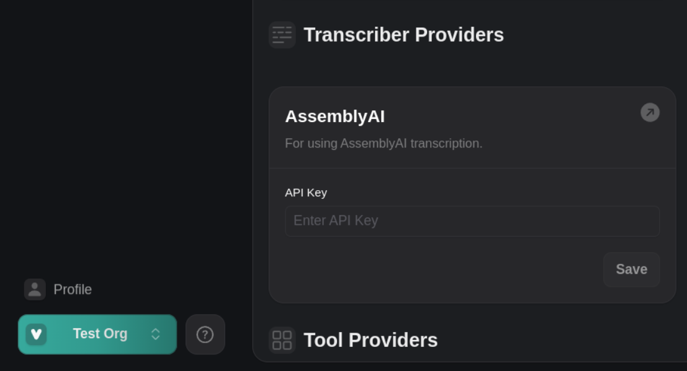
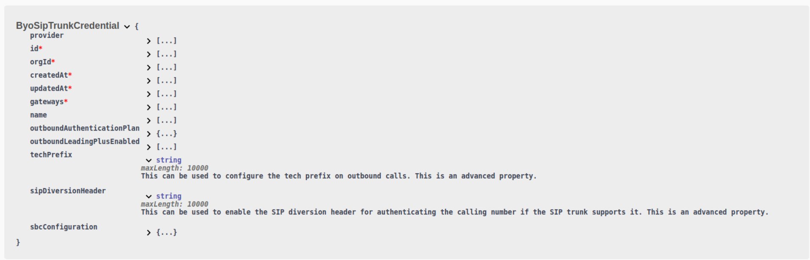

# November 15 to November 21, 2024

1. **Voice Fallback Plan**: You can now define a `fallbackPlan` in your assistant's voice settings in `assistant.voice.fallbackPlan` or `call.squad.members.assistant.voice.fallbackPlan` to specify alternative voices if your primary voice provider fails.

2. **AssemblyAI Credential Management**: You can now specify your AssemblyAI API keys in the updated "Transcriber Providers" page. Create your API key in the [AssemblyAI dashboard](https://www.assemblyai.com/app/account). AssemblyAI errors are now surfaced in the `endedReason` of `Call`, `ServerMessageEndOfCallReport`, and `ServerMessageStatusUpdate`.

  <Frame caption="Specify AssemblyAI API keys in the Transcriber Providers page">
    
  </Frame>

3. **Enhanced BYO SIP Trunk Configuration**: When configuring BYO SIP trunk credentials, you can now specify a `techPrefix` for outbound SIP calls and enable `sipDiversionHeader` for authenticating the calling number (if supported). Refer to the `ByoSipTrunkCredential` schema in the [API reference](https://api.vapi.ai/api) to learn more.

  <Frame caption="Learn more about `techPrefix` and `sipDiversionHeader` in the BYO SIP Trunk Credential schema: https://api.vapi.ai/api">
    
  </Frame>

4. **File Name Length Constraints**: The maximum file `name` length has been reduced from 100 to 40 characters. The required minimum length is still 1 character. 

5. **Increased Server Timeout Limit**: The maximum value of `server.timeoutSeconds` has increased from 60 to 120 seconds, allowing longer timeouts for server responses.

7. **Extended Delay for Tool Messages**: The `timingMilliseconds` maximum in `ToolMessageDelayed` has increased from 20,000 to 120,000 milliseconds, enabling a longer delay for tool messages.
