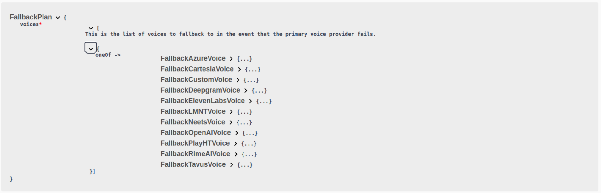

1. **Voice Fallback Plan Introduced**: You can now enhance your assistant's reliability by defining fallback voice providers using `assistant.voice.fallbackPlan.voices`. This allows your assistant to switch to alternative voices or providers like `FallbackLMNTVoice`, `FallbackAzureVoice`, `FallbackNeetsVoice`, `FallbackTavusVoice`, `FallbackOpenAIVoice`, and others if the primary voice provider fails.

  <Frame caption="Refer to the `FallbackPlan` schema for more information: https://api.vapi.ai/api">
    
  </Frame>

2. **Language Selection for PlayHTVoice**: The `language` property has been added to `PlayHTVoice`. You can now specify the desired language for speech synthesis using `assistant.voice.language`.

3. **AssemblyAI Transcriber Available**: You can now use AssemblyAI for transcribing by setting `Assistant.transcriber` to `AssemblyAITranscriber`. This provides a new option for converting speech to text in your assistant.

4. **Updated OpenAI Model Support**: The `gpt-4o-2024-11-20` model has been added to `OpenAIModel.model` and `OpenAIModel.fallbackModels`. You can now configure your assistant to use this latest OpenAI model.

5. **Removal of 'fillerInjectionEnabled' Property**: The `fillerInjectionEnabled` property has been removed from voice configurations like `LMNTVoice`, `AzureVoice`, etc. You no longer need to include this property when configuring these voices.
