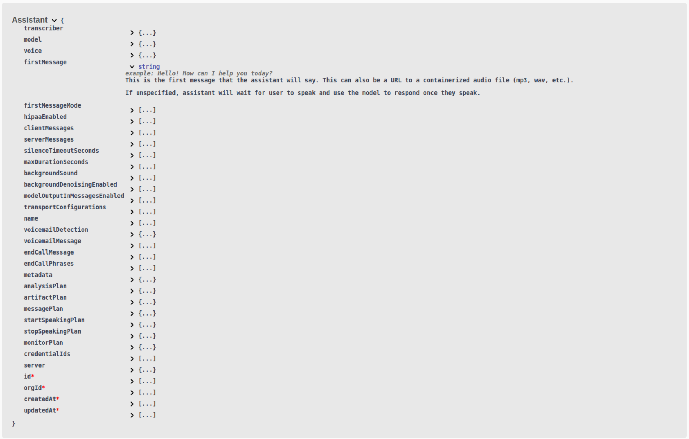

1. **No length limit for assistant's first message**: You can now set `assistant.firstMessage` or `call.assistant.firstMessage` to any length; the previous maximum length restriction has been removed. This allows you to provide longer initial messages for the assistant's greeting. 

  <Frame caption="Refer to the `Assistant` schema for more information: https://api.vapi.ai/api">
    
  </Frame>

