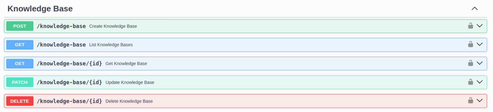
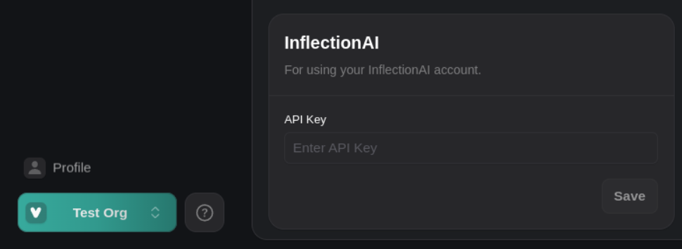

1. **New Knowledge Base API Endpoints**: You can now create a knowledge base with [`POST /knowledge-base`](https://api.vapi.ai/api#/Knowledge%20Base/KnowledgeBaseController_create), list knowledge bases with [`GET /knowledge-base`](https://api.vapi.ai/api#/Knowledge%20Base/KnowledgeBaseController_findAll) or [`GET /knowledge-base/{id}`](https://api.vapi.ai/api#/Knowledge%20Base/KnowledgeBaseController_findOne) for a specific knowledge base, update a knowledge base with [`PATCH /knowledge-base/{id}`](https://api.vapi.ai/api#/Knowledge%20Base/KnowledgeBaseController_update), or delete a knowledge base with [`DELETE /knowledge-base/{id}`](https://api.vapi.ai/api#/Knowledge%20Base/KnowledgeBaseController_remove). Refer to the [Vapi API endpoints](https://api.vapi.ai/api#/) for more details.

  <Frame caption="Refer to the `Knowledge Base` endpoints for more information: https://api.vapi.ai/api">
    
  </Frame>

2. **Configure Custom Knowledge Bases for your Assistant**: Configure a custom knowledge base for your assistant in three steps by first uploading a file [through the dashboard](https://dashboard.vapi.ai/files) or  [the API](https://api.vapi.ai/api#/Files/FileController_create), then [create a knowledge base](https://docs.vapi.ai/knowledgebase#step-2-create-a-knowledge-base), and lastly [updating your assistant](https://docs.vapi.ai/knowledgebase#step-3-create-an-assistant) with the knowledge base id. You can also assign a knowledge base to models like `GroqModel`, `VapiModel`, `GoogleModel`, and others using the new `knowledgeBaseId` property.

3. **Integration with Trieve Knowledge Base**: Vapi now supports [Trieve](https://trieve.ai/) as our first knowledge base provider. Refer to [our docs](https://docs.vapi.ai/knowledgebase#step-2-create-a-knowledge-base) for an example of how to use Trieve.

4. **Inflection AI Credential Management**: You can now manage Inflection AI credentials through the [updated providers credentials](https://dashboard.vapi.ai/keys) page. `Call.endedReason` also now enumerates new values like `'pipeline-error-inflection-ai-llm-failed'` to indicate specific Inflection AI errors.

  <Frame caption="Use the updated provider credentials page to manage Inflection AI credentials: https://dashboard.vapi.ai/keys">
    
  </Frame>

5. **New Transfer Mode with Summary in SIP Header**: You can now configure `TransferPlan.mode` to `'blind-transfer-add-summary-to-sip-header'` to forward calls and include a summary in the SIP header called `X-Transfer-Summary`. You can also add custom SIP headers during a transfer call using the `sipHeaders` property in `TransferDestinationSip`. 

6. **Azure Credential Service Default**: When creating or updating Azure credentials in the [updated providers credentials](https://dashboard.vapi.ai/keys), the `service` field now defaults to `'speech'`.

7. **Support for Cantonese in Deepgram Transcriber**: The `DeepgramTranscriber.language` option now includes `'zh-HK'` for Cantonese (Hong Kong).