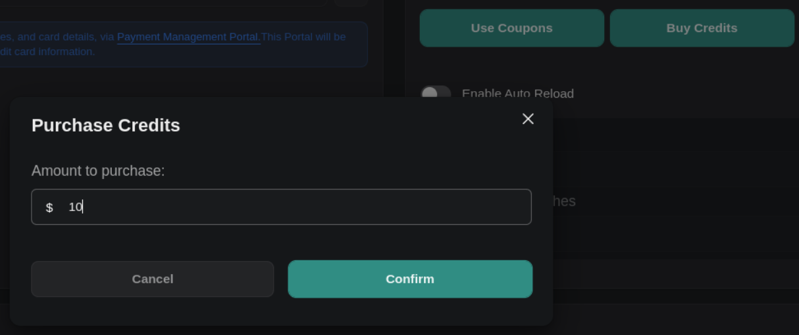

1. **Extended Silence Timeout for Assistants**: You can now set `silenceTimeoutSeconds` up to 3600 seconds (previously 600 seconds) when creating or updating assistants and assistant overrides. This allows for longer periods of silence before an assistant session times out.

2. **New Credits Purchase Option**: You can now purchase credits to your subscription by  navigating to the [updated billing page](https://dashboard.vapi.ai/org/billing/credits). Specify the dollar amount of your credits in the `credits` field to complete the purchase.

  <Frame caption="Navigate to the updated billing page to buy credits: https://dashboard.vapi.ai/org/billing/credits">
    
  </Frame>