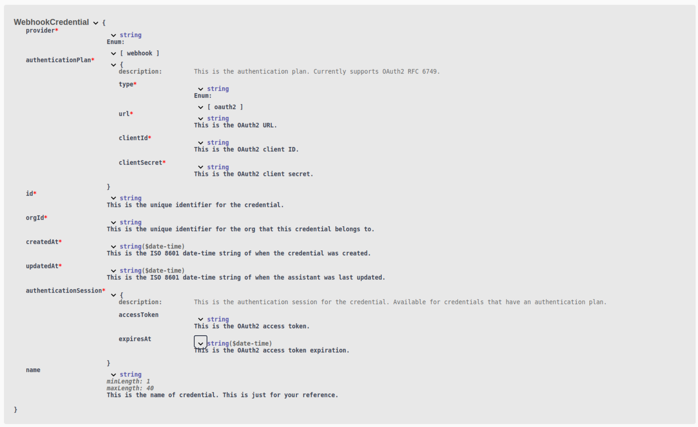

1. **OAuth2 Support for Custom LLM Credentials and Webhooks**: You can now authorize access to your [custom LLMs](https://docs.vapi.ai/customization/custom-llm/using-your-server#step-2-configuring-vapi-with-custom-llm) and [server urls (aka webhooks)](https://docs.vapi.ai/server-url) using OAuth2 (RFC 6749).

For example, create a webhook credential with `CreateWebhookCredentialDTO` with the following payload:

```json
{
    "provider": "webhook",
    "authenticationPlan": {
        "type": "oauth2",
        "url": "https://your-url.com/your/path/token",
        "clientId": "your-client-id",
        "clientSecret": "your-client-secret"
    },
    "name": "your-credential-name-between-1-and-40-characters"
}
```

This returns a [`WebhookCredential`](https://api.vapi.ai/api) object as follows:

  <Frame caption="Refer to the `WebhookCredential` schema for more information">
    
  </Frame>

3. **Removal of Canonical Knowledge Base**: The ability to create, update, and use canoncial knowledge bases in your assistant has been removed from the API(as custom knowledge bases and the Trieve integration supports as superset of this functionality). Please update your implementations as endpoints and models referencing canoncial knowledge base schemas are no longer available.