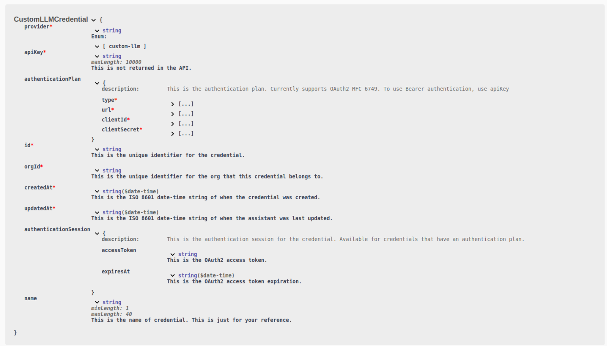

1. **OAuth 2 Authentication for Custom LLM Models and Webhooks**: In addition to (AuthZ)[https://www.okta.com/identity-101/authentication-vs-authorization/], you can now now authenticate users accessing your [custom LLMs](https://docs.vapi.ai/customization/custom-llm/using-your-server#step-2-configuring-vapi-with-custom-llm) and [server urls (aka webhooks)](https://docs.vapi.ai/server-url) using OAuth2 (RFC 6749). Use the `authenticationSession` dictionary which contains an `accessToken` and `expiresAt` datetime to authenticate further requests to your custom LLM or server URL. 

For example, create a webhook credential with `CreateCustomLLMCredentialDTO` with the following payload:
```json
{
    "provider": "custom-llm",
    "apiKey": "your-api-key-max-10000-characters",
    "authenticationPlan": {
        "type": "oauth2",
        "url": "https://your-url.com/your/path/token",
        "clientId": "your-client-id",
        "clientSecret": "your-client-secret"
    },
    "name": "your-credential-name-between-1-and-40-characters"
}
```

This returns a [`CustomLLMCredential`](https://api.vapi.ai/api) object as follows:

  <Frame caption="Refer to the `CustomLLMCredential` schema for more information">
    
  </Frame>

This can be used to authenticate successive requests to your custom LLM or server URL.
