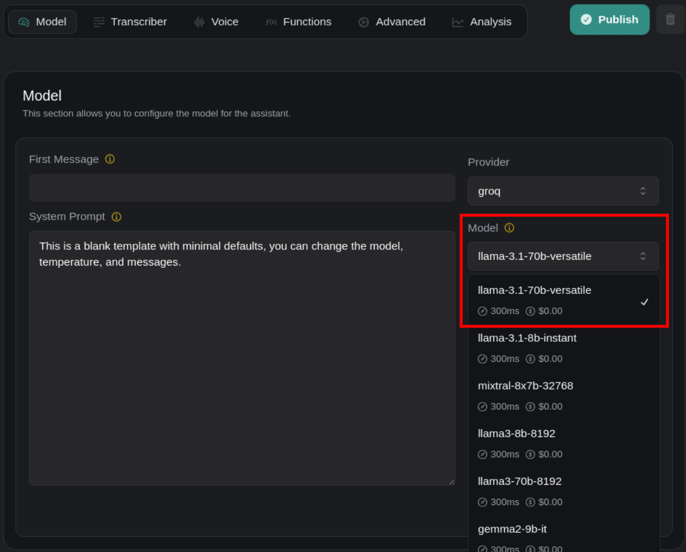

1. **New Transfer Plan Mode Added**: You can now include call summaries in the SIP header during blind transfers without assistant involvement with `blind-transfer-add-summary-to-sip-header` (a new `TransferPlan.mode` option). Doing so will make `ServerMessageStatusUpdate` include a `summary` when the call status is `forwarding` - which means you can access call summaries for real-time display or logging purposes in your SIP calls.

2. **Azure Speech Transcription Support**: You can now specify a new property called `AzureSpeechTranscriber.language` in Azure's Speech-to-Text service to improve the accuracy of processing spoken input.

3. **New Groq Model Available**: You can now use `'llama-3.3-70b-versatile'` in `GroqModel.model`.

<Frame caption="New Groq Model">
    
</Frame>
