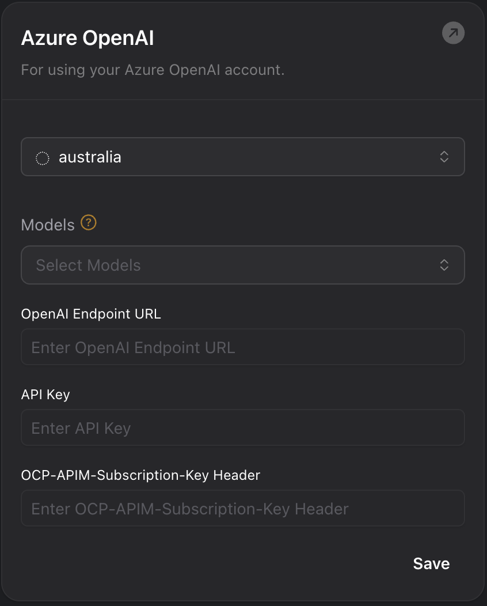

# Updated Azure Regions for Credentials

1. **Updated Azure Regions for Credentials**: You can now specify `canadacentral`, `japaneast`, and `japanwest` as valid regions when specifying your Azure credentials. Additionally, the region `canada` has been renamed to `canadaeast`, and `japan` has been replaced with `japaneast` and `japanwest`; please update your configurations accordingly.

<Frame caption="Updated Azure Regions for Credentials">
    
</Frame>
