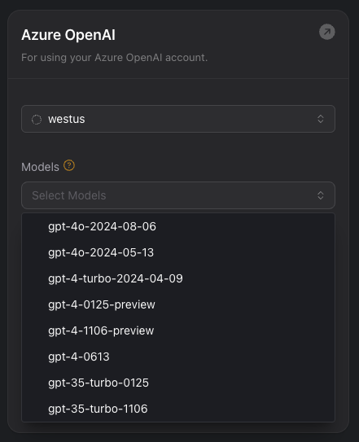

# API Enhancements, Call Features, and Workflow Improvements

1.  **`POST` requests to `/analytics` (migrate from `GET`)**: You should now make `POST` requests (instead of `GET`) to the [`/analytics`](https://api.vapi.ai/api#/Analytics/AnalyticsController_query) endpoint. Structure your analytics query as a JSON payload using [`AnalyticsQuery`](https://api.vapi.ai/api#/Analytics/AnalyticsQuery) in the request body.

2.  **Use `SayHook` to Intercept and Modify Text for Assistant Speech**: You can use [`SayHook`](https://api.vapi.ai/api#/Hooks/SayHook) to intercept and modify text before it's spoken by your assistant. Specify the text to be spoken using the `exact` or `prompt` properties.

3.  **Call Transfer Support**: The `Transfer` node type is now available in workflows.  Configure the `destination` property to define the transfer target.

4.  **Workflow Edge Condition Updates**: [`AIEdgeCondition`](https://api.vapi.ai/api#:~:text=AIEdgeCondition) (which replaces `SemanticEdgeCondition`) enables AI-powered routing decisions by analyzing conversation context and intent, while [`LogicEdgeCondition`](https://api.vapi.ai/api#:~:text=LogicEdgeCondition) (which replaces `ProgrammaticEdgeCondition`) allows for rule-based routing using custom logical expressions. The previous `SemanticEdgeCondition` and `ProgrammaticEdgeCondition` are now deprecated, and a new `FailedEdgeCondition` has been added to handle node failures in workflows.

5.  **`Gather` Node: Data Collection Refactor**: The [`Gather` node](https://api.vapi.ai/api#:~:text=Gather) now requires an `output` property to define the expected data schema. The `instruction` and `schema` properties have been removed.

6.  **Call Packet Capture (PCAP) Configuration**: Your call [`Artifact`](https://api.vapi.ai/api#:~:text=Artifact)s now support links to download a call's network packet capture (PCAP) file, providing you with detailed network traffic analysis and troubleshooting for calls. PCAP is only supported by `vapi` and `byo-phone-number` providers. Enable PCAP through `pcapEnabled`, automatically upload to S3 bucket with `pcapS3PathPrefix`, and access via `pcapUrl`.

7.  **`ApiRequest` Node Improvements**: [`ApiRequest`](https://api.vapi.ai/api#:~:text=ApiRequest) now supports `GET` requests. You can also define the expected response schema. You can make API requests as `blocking` or run in the `background` with `ApiRequest.mode`.

8.  **`Call` and `ServerMessage` `endedReason` Updates**: The `assistant-not-invalid` `Call.endedReason` has been corrected to `"assistant-not-valid"`. Also added `"assistant-ended-call-with-hangup-task"` to the `Call.endedReason`.

9.  **New Azure OpenAI Model `gpt-4o-2024-08-06-ptu`**: You can now use `gpt-4o-2024-08-06-ptu` from Azure OpenAI inside your [Assistant](https://dashboard.vapi.ai/assistants/2ec63711-f867-4066-8c54-7833346783b1).

<Frame caption="New Azure OpenAI Model gpt-4o-2024-08-06-ptu.png">
    
</Frame>

10. **Deprecated Schemas and Properties**: The following properties and schemas are now deprecated in the [API reference](https://api.vapi.ai/api/):
    *   `SemanticEdgeCondition`
    *   `ProgrammaticEdgeCondition`
    *   `Workflow.type`
    *   `ApiRequest.waitTaskMessage`
    *   `ApiRequest.startTaskMessage`
    *   `ApiRequest.failureTaskMessage`
    *   `ApiRequest.successTaskMessage`
    *   `OpenAIModel.semanticCachingEnabled`
    *   `CreateWorkflowDTO.type`
