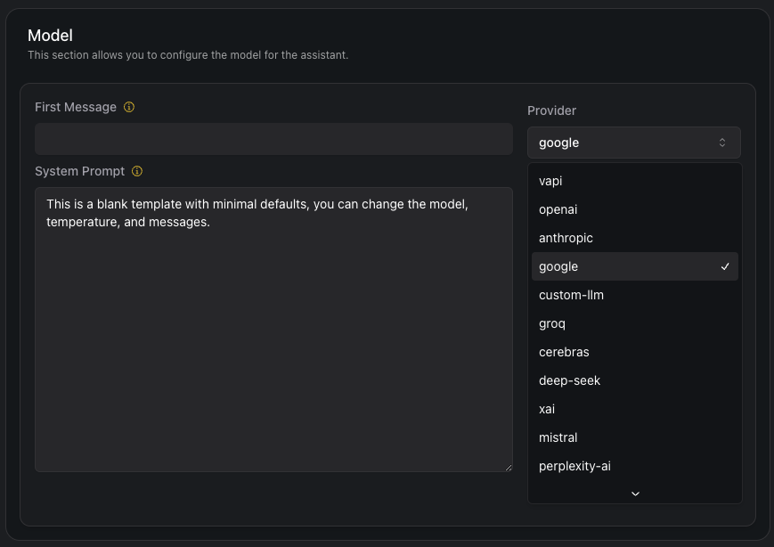

## What's New

### Compliance & Security Enhancements
- **New [CompliancePlan](https://api.vapi.ai/api#:~:text=CompliancePlan) Consolidates HIPAA and PCI Compliance Settings**: You should now enable HIPAA and PCI compliance settings with `Assistant.compliancePlan.hipaaEnabled` and `Assistant.compliancePlan.pciEnabled` which both default to `false` (replacing the old HIPAA and PCI flags on `Assistant` and `AssistantOverrides`).

- **Phone Number Status Tracking**: You can now view your phone number `status` with `GET /phone-number/{id}` for all phone number types ([Bring Your Own Number](https://api.vapi.ai/api#:~:text=ByoPhoneNumber), [Vapi](https://api.vapi.ai/api#:~:text=VapiPhoneNumber), [Twilio](https://api.vapi.ai/api#:~:text=TwilioPhoneNumber), [Vonage](https://api.vapi.ai/api#:~:text=VonagePhoneNumber)) for better monitoring.

### Advanced Call Control

- **Assistant Hooks System**: You can now use [`AssistantHooks`](https://api.vapi.ai/api#:~:text=AssistantHooks) to support `call.ending` events with customizable filters and actions
  - Enable transfer actions through [`TransferAssistantHookAction`](https://api.vapi.ai/api#:~:text=TransferAssistantHookAction). For example:
```javascript
{
  "hooks": [{
    "on": "call.ending",
    "do": [{
      "type": "transfer",
      "destination": {
        // Your transfer configuration
      }
    }]
  }]
}
```

  - Conditionally execute hooks with `Assistant.hooks.filter`. For example, trigger different hooks for call completed, system errors, or customer hangup / transfer:

```json
{
  "assistant": {
    "hooks": [{
        "filters": [{
          "type": "oneOf",
          "key": "call.endedReason",
          "oneOf": ["pipeline-error-custom-llm-500-server-error", "pipeline-error-custom-llm-llm-failed"]
        }]
      }
    ]
  }
}
```

### Model & Voice Updates

- **New Models Added**: You can now use new models inside `Assistant.model[provider="google", "openai", "xai"]` and `Assistant.fallbackModels[provider="google", "openai", "xai"]`
  - Google: Gemini 2.0 series (`flash-thinking-exp`, `pro-exp-02-05`, `flash`, `flash-lite-preview`)
  - OpenAI: o3 mini `o3-mini`
  - xAI: Grok 2 `grok-2`

<Frame caption="Assistant Models">
    
</Frame>

- **New `PlayDialog` Model for [PlayHT Voices](https://api.vapi.ai/api#:~:text=PlayHTVoice)**: You can now use the `PlayDialog` model in `Assistant.voice[provider="playht"].model["PlayDialog"]`.

- **New `nova-3` and `nova-3-general` Models for [Deepgram Transcriber](https://api.vapi.ai/api#:~:text=DeepgramTranscriber)**: You can now use the `nova-3` and `nova-3-general` models in `Assistant.transcriber[provider="deepgram"].model["nova-3", "nova-3-general"]`

### API Improvements

- **Workflow Updates**: You can now send a [`workflow.node.started`](https://api.vapi.ai/api#:~:text=ClientMessageWorkflowNodeStarted) message to track the start of a workflow node for better call flow tracking

- **Analytics Enhancement**: Added subscription table and concurrency columns in [POST /analytics](https://api.vapi.ai/api#/Analytics/AnalyticsController_query) for richer queries about your subscriptions and concurrent calls.

### Deprecations

<Warning>The `/logs` endpoints are now marked as deprecated - plan to update your implementation accordingly.</Warning>
