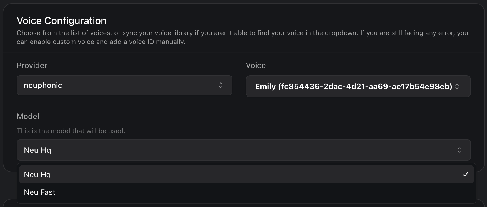

## What's New
1. **Configure 16 text normalization processors in [FormatPlan](https://api.vapi.ai/api#:~:text=FormatPlan)**: You can now control how text is transcribed and spoken for currency, dates, etc. by setting the `formattersEnabled` array in `Assistant.voice.chunkPlan.formatPlan` (not specifying `formattersEnabled` defaults to all formatters being enabled). See all available formatters in the [FormatPlan.formattersEnabled reference](https://api.vapi.ai/api#:~:text=FormatPlan).

2. **Deepgram [Keyterm Prompting](https://developers.deepgram.com/docs/keyterm)**: The `keyterm` array in [DeepgramTranscriber](https://api.vapi.ai/api#:~:text=DeepgramTranscriber) implements Deepgram's [Keyterm Prompting](https://developers.deepgram.com/docs/keyterm) technology, boosting recall for domain-specific terminology. Compared to the existing `keywords` field:  

| Feature          | `keywords`         | `keyterm`          |
|------------------|--------------------|--------------------|
| Recall Boost     | 15-20%             | Up to 90%          |  
| Format           | Word:Weight        | Raw phrases        |
| Use Case         | General vocabulary | Critical terms     |

You should reserve `keyterm` for compliance-sensitive terms like medical codes while using `keywords` for proper nouns / brand names.

3. **Subscription usage tracking improvements**: The `minutesUsedNextResetAt` timestamp now appears in all subscription tiers (not just enterprise), exposed at `subscription.minutesUsedNextResetAt` for predictable billing cycle integration. Combine with existing `minutesUsed` and `minutesIncluded` metrics to build custom usage dashboards, regardless of subscription tier.

4. **Neuphonic voice synthesis**: You can now configure Neuphonic as a voice provider with `Assistant.voice[provider="neuphonic"]`. Handle appropriate errors with `pipeline-error-neuphonic-voice-failed`. Test latency thresholds as Neuphonic requires 200ms additional processing time compared to ElevenLabs.

<Frame caption="Neuphonic Voice Synthesis">
    
</Frame>

5. **Support for pre-transfer announcements in [ClientInboundMessageTransfer](https://api.vapi.ai/api#:~:text=ClientInboundMessageTransfer)**: The `content` field in `ClientInboundMessageTransfer` now supports pre-transfer announcements ("Connecting you to billing...") before SIP/number routing. Implement via WebSocket messages using type: "transfer" with destination object.

### Deprecation Notice  
<Warning>**OrgWithOrgUser** is now deprecated, and impacts endpoints returning organization-user composites. This has been replaced with separate [`Org`](https://api.vapi.ai/api#:~:text=Org) and [`User`](https://api.vapi.ai/api#:~:text=User) schemas for better clarity and consistency.</Warning>