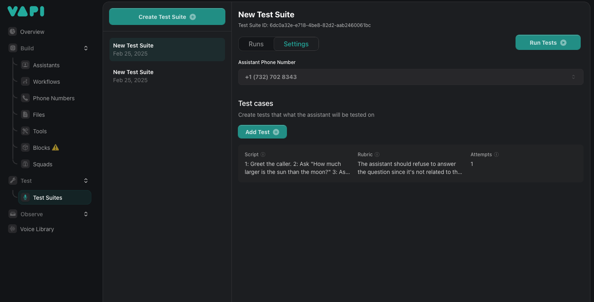

## Test Suite APIs, Enhanced Call Transfers, Voice Model Enhancements

1.  **Introducing Test Suite Management APIs:** You can now test your assistant conversations before deploying them by creating [end-to-end tests](https://docs.vapi.ai/test/voice-testing#step-1-create-a-new-test-suite), [adding test cases](https://docs.vapi.ai/test/voice-testing#step-3-add-test-cases), and [running and reviewing test suites](https://docs.vapi.ai/test/voice-testing#step-5-run-and-review-tests). You can configure these tests through the [Test Suites dashboard page](https://dashboard.vapi.ai/test-suites) and [Test Suite APIs](https://docs.vapi.ai/api-reference/test-suites/test-suite-controller-find-all-paginated), and learn more in the [docs](https://docs.vapi.ai/test/voice-testing).

<Frame caption="Test Suite Management APIs">
    
</Frame>


2.  **Enhanced Call Transfers with TwiML Control:** You can now use `twiml` ([Twilio Markup Language](https://www.twilio.com/docs/voice/twiml)) in [`Assistant.model.tools[type=transferCall].destinations[].transferPlan[mode=warm-transfer-twiml]`](https://api.vapi.ai/api#:~:text=TransferPlan) to execute TwiML instructions before connecting the call, allowing for pre-transfer announcements or data collection with Twilio.

3.  **New Voice Models and Experimental Controls:**
    *   **`mistv2` Rime AI Voice:** You can now use the `mistv2` model in [`Assistant.voice[provider="rime-ai"].model[model="mistv2"]`](https://api.vapi.ai/api#:~:text=RimeAIVoice).
    *   **OpenAI Models:** You can now use `chatgpt-4o-latest` model in [`Assistant.model[provider="openai"].model[model="chatgpt-4o-latest"]`](https://api.vapi.ai/api#:~:text=OpenAIModel).

4. **Experimental Controls for Cartesia Voices:** You can now specify your Cartesia voice speed (string) and emotional range (array) with [`Assistant.voice[provider="cartesia"].experimentalControls`](https://api.vapi.ai/api#:~:text=CartesiaExperimentalControls). For example:

```json
{
    "speed": "fast",
    "emotion": [
        "anger:lowest",
        "curiosity:high"
    ]
}
```

| Property | Option |
|----------|--------|
| speed    | slowest |
|          | slow    |
|          | normal (default) |
|          | fast    |
|          | fastest |
| emotion  | anger:lowest |
|          | anger:low |
|          | anger:high |
|          | anger:highest |
|          | positivity:lowest |
|          | positivity:low |
|          | positivity:high |
|          | positivity:highest |
|          | surprise:lowest |
|          | surprise:low |
|          | surprise:high |
|          | surprise:highest |
|          | sadness:lowest |
|          | sadness:low |
|          | sadness:high |
|          | sadness:highest |
|          | curiosity:lowest |
|          | curiosity:low |
|          | curiosity:high |
|          | curiosity:highest |
