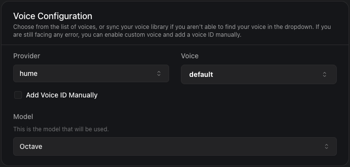

## Claude 3.7 Sonnet and GPT 4.5 preview, New Hume AI Voice Provider, New Supabase Storage Provider, Enhanced Call Transfer Options

1. **Claude 3.7 Sonnet with Thinking Configuration Support**:
You can now use the latest claude-3-7-sonnet-20250219 model with a new "thinking" feature via the [`AnthropicThinkingConfig`](https://api.vapi.ai/api#:~:text=AnthropicThinkingConfig) schema. 
Configure it in `assistant.model` or `call.squad.members.assistant.model`:
```json
{
  "model": "claude-3-7-sonnet-20250219",
  "provider": "anthropic",
  "thinking": {
    "type": "enabled",
    "budgetTokens": 5000 // min 1024, max 100000
  }
}
```

2. **OpenAI GPT-4.5-Preview Support**:
You can now use the latest gpt-4.5-preview model as a primary model or fallback option via the [`OpenAIModel`](https://api.vapi.ai/api#:~:text=OpenAIModel) schema.
Configure it in `assistant.model` or `call.squad.members.assistant.model`:
```json
{
  "model": "gpt-4.5-preview",
  "provider": "openai"
}
```

3. **New Hume Voice Provider**:
Integrated Hume AI as a new voice provider with the "octave" model for text-to-speech synthesis.

<Frame caption="Hume Voice Provider">
    
</Frame>

4. **Supabase Storage Integration**:
New Supabase S3-compatible storage support for file operations. This integration lets developers configure buckets and paths across 16 regions, enabling structured file storage with proper authentication.
Configure [`SupabaseBucketPlan`](https://api.vapi.ai/api#:~:text=SupabaseBucketPlan) in `assistant.credentials.bucketPlan`,`call.squad.members.assistant.credentials.bucketPlan`

5. **Voice Speed Control**
Added a speed parameter to ElevenLabs voices ranging from 0.7 (slower) to 1.2 (faster) [`ElevenLabsVoice`](https://api.vapi.ai/api#:~:text=ElevenLabsVoice). This enhancement gives developers more control over speech cadence for more natural-sounding conversations.

6. **Enhanced Call Transfer Options in TransferPlan**
Added a new dial option to the sipVerb parameter for call transfers. This complements the existing refer (default) and bye options, providing more flexibility in call handling.
- 'dial': Uses SIP DIAL to transfer the call

7. **Zero-Value Minumum Subscription Minutes**
Changed the minimum value for minutesUsed and minutesIncluded from 1 to 0. This supports tracking of new subscriptions and free tiers with no included minutes.

8. **Zero-Value Minimum KeypadInputPlan Timeout**
Adjusted the KeypadInputPlan.timeoutSeconds minimum from 0.5 to 0.
