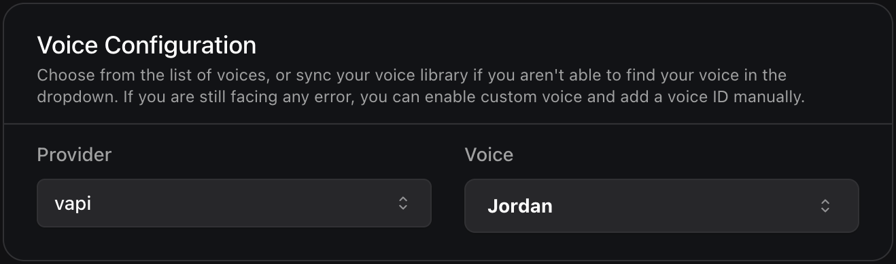

## New Query Tool and Vapi Voice Provider, Updates to Language Support and Error Handling

1. **New Query Tool Feature and Knowledge Base Integration**

* The API now supports a new query tool that allows assistants to search through knowledge bases. Add this tool to any assistant model by configuring it at `assistant.model.tools[type=query]` path.
* You can now link knowledge bases to query tools, providing structured information sources for assistants to access. Define knowledge bases with a name, model, provider, description, and associated file IDs.

<Accordion title='Example configuration for [`QueryTool`](https://api.vapi.ai/api#:~:text=QueryTool)'>
```json
{
  "type": "query",
  "async": false,
  "server": {
    "url": "https://api.example.com/query-handler"
  },
  "function": {
    "name": "query_knowledge",
    "description": "Query knowledge bases for information",
    "parameters": {
      "type": "object",
      "properties": {
        "query": {
          "type": "string",
          "description": "The query to search for"
        }
      },
      "required": ["query"]
    }
  },
  "knowledgeBases": [
    {
      "name": "Product Documentation",
      "model": "gemini-1.5-flash",
      "provider": "google",
      "description": "Contains all product manuals",
      "fileIds": ["file-123", "file-456"]
    }
  ]
}
```
</Accordion>


2. **New Voice Provider Support**

A new voice provider "vapi" has been added with support for a voice called "Jordan" in [`FallbackVapiVoice`](https://api.vapi.ai/api#:~:text=FallbackVapiVoice). Configure it in our assistant fallback plans at `assistant.voice.fallbackPlan.voices`.

<Frame caption="Vapi Voice Provider">
    
</Frame>

3. **Language Support Updates**

Myanmar language ("my") has been added to supported languages, while "jp" and "mymr" codes have been removed. Use "ja" for Japanese language and "my" for Myanmar. Reference [`GladiaTranscriber`](https://api.vapi.ai/api#:~:text=GladiaTranscriber) for more language codes.

4. **Error Handling Improvements**

Added new error code `pipeline-error-11labs-transcriber-failed` for `ServerMessageStatusUpdate.endedReason` and `ServerMessageEndOfCallReport.endedReason`. Also added an explicit `failed` status for test suite runs in [`TestSuiteRun`](https://api.vapi.ai/api#:~:text=TestSuiteRun). These additions provide more detailed error reporting.

5. **Azure OpenAI Model Update**

The model `gpt-4o-2024-08-06-ptu` has been removed from Azure OpenAI credential schemas. Update any credential configurations that were using this model.