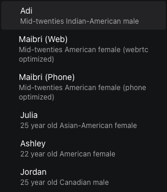

## Enhanced Voicemail Detection, File Processing, Knowledge Base Integration, and Invoicing Updates

1. **Track Voicemail Detection Cost, Configure Google and Twilio Voicemail Detection Plans**

* You can now configure provider-specific settings and track voicemail detection costs through the new `VoicemailDetectionCost` schema at `call.costs[type=voicemail-detection]`.
* Configure Google or Twilio voicemail detection settings using the new [`GoogleVoicemailDetectionPlan`](https://api.vapi.ai/api#:~:text=GoogleVoicemailDetectionPlan) and [`TwilioVoicemailDetectionPlan`](https://api.vapi.ai/api#:~:text=TwilioVoicemailDetectionPlan) schemas.

```json
// Google configuration example
{
  "provider": "google",
  "voicemailExpectedDurationSeconds": 15  // Range: 5-60 seconds
}
```

```json
// Twilio configuration example
{
  "provider": "twilio",
  "enabled": true,
  "machineDetectionTimeout": 30,  // Range: 3-59 seconds
  "voicemailDetectionTypes": ["machine_end_beep", "machine_end_silence"]
}
```

2. **Improved File Processing Statuses and Parsed Text Content**

* File processing statuses have been renamed to better reflect their purpose: `processing` → `done` → `failed`.
* Two new properties have been added to the [`File`](https://api.vapi.ai/api#:~:text=File) schema: `parsedTextUrl` and `parsedTextBytes`, providing direct access to parsed text content from processed files.

3. **Google Gemini Models for Knowledge Base Integration**

* The [`KnowledgeBase`](https://api.vapi.ai/api#:~:text=KnowledgeBase) schema now fully supports Google's Gemini models with specific model options.
* You can use Gemini models in your knowledge bases at `assistant.model.tools[type=query].knowledgeBases`.

```json
"model": {
  "enum": [
    "gemini-2.0-flash-thinking-exp",
    "gemini-2.0-pro-exp-02-05",
    "gemini-2.0-flash",
    "gemini-2.0-flash-lite-preview-02-05",
    "gemini-2.0-flash-exp",
    "gemini-2.0-flash-realtime-exp",
    "gemini-1.5-flash",
    "gemini-1.5-flash-002",
    "gemini-1.5-pro",
    "gemini-1.5-pro-002",
    "gemini-1.0-pro"
  ]
}
```

4. **New Invoicing Features**

* You can now use [`InvoicePlan`](https://api.vapi.ai/api#:~:text=InvoicePlan) schema for customizing invoice information with company details.
* This can be accessed via the new `invoicePlan` property on the [`Subscription`](https://api.vapi.ai/api#:~:text=Subscription) schema.
* Customize company name, email, tax ID, and address for your invoices.

5. **Additional Voice Options**

* Five new voice options have been added to the [`FallbackVapiVoice`](https://api.vapi.ai/api#:~:text=FallbackVapiVoice) schema: `Adi`, `Julia`, `Maibri (Web)`, `Maibri (Phone)`, and `Ashley`.
* Configure these voices in your assistant fallback plans at `assistant.voice.fallbackPlan.voices`.
<Frame caption="Additional Vapi Voices">
    
</Frame>