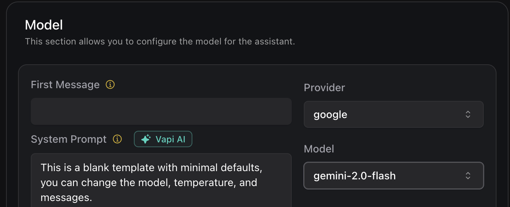

# Enhancements in Assistant Responses, New Gemini Model, and Call Handling

1. **Introduction of 'gemini-2.0-flash-lite' Model Option**: You can now use `gemini-2.0-flash-lite` in [`Assistant.model[provider="google"].model[model="gemini-2.0-flash-lite"]`](https://api.vapi.ai/api#:~:text=GoogleModel) for a reduced latency, lower cost Gemini model with a 1 million token context window.

<Frame caption="gemini-2.0-flash-lite Model Option">
    
</Frame>

2. **New Assistant Paginated Response**: All [`Assistant`](https://api.vapi.ai/api#:~:text=Assistants) endpoints now return paginated responses. Each response specifies `itemsPerPage`, `totalItems`, and `currentPage`, which you can use to navigate through a list of assistants.