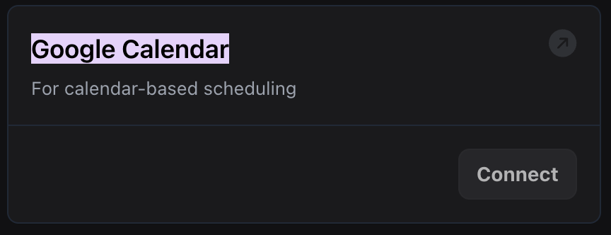

# Introducing Google Calendar Integration, and Chat Test Suite / Rime AI Voice Enhancements

1. **Integration with Google Calendar**: You can now create and manage Google Calendar events directly within your tools. Configure OAuth2 credentials through the [dashboard > Build > Provider Keys](https://dashboard.vapi.ai/keys#:~:text=Google%20Calendar) to authenticate and interact with Google Calendar APIs.

<Frame caption="Google Calendar Integration">
    
</Frame>

2. **Enhanced Voice Customization for RimeAIVoice**: Gain more control over [Rime AI voice](https://api.vapi.ai/api#:~:text=RimeAIVoice) properties with new options like `reduceLatency`, `inlineSpeedAlpha`, `pauseBetweenBrackets`, and `phonemizeBetweenBrackets`. These settings let you optimize voice streaming and adjust speech delivery to better suit your assistant's needs.

3. **Chat Test Suite Enhancements**: You can now create and run chat-based tests in your test suites using the new [`TestSuiteTestChat`](https://api.vapi.ai/api#:~:text=TestSuiteTestChat) to more comprehensively test conversational interactions in your assistant.

4. **Maximum Length for Test Suite Chat Scripts**: When creating or updating chat tests, note that the `script` property now has a maximum length of 10,000 characters. Ensure your test scripts conform to this limit to avoid any validation errors.