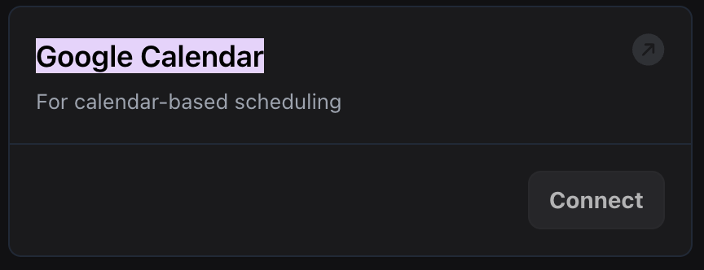

1. **New Slack and Google Calendar Tools Added**: You can now use the built-in  [Slack tool](https://docs.vapi.ai/tools/slack) to send messages and use the [Google Calendar tool](https://docs.vapi.ai/tools/google-calendar) to check calendar availability directly from your assistant, with full CRUD operations available via the [`/tool` API endpoint](https://docs.vapi.ai/api-reference/tools/list). You can authenticate the [Slack tool](https://dashboard.vapi.ai/keys#:~:text=Slack) and the [Google Calendar tool](https://dashboard.vapi.ai/keys#:~:text=Google%20Calendar) using OAuth2 from the [Vapi provider keys page](https://dashboard.vapi.ai/keys).

<Frame caption="Slack Tool">
    
</Frame>

<Frame caption="Google Calendar Tool">
    
</Frame>

2. **Select LLM Model in Workflow Nodes**: You can now select and update which LLM model you want to use within workflow nodes, allowing more precise control over the assistant's behavior in different workflow nodes and easier configuration updates.

4. **Enhanced Call Monitoring and Reporting**: We've improved call monitoring with conversation turn tracking, millisecond-precision timestamps, and provided more detailed call end reasons. These enhancements make it easier to track conversation flow, perform precise time calculations, and diagnose specific call termination issues like server overloads or database errors.

5. **Enable Background Denoising**: You can now filter out background noise during calls by setting `Assistant.backgroundDenoisingEnabled` to `true`.