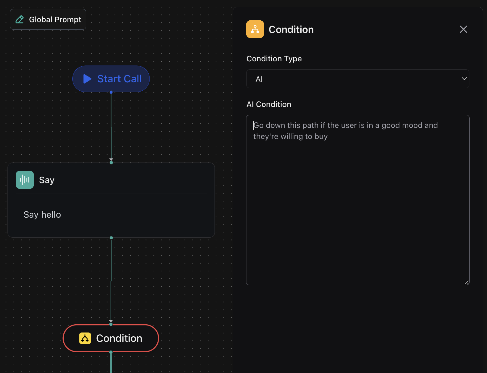

1. **Updated AI Edge Condition with Prompt**: When defining an AI edge condition, the `matches` property has been renamed to `prompt`. The `prompt` allows you to provide a natural language condition (up to 1000 characters) that guides AI decision-making in workflows.

<Frame caption="Updated AI Edge Condition with Prompt">
    
</Frame>

2. **Assistant Overrides per Customer**: You can now customize assistant settings for individual customers using `assistantOverrides` when [creating customers](https://api.vapi.ai/api#:~:text=CreateCustomerDTO). This enables personalized assistant interactions for each customer in batch calls.

3. **New Call Ended Reasons**: New error codes have been added to `endedReason` enums, providing more detailed insights into call terminations related to providers like Anthropic Bedrock and Vertex. This helps in better error handling and debugging of call issues.