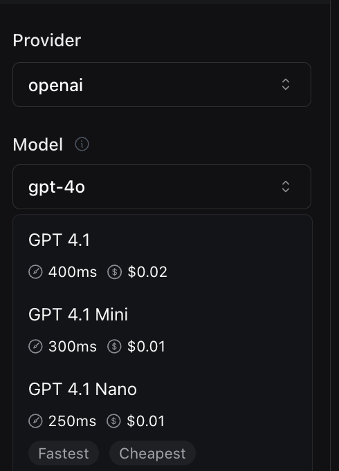

1.  **New GPT-4.1 Models Available**: You can now use `'gpt-4.1'`, `'gpt-4.1-mini'`, and `'gpt-4.1-nano'` as options for the `model` and `fallbackModels` with your [OpenAI models](https://api.vapi.ai/api#:~:text=OpenAIModel). These models may offer improved performance or features over previous versions.

<Frame caption="New GPT-4.1 Models Available">
    
</Frame>
