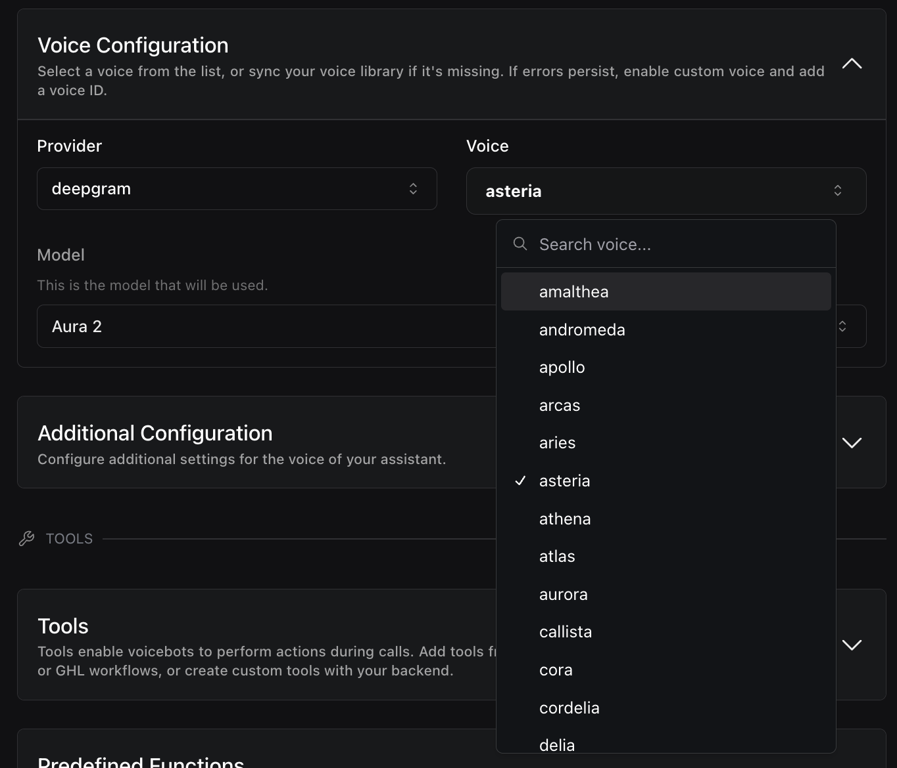

1. **Assistant Overrides in Testing (`TargetPlan.assistantOverrides`)**: You can now apply `assistantOverrides` when testing an assistant with a [Target Plan](https://api.vapi.ai/api#:~:text=TargetPlan), allowing modifications to the assistant's configuration specifically for tests without changing the original assistant. This helps in testing different configurations or behaviors of an assistant without affecting the live version.

2. **Specify Voice Model with Deepgram**: You can now specify the `model` to be used by Deepgram voices by setting the `model` property to `"aura"` or `"aura-2"` (default: `"aura-2"`).

3. **Expanded Deepgram Voice Options (`voiceId` in `DeepgramVoice` and `FallbackDeepgramVoice`)**: The list of available deepgram voice options has been greatly expanded, providing a wider selection of voices for assistants. This allows you to customize the assistant's voice to better match your desired persona with `Assistant.voice["DeepgramVoice"].voiceId`.

<Frame caption="Expanded Voice Options">
    
</Frame>

4. **Control Text Replacement Behavior (`replaceAllEnabled` in `ExactReplacement`)**: A new property `replaceAllEnabled` allows you to decide whether to replace all instances of a specified text (`key`) or just the first occurrence in [`ExactReplacement`](https://api.vapi.ai/api#:~:text=ExactReplacement) configurations. Setting `replaceAllEnabled` to `true` ensures that all instances are replaced.