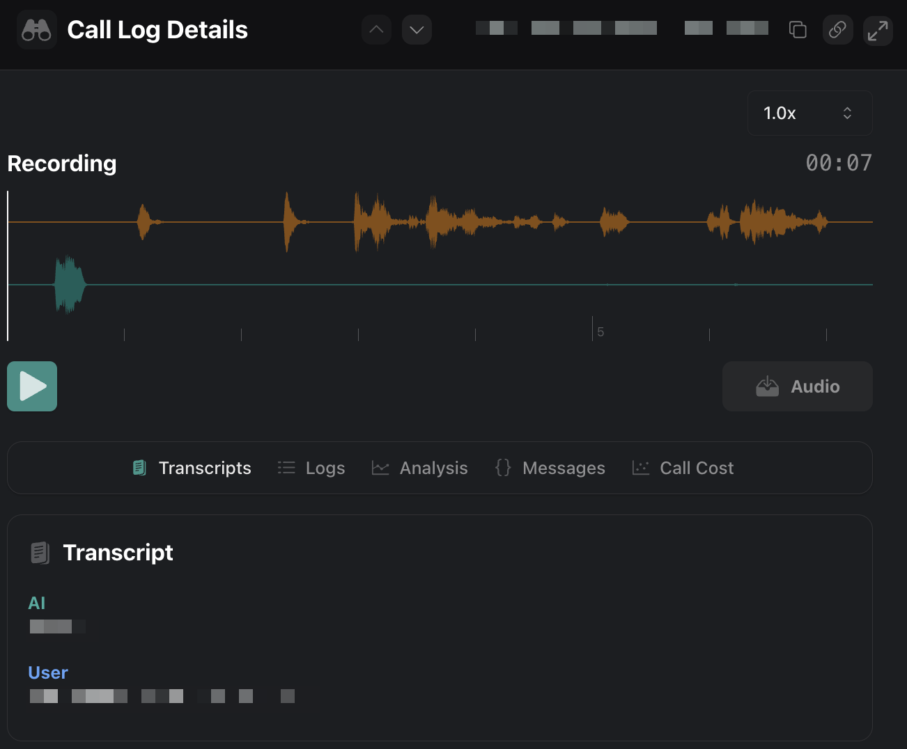

1. **Simplified Assistant Schema**: The `Assistant` schema is now simplified to focus on essential properties like `assistantId`, `name`, `type`, and `metadata`. Other advanced settings have been moved to the Call schema.

<Warning>Configure advanced call-specific assistant parameters using `Call.assistant` instead of `Assistant`.</Warning>

2. **New Structured Recording Properties in Artifact Schema**: You can now access recording details through `Call.artifact.recording`, which provides a structured way to obtain mono, stereo, and video recordings. This replaces the old recording url properties with a more organized format. You can also access this data through the [dashboard (Observe > Call Logs)](https://dashboard.vapi.ai/calls)

<Frame caption="Access Call Artifact Recording from the Dashboard">
    
</Frame>

<Warning>
The `Call.recordingUrl`, `Call.videoRecordingUrl`, `Call.stereoRecordingUrl`, and `Call.videoRecordingStartDelaySeconds` properties are now deprecated. Transition to using `Call.artifact.recording` for accessing recording information.
</Warning>

3. **Include SIP Headers in Refer-To URI for Transfers**: By enabling `sipHeadersInReferToEnabled` in your `Call.assistant.hooks.do[type=transfer].destination.transferPlan`, you can now include SIP headers as URL-encoded query parameters during call transfers.

4. **Increased Length Limits for Liquid and Rubric Fields**: You can now write longer [LiquidJS](https://liquidjs.com/) expressions in `LogicEdgeCondition.liquid` (up to 1000 characters) and more detailed rubrics in `TestSuiteRunScorerAI.rubric` and `TestSuiteTestScorerAI.rubric` (up to 10,000 characters). Refer to [Advanced Date and Time Formatting documentation](https://docs.vapi.ai/assistants/dynamic-variables#advanced-date-and-time-usage) for more information.

5. **Introduction of Start Node in Workflow**: A new [`Start`](https://api.vapi.ai/api#:~:text=Start) node type is available in the assistant's workflow. Use this to define the starting point of your assistant's conversational flow with customizable metadata. Refer to [Workflows documentation](https://docs.vapi.ai/workflows#step-4-build-your-workflow) for more information.

6. **Standardized Assistant Version Pagination Response**: When fetching assistant versions, responses now conform to the [`AssistantVersionPaginatedResponse`](https://api.vapi.ai/api#:~:text=AssistantVersionPaginatedResponse). This standardization makes it easier to handle paginated data.
