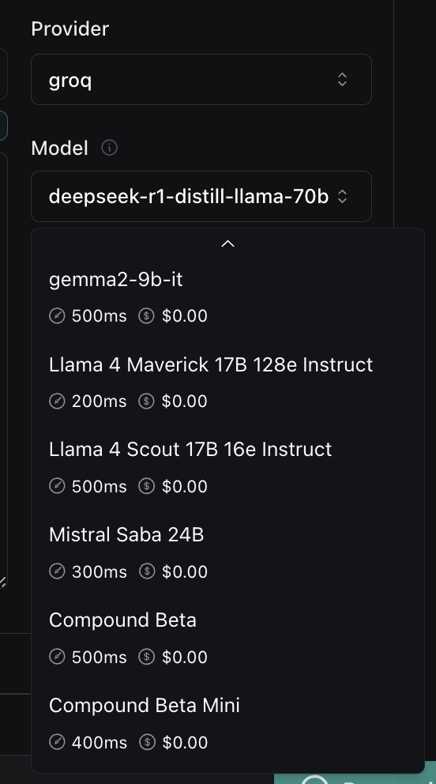
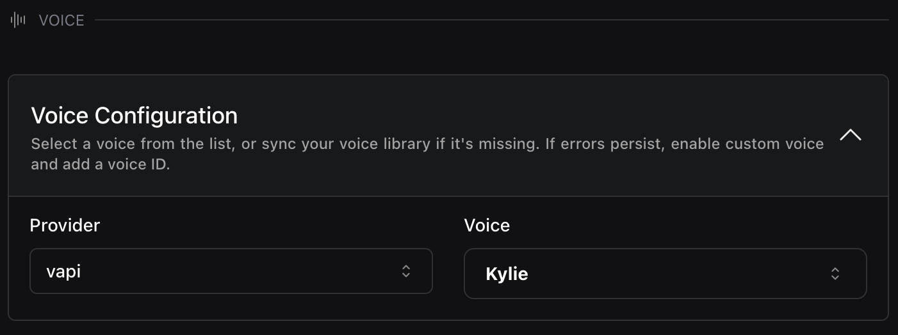

1. **Specify Start Node in Workflows with `isStart` Property**: You can now explicitly define the starting point of your workflow by setting the `isStart` property to `true` on any node like [`Say`](https://api.vapi.ai/api#:~:text=Say), [`Gather`](https://api.vapi.ai/api#:~:text=Gather), or [`Hangup`](https://api.vapi.ai/api#:~:text=Hangup).

2. **Updated Model Options in `GroqModel`**: You can now use the following new Assistant modles with [Groq](https://api.vapi.ai/api#:~:text=GroqModel):
   - `meta-llama/llama-4-maverick-17b-128e-instruct`
   - `meta-llama/llama-4-scout-17b-16e-instruct`
   - `mistral-saba-24b`
   - `compound-beta`
   - `compound-beta-mini`

<Frame caption="New Groq Models">
    
</Frame>

<Warning>Note that some older models have been removed, including `llama-3.1-70b-versatile` and `mixtral-8x7b-32768`.</Warning>

3. **New `Kylie` Voice Available in Vapi**: You can now use the new `Kylie` voice when using [`Vapi` as your voice provider](https://dashboard.vapi.ai/assistants#:~:text=Voice%20Configuration). You can learn more in the [Vapi voices documentation](https://docs.vapi.ai/providers/voice/vapi-voicesn).

<Frame caption="New Vapi Voice: Kylie">
    
</Frame>
