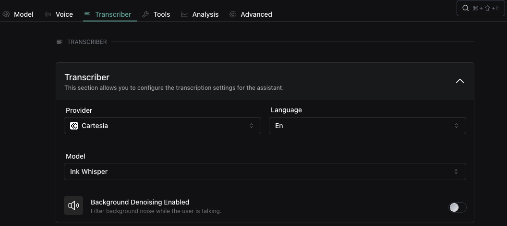

# Assembly AI Transcriber Improvements, chat cost tracking, and API tool enhancements

1. **Chat Cost Tracking**: You can now access detailed cost information per [Chat](https://api.vapi.ai/api#:~:text=FunctionCall-,Chat,-CreateChatDTO) and [Call](https://api.vapi.ai/api#:~:text=SchedulePlan-,Call,-CallBatchError), including total and per-component breakdowns. Use `Call.cost` and `Chat.cost` to get the total cost, and `Call.costs` and `Chat.costs` to get the breakdown.`

  <CodeBlocks>
  ```json title="Chat Schema (excerpt)"
  {
    "cost": 0.12,
    "costs": [
      { "type": "model", "cost": 0.22 },
      { "type": "chat", "cost": 0.10 },
    ]
  }
  ```
  </CodeBlocks>

2. **Enhanced AssemblyAI Transcriber Configuration**: You can now fine-tune the AssemblyAI transcriber with:
  - `maxTurnSilence`: The maximum amount of silence in milliseconds before a turn is considered complete.
  - `endOfTurnConfidenceThreshold`: The confidence threshold for determining the end of a turn.
  - `minEndOfTurnSilenceWhenConfident`: The minimum amount of silence in milliseconds before a turn is considered complete when the confidence is high.
  - `wordFinalizationMaxWaitTime`: The maximum amount of time in milliseconds to wait for word finalization.

3. **New Cartesia Transcriber Option**: You can now use the [Cartesia "Ink Whisper" transcriber](https://api.vapi.ai/api#:~:text=CartesiaTranscriber) for your for assistants and workflow nodes using `Assistant.transcriber` and `ConversationNode.transcriber`. Set this in your [Vapi Assistant dashboard today](https://dashboard.vapi.ai/assistants#:~:text=Transcriber).

<Frame caption="Cartesia Transcriber">
    
</Frame>

4. **API Request Tool Variable Extraction**: You can now use [`assistant.model.tools[type=apiRequest].variableExtractionPlan`](https://api.vapi.ai/api#:~:text=VariableExtractionPlan) to extract and validate variables from API responses by defining a variable schema.
