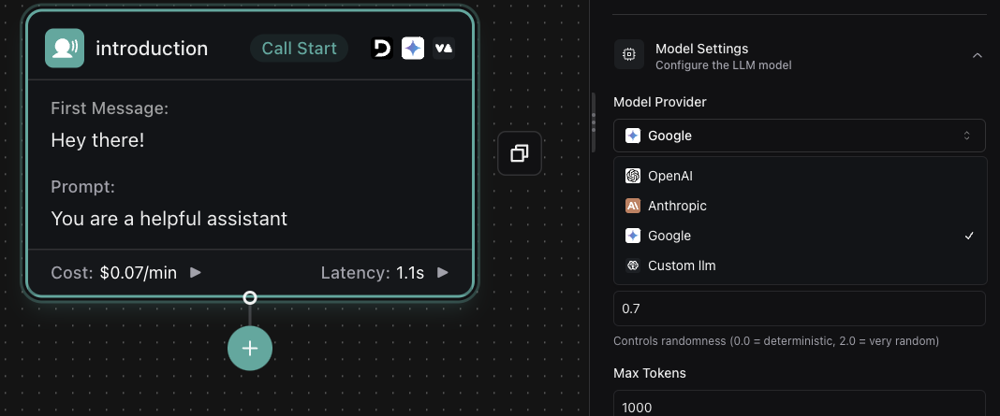

# Background Speech Denoising, Cartesia Transcriber, Workflow Enhancements, and Call Error Handling

1. **Background Speech Denoising Plan**: You can now enhance call quality by configuring advanced background speech denoising options using the new [`assistant.backgroundSpeechDenoisingPlan.smartDenoisingPlan`](https://api.vapi.ai/api#:~:text=SessionPaginatedResponse-,Assistant,-AssistantPaginatedResponse) (default: `false`), which replaces the previous `backgroundDenoisingEnabled` setting.

<CardGroup cols={2}>
  <Card title="Enable Smart Denoising (Krisp)" icon="volume-up">
    Use the `SmartDenoisingPlan` to filter out background speech and noise using [Krisp technology](https://krisp.ai/).
  </Card>
  <Card title="Customize Fourier Denoising" icon="sliders">
    Fine-tune noise reduction with the new `FourierDenoisingPlan` for more control over audio clarity.
  </Card>
</CardGroup>

<Info>
  Smart and Fourier denoising can be combined for optimal results. Order of precedence: Smart denoising, then Fourier denoising.
</Info>

2. **Workflow Server Property**: Workflows now support a [`server`](https://api.vapi.ai/api#:~:text=TrieveKnowledgeBaseImport-,Workflow,-UpdateWorkflowDTO) property, allowing you to specify a server URL to receive webhook callbacks for workflow events directly.

3. **New Workflow Models**: You can now integrate Google's LLMs or custom models into your workflows by specifying [`Google`](https://api.vapi.ai/api#:~:text=WorkflowGoogleModel) or [`Custom LLM`](https://api.vapi.ai/api#:~:text=WorkflowCustomModel) in your workflow model settings. Select your model under [Model Settings](https://dashboard.vapi.ai/workflows#:~:text=Model%20Settings)

<Frame caption="Workflow Google Custom LLM">
  
</Frame>

4. **Enhanced Error Reporting for Cartesia Services**: A new `endedReason` value `pipeline-error-cartesia-502-server-error` has been added to help you identify and handle specific errors related to Cartesia server issues.

5. **Enhanced Error Handling and Status Enums**: We've added new error enums and status codes to help you better handle and debug call-related issues:

   - **VAPI Fault Errors**: Detect specific VAPI-related errors during call start using `call.start.error-vapifault-get-org` and `call.start.error-vapifault-get-subscription`
   
   - **Subscription Status Errors**: Identify subscription-related issues with new enums:
     - `call.start.error-subscription-frozen` (replaces `unknown-error`)
     - `call.start.error-subscription-insufficient-credits`
   
   - **Call Completion Statuses**: Track how calls are completed with new enums:
     - `call.in-progress.twilio-completed-call`
     - `call.in-progress.sip-completed-call`
   
   - **In-Call Error Detection**: Handle specific errors during active calls using enums like `call.in-progress.error-vapifault-chat-pipeline-failed-to-start`