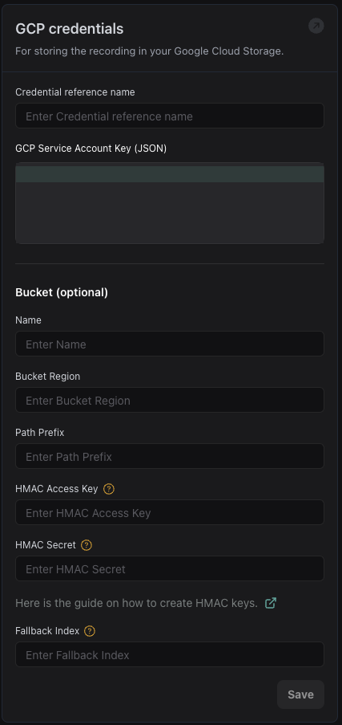

## Overview

1. **API Request Tool**: You can now create [API request tools](https://api.vapi.ai/api#:~:text=ApiRequestTool) that allow the assistant to make REST API calls during conversations

  <Frame caption="Make GET or POST requests to any API in your workflows">
    
  </Frame>

2. **Specify GCP Region**: You can now specify the region for your [GCP Credentials](https://dashboard.vapi.ai/settings/integrations#:~:text=Save-,GCP%20credentials,-For%20storing%20the), This gives you control over where your call artifacts are stored.

  <Frame caption="Specify the region for your GCP Credentials">
    
  </Frame>

3. **Transcriber Formatting Option**: A new `formatTurns` option in your [`Assembly AI Transcriber`](https://api.vapi.ai/api#:~:text=AssemblyAITranscriber) that lets you enable or disable formatting of transcripts when using AssemblyAI's Universal Streaming API. This helps you format transcript outputs to show speaker turns.
