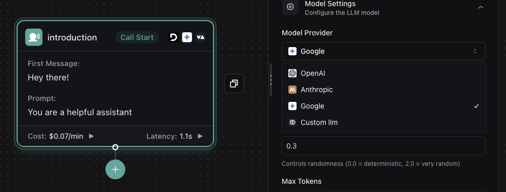

# New Campaigns APIs and Assistant Improvements

<Card title="Campaign API Endpoints" icon="bullhorn">
  **Create, retrieve, and manage campaigns** using the new [`/campaign` endpoints](https://docs.vapi.ai/api-reference/calls/list#:~:text=Campaign). Build automated call campaigns with specified customers and schedules.
</Card>

<Check>
  **General Availability**: [`Assistant.modelOutputInMessagesEnabled`](https://api.vapi.ai/api#:~:text=SessionPaginatedResponse-,Assistant,-AssistantPaginatedResponse) is now generally available without beta limitations. You can decide whether to use the model's output in conversation history instead of the assistant's speech transcription.
</Check>

1. **Simplified Assistant Property Structure**: Properties like `serverMessages`, `clientMessages`, and `serverUrl` have been moved under [`Assistant.monitorPlan`](https://api.vapi.ai/api#:~:text=SessionPaginatedResponse-,Assistant,-AssistantPaginatedResponse). This reorganization simplifies how you configure monitoring for your assistants.

2. **Node-Level Overrides for Model and Voice**: In [`Conversation Node`](https://api.vapi.ai/api#:~:text=ConversationNode), properties like `model`, `voice`, and `transcriber` now explicitly override the workflow's settings. This allows you to customize these settings for individual nodes within a workflow for greater control.

3. **Enhanced Credential Configuration in Assistants**: Assistants now support `credentials` and `credentialIds`, similar to workflows. This allows you to specify dynamic credentials specifically for assistant calls, enhancing security and flexibility.

4. **New Models Available in `ConversationNode`**: You can now use [`Google Models`](https://api.vapi.ai/api#:~:text=WorkflowGoogleModel) and [`Custom Models`](https://api.vapi.ai/api#:~:text=WorkflowCustomModel) in conversation nodes. This expands the range of language models that can be integrated into conversation nodes.

<Frame caption="New Workflow Models">
    
</Frame>