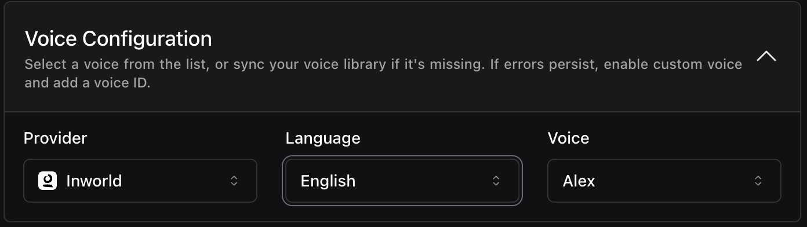

<Card title="Support for 'Inworld' Voice Provider" icon="microphone">
  You can now use Inworld as a voice provider by selecting [`Inworld`](https://dashboard.vapi.ai/assistants#:~:text=VOICE-,Voice%20Configuration,-Select%20a%20voice) in your configuration. You can also route your InWorld credentials under [Settings > Integrations](https://dashboard.vapi.ai/settings/integrations#:~:text=Save-,Inworld,-For%20using%20voices). Finally, there are new `Call.endedReason` codes to help you better understand why calls ended due to Inworld voice issues.

  <Frame caption="Inworld Voice Configuration">
    
  </Frame>
</Card>

2. **HMAC Authentication for Webhook Credentials**: Secure your webhooks with HMAC authentication by configuring [`Assistant.credentials.authenticationPlan`](https://api.vapi.ai/api#:~:text=Assistant,-AssistantPaginatedResponse) with [`HMACAuthenticationPlan`](https://api.vapi.ai/api#:~:text=HMACAuthenticationPlan), providing an alternative to OAuth2.

3. **Detailed Call End Reasons for Inworld Voice**: New `endedReason` codes provide more insight when calls end due to Inworld voice issues.

<Warning>
**Breaking Change**: The `codeSwitchingEnabled` property has been removed from Deepgram transcribers. If you're currently using this property in your Deepgram transcriber configurations, you'll need to remove it to avoid errors.
</Warning>

<Warning>
**Org Concurrency Limit Deprecated**: The `concurrencyLimit` field in [`Org`](https://api.vapi.ai/api#:~:text=Org), [`CreateOrgDTO`](https://api.vapi.ai/api#:~:text=CreateOrgDTO), and [`UpdateOrgDTO`](https://api.vapi.ai/api#:~:text=UpdateOrgDTO) is now marked as deprecated.
</Warning>