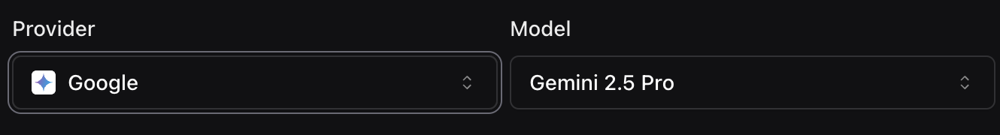

1. **Support for 'Inworld' Voice Provider**: You can now use Inworld as a voice provider by selecting [`Inworld`](https://dashboard.vapi.ai/assistants#:~:text=VOICE-,Voice%20Configuration,-Select%20a%20voice) in your configuration. You can also route your InWorld credentials under [Settings > Integrations](https://dashboard.vapi.ai/settings/integrations#:~:text=Save-,Inworld,-For%20using%20voices). Finally, there are new `Call.endedReason` codes to help you better understand why calls ended due to Inworld voice issues.

<Frame caption="Inworld Voice Configuration">
    
</Frame>

2. **Detailed Call End Reasons for Inworld Voice**: New `endedReason` codes provide more insight when calls end due to Inworld voice issues, aiding in better error handling.

3. **New Google Language Models Available**: You can now use `'gemini-2.5-pro'` when using Google as a model provider.

<Frame caption="Google Model Configuration">
    
</Frame>

4. **Removal of `codeSwitchingEnabled` from Deepgram Transcriber**: The `codeSwitchingEnabled` property is no longer supported in Deepgram transcribers; update your Deepgram transcriber settings accordingly.

<Warning>
**Breaking Change**: The `codeSwitchingEnabled` property has been removed from Deepgram transcribers. If you're currently using this property in your Deepgram transcriber configurations, you'll need to remove it to avoid errors.
</Warning>

<Warning>
**Breaking Change**: The `'aws-sts'` type is no longer supported in [`OAuth2AuthenticationPlan`](https://api.vapi.ai/api#:~:text=OAuth2AuthenticationPlan). If you're currently using this type in your OAuth2 authentication configurations, you'll need to update it to avoid errors.
</Warning>

**Include Messages in Transfer Destination Requests**: When transferring calls, you can now include a `message` to communicate with users during the process with `Assistant.transferDestination.message`.

