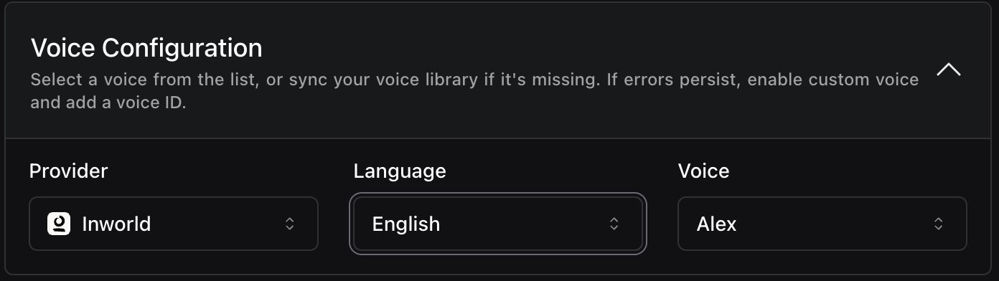

<Card title="Web Chat Support for Assistants" icon="message-circle">
  **Create web-based chat sessions with your assistants** using the new [`Web Chat`](https://api.vapi.ai/api#:~:text=WebChat) integration with [`OpenAI Web Chat Requests`](https://api.vapi.ai/api#:~:text=OpenAIWebChatRequest). Accept user input as strings or message arrays and manage conversations with session and customer information.
</Card>

2. **Inworld TTS Voice Provider Integration**: You can now customize which language [`Inworld Voices`](https://api.vapi.ai/api#:~:text=InworldVoice) use like `English`, `Chinese`, and `Korean`. You can also set the TTS `model` and toggle voice caching with `cachingEnabled`.

<Frame caption="Inworld Voice Configuration">
    
</Frame>

3. **Additional Customer Information Fields**: You can now include `email` and `externalId` fields when [creating customers](https://api.vapi.ai/api#:~:text=CreateCustomerDTO). You can also disable the E164 number format check with `numberE164CheckEnabled` – setting it to `false` lets you use non-E164 numbers like `1234` or `abc`, useful for dialing non-standard numbers on SIP trunks. This lets you store extra contact information and link customers to external systems.

4. **`schedulePlan` No Longer Required in Campaigns**: You can now [create campaigns](https://docs.vapi.ai/api-reference/campaigns/campaign-controller-create) without specifying a `schedulePlan`.

<Note>
**Behavior Change**: The `Chat.assistantOverrides` property now only supports variable substitution in chat contexts, limiting its functionality compared to previous versions.
</Note>
