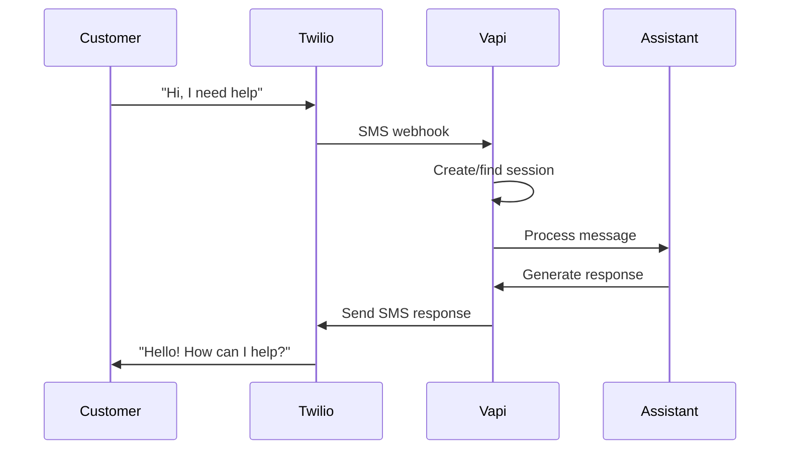

## Overview

Let customers chat with your Vapi assistants through SMS text messages. Perfect for businesses that want to provide AI support through familiar messaging channels.

**What You'll Enable:**
* Text-based conversations through SMS
* Automatic session management for each customer
* Context-aware responses across message exchanges

<Warning>
SMS chat requires a **10DLC-approved Twilio number**. Only customers can initiate conversations - assistants cannot send the first message.
</Warning>

## Prerequisites

* A [Vapi account](https://dashboard.vapi.ai/) with an existing assistant
* A **10DLC-approved Twilio phone number** (required for assistant responses)
* Basic understanding of [phone number management](/phone-numbers)

---

## Setup Steps

<Steps>
  <Step title="Import your 10DLC Twilio number">
    Bring your approved Twilio number into Vapi so we can manage SMS messaging.
    
    <Note>
    SMS is **enabled by default** when importing Twilio numbers.
    </Note>
    
    See: [Import number from Twilio](/phone-numbers/import-twilio) and [Inbound SMS setup](/phone-numbers/inbound-sms)
  </Step>
  <Step title="Attach the number to an assistant">
    Assign the assistant that will handle SMS conversations for this number.
    
    When customers text your number, they'll automatically start a chat session with this assistant.
  </Step>
  <Step title="Test the integration">
    Send a text message to your phone number to verify the assistant responds correctly.
  </Step>
</Steps>

<Tip>
View all SMS conversations in the [Session Logs](https://dashboard.vapi.ai/logs/session) page of your dashboard. Each SMS conversation creates a session where you can see the full message history and conversation flow.
</Tip>

---

## How It Works

When a customer texts your number:

1. **Session Creation**: Vapi automatically creates a chat session for the customer
2. **Context Management**: All messages maintain conversation context within the session
3. **Response Delivery**: Assistant responses are sent back as SMS messages
4. **Session Expiry**: Sessions expire after 24 hours of inactivity, then create fresh sessions for new conversations

---

## Session Management

SMS conversations use automatic session management:

* **New customers**: Get a fresh session on first text
* **Returning customers**: Continue existing session if under 24 hours
* **Session expiry**: After 24 hours, new session created automatically
* **Context preservation**: Full conversation history maintained within session

---

## Limitations

<Note>
**Current SMS chat limitations:**
- **10DLC requirement**: Only 10DLC-approved Twilio numbers support assistant responses
- **Customer-initiated**: Assistants cannot send the first message to customers
- **Query tool**: Knowledge-base searches are not supported (same as Chat API)
- **Twilio only**: Other SMS providers are not currently supported
</Note>

---

## Next Steps

Enhance your SMS chat implementation:

* **[Chat API](/chat/quickstart)** - Understand the underlying chat technology
* **[Session management](/chat/session-management)** - Learn how sessions work in detail
* **[Phone number management](/phone-numbers)** - Configure advanced telephony features
* **[Assistant configuration](/assistants/quickstart)** - Optimize your assistant for text conversations

<Tip>
For the best SMS experience, configure your assistant with concise responses and clear conversation flows. SMS users expect quick, direct answers.
</Tip>
